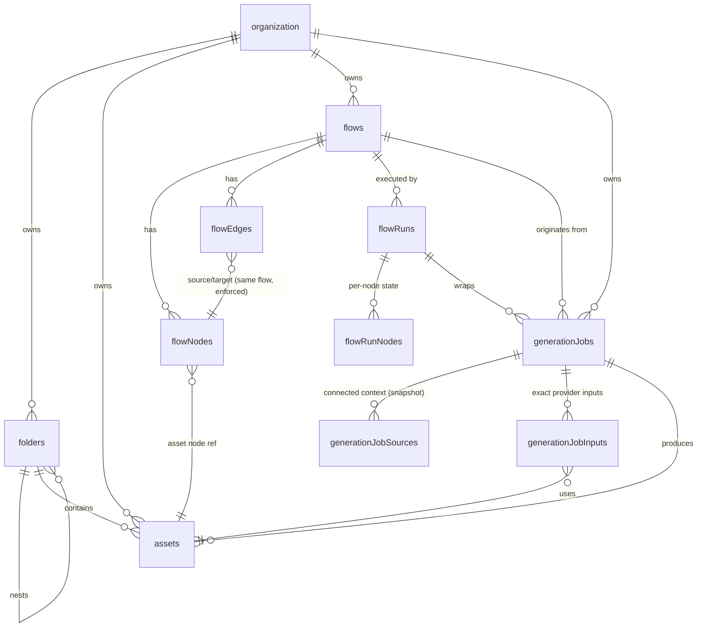

# TaleLabs — Database Design v2 (PostgreSQL)

> **Active MVP override (2026-07-14):** the runtime product spine is
> **Assets → Flows → Generated Assets → Continued Iteration**. Standalone
> Element tables are preserved as dormant historical work, but `flowNodes` no
> longer carries `elementId` and active execution must not hydrate Element
> context. M5 implements five provider-independent run modes with deterministic
> mocks; M6 replaces only the adapter boundary with real providers. See
> `assets-flows-mvp-contract.md`.

Supersedes `db-design-planning.md`. The active MVP is designed around **Assets → Flows → Generated Assets → Continued Iteration**.

In scope: Assets, folders, Asset tags and favorites, the normalized Flow graph,
immutable run snapshots, durable generation jobs, explicit iteration, and
multi-context generation executed through Trigger.dev.

Out of scope (deferred, with seams noted in [Future-proofing](#future-proofing)): billing/credits enforcement (though **costs are recorded from day one** — see `generationJobs`), Recipes, Tools, Storyboard, collaboration, projects, public galleries.

Execution has **one spine**: every M5 command (`node`, `downstream`, `upstream`,
`selection`, or `all`) creates a `flowRuns` row wrapping ordinary
`generationJobs`. Future Tools reuse this spine. Credit-system design has its own
planning document: `credits-planning.md`.

Retired from v1 — these do not return: `brands`, `products`, `characters`,
`brand_characters`, `project_*` tables, job-level `character_id`, `credit_source`,
and `featured_at`. The later Element experiment remains dormant and is not an
MVP dependency. Flows are the creative document; Tags, folders, and favorites
provide lightweight Asset-library organization.

Requires PostgreSQL 15+ (`unique nulls not distinct`, column-targeted `on delete set null`).

---

## How the tools shape the persistence layer

**React Flow (`@xyflow/react` v12)** serializes a canvas as `{ nodes, edges, viewport }`, where a node is `{ id, type, position: {x, y}, data }` and an edge is `{ id, source, target, sourceHandle?, targetHandle? }`. React Flow is UI only — it is not the source of truth. The DB stores the graph in **normalized `flowNodes` / `flowEdges` tables**, not one jsonb document, because the product requires relational answers React Flow can't give:

- Server-side upstream context resolution at run time → walk `flowEdges` in SQL, no document parsing
- Autosave = per-node upserts (position changes touch one small row, not a rewritten megabyte document under TOAST)
- Referential integrity: an Asset node's `assetId` is a real FK; purge keeps a
  tombstone and prevents silent dangling IDs
- Collaboration later = per-row updates merge; a whole-document write is last-writer-wins by construction

Node/edge **ids are client-generated cuid2** (same `@paralleldrive/cuid2` lib runs in the browser) — React Flow creates nodes locally before any server round trip, and stable ids are the vision's prerequisite for future collaboration. The server validates format and uniqueness on write.

**Trigger.dev (v4)** owns queueing, retries, concurrency, cancellation, and
worker execution telemetry on its platform. PostgreSQL does not copy its debug
logs or traces. PostgreSQL does own the durable product-level run and job state:
tenancy, provenance, immutable snapshots, costs, safe errors, and resulting
Assets. A future append-only domain-event stream and internal Run Inspector may
be built from that product state as defined in `observability-planning.md`; this
is deferred production-readiness work, not M5 scope. The integration contract:

```txt
1. API validates and plans the requested mode, then inserts the immutable run,
   node summaries, expanded items, initial jobs, and provenance in one admission
   transaction. Run-level idempotency rejects duplicate user requests.
2. After commit, trigger one parent orchestration task for every mode with
   { flowRunId, organizationId } and idempotencyKey = flowRunId. Payloads carry
   IDs only; tasks load immutable state from PostgreSQL.
3. Trigger run IDs have two writers: the API stores the returned handle and the
   task persists ctx.run.id as its first action. Reconciliation redispatches a
   pending run whose triggerRunId remains null.
4. The orchestrator executes ready topological levels and creates/dispatches
   item/request jobs just in time using the deterministic key
   flowRunId:nodeId:itemKey:requestIndex. In M5 those jobs call local mock
   adapters only. M6 introduces provider submission/polling behind the same
   adapter contract and retains the write-ahead uncertainty rules.
5. Mock and future provider media uploads use deterministic keys
   (generations/{jobId}/{outputIndex}), so a
   retried upload overwrites its own partial object instead of orphaning a new one
6. Completion is one transaction, and ORDER MATTERS — a constraint violation
   aborts a Postgres transaction (no reads allowed without rollback/savepoint),
   so the guarded update comes FIRST; its row lock also serializes concurrent
   completion attempts:
     a. UPDATE generationJobs SET status = 'succeeded', completedAt = now(), ...
        WHERE id = $1 AND status IN ('pending','running') RETURNING id
     b. zero rows -> ROLLBACK, then read the terminal status:
          'succeeded' -> a prior attempt already completed: keep the objects,
                         return the existing outputs, do nothing else
          'canceled'/'failed' -> delete only objects no asset row references
     c. won -> INSERT output Assets with ON CONFLICT (generationJobId, outputIndex)
        DO NOTHING (harmless belt against replayed partial state)
     d. update job + run item together; aggregate item -> node -> run in guarded
        transactions. Failures and partial success mirror the same hierarchy.
     e. COMMIT. Cancel racing completion resolves to exactly one outcome; a
        completion retry can never destroy a canonical output; job, run-node,
        and run states can never diverge.
7. Cancellation = runs.cancel(triggerRunId) + the same guarded update
8. Reconciliation sweeps: (a) redispatch status = 'pending' AND triggerRunId IS NULL
   AND createdAt < now() - interval '1 minute' — safe because domain-derived
   idempotency makes redispatch a no-op if the original trigger landed (running jobs never need
   this sweep thanks to step 3); (b) delete storage objects under generations/{jobId}/
   for terminally failed/canceled jobs — cleans orphans from crashes between upload
   and commit.
9. Run-status UI: poll our API, or subscribe via Trigger.dev Realtime with a
   public access token — either way the DB row is the domain truth
```

Duplicate protection has one mechanism per boundary: the run key stops duplicate
user requests; the run/node/item/request tuple stops duplicate planned jobs;
Trigger idempotency stops duplicate task runs. M6 additionally uses the
write-ahead `providerSubmittedAt` + `providerJobId` pair. True provider
exactly-once exists only where that provider supports idempotency; elsewhere the
contract is at-most-once with explicit uncertainty.

---

## Conventions

- Better Auth tables `"user"`, `"organization"`, `"session"`, `"account"`, etc. exist already (singular, quoted — `user` is a reserved word).
- **Identifiers are quoted camelCase**, matching the existing database exactly: Better Auth created camelCase columns (`"createdAt"`, `"activeOrganizationId"`), the repo's migrations are raw SQL with quoted camelCase, and Kysely runs **without** `CamelCasePlugin` — so TS property names and SQL column names are the same string, no mapping layer. New tables follow suit (`"flowNodes"`, `"organizationId"`). Do not introduce `CamelCasePlugin` now: it would remap the existing Better Auth tables and break them.
- Primary keys: `text` holding cuid2. Server-generated everywhere except `flowNodes.id` / `flowEdges.id` (client-generated, validated).
- Every table is tenant-scoped by `"organizationId"`; `"createdBy"` (`on delete set null`) for attribution.
- `timestamptz` everywhere; `"createdAt"`/`"updatedAt"` on mutable tables.
- Archive (`"deletedAt"`) and purge (`"purgedAt"`) exist **only on `assets`** — see the two-tier deletion note there. Everything else hard-deletes.
- Enum-like values: `text` + `check` — except where the vocabulary is owned by a **code registry** (element types, node types, provider input roles), which get no check so a registry change never requires a migration. App-layer validation against the registry is the contract there.
- Migration order: `folders` → `flows` → `flowRuns` → `generationJobs` → `flowRunNodes` → `assets` → `elements` → `elementAssets` → `flowNodes` → `flowEdges` → `generationJobSources` → `generationJobInputs`.

---

## Entity relationship overview



---

## Schema

Asset and Folder name search uses PostgreSQL trigram indexes:

```sql
create extension if not exists pg_trgm;
```

### 1. Folders — manual asset organization

Adjacency-list tree, org-wide.

```sql
create table "folders" (
  "id" text primary key,
  "organizationId" text not null references "organization"("id") on delete cascade,
  "parentId" text,
  "name" text not null,
  "systemRole" text,                 -- internal stable purpose; null for ordinary user folders
  "createdAt" timestamptz not null default now(),
  "updatedAt" timestamptz not null default now(),
  unique ("id", "organizationId"),    -- composite target for org-scoped FKs
  foreign key ("parentId", "organizationId")
    references "folders" ("id", "organizationId") on delete cascade
);

create index "foldersOrgIdx" on "folders" ("organizationId");
create index "foldersParentIdx" on "folders" ("parentId");
create unique index "foldersSystemRoleIdx"
  on "folders" ("organizationId", "systemRole") where "systemRole" is not null;
create index "foldersNameSearchIdx"
  on "folders" using gin (lower("name") gin_trgm_ops);
```

**Cycle guard (app-layer, documented contract):** the adjacency list permits a folder to become its own descendant. Every folder _move_ must run inside the write transaction a recursive CTE walking the new parent's ancestor chain and reject the move if it contains the folder being moved. Creation can't produce cycles; only re-parenting can.

### 2. Flows — the creative document

Thin by design: the graph lives in the node/edge tables. `"viewport"` is the one piece of canvas state that belongs to the document (React Flow's `{ x, y, zoom }`).

`"revision"` is the autosave concurrency guard: debounced writes from two tabs can arrive out of order, so every graph write is compare-and-swap — the client sends the revision it based its change on, the server runs `update "flows" set "revision" = "revision" + 1, "updatedAt" = now() where "id" = $1 and "revision" = $2` in the same transaction as the node/edge upserts, and zero rows affected → `409`, client refetches and replays. This also gives "recently edited" sorting for free.

```sql
create table "flows" (
  "id" text primary key,
  "organizationId" text not null references "organization"("id") on delete cascade,
  "createdBy" text references "user"("id") on delete set null,
  "name" text not null,
  "viewport" jsonb not null default '{"x": 0, "y": 0, "zoom": 1}',
  "revision" bigint not null default 0,
  "createdAt" timestamptz not null default now(),
  "updatedAt" timestamptz not null default now(),
  unique ("id", "organizationId")     -- composite target for org-scoped FKs
);

create index "flowsOrgUpdatedIdx" on "flows" ("organizationId", "updatedAt" desc, "id" desc);
```

### 3. Generation jobs — one durable provider-shaped request

One row per provider-shaped request. A node work item normally creates one job,
but request sharding may create several. The job remains the atomic retry and
cost unit: one adapter, one model, one operation, one work item, one request
index. Everything the adapter sees is snapshotted at creation; Trigger.dev
executes it.

```sql
create table "generationJobs" (
  "id" text primary key,
  "organizationId" text not null references "organization"("id") on delete cascade,
  "createdBy" text references "user"("id") on delete set null,

  "flowRunId" text not null,        -- every job belongs to exactly one run (section 11)
  "flowId" text,                    -- denormalized for canvas queries; history survives flow deletion
  "nodeId" text not null,           -- generation node id at run time; no FK — it's a snapshot,
                                    -- the node may be deleted or reused later
  "itemKey" text not null,          -- deterministic flowRunNodeItems identity
  "requestIndex" integer not null default 0, -- bounded shard within the item

  "mediaType" text not null check ("mediaType" in ('text', 'image', 'video', 'audio')),
  "status" text not null default 'pending'
           check ("status" in ('pending', 'running', 'succeeded', 'failed', 'canceled')),

  "provider" text not null,          -- resolved provider/adapter family, not a UI model identity
  "model" text not null,             -- stable TaleLabs product model id ('talelabs/veo-3.1')
  "operation" text not null,         -- curated operation id ('imageToVideo', 'tts', ...)
  "providerModel" text not null,     -- native provider model id selected at admission
  "modelRegistryVersion" text not null,
  "providerRouteVersion" text not null,
  "adapterVersion" text not null,
  "settings" jsonb not null default '{}',  -- aspect ratio, resolution, seed, ... (model-shaped)
  "resolvedPrompt" text,            -- final instructions composed from resolved Text sources

  "idempotencyKey" text not null,   -- server-derived from run/node/item/request; the API-facing
                                    -- key lives on flowRuns — retried orchestration can never
                                    -- double-create a node's job
  "requestHash" text not null,      -- hash of the snapshotted job payload
  "triggerRunId" text,              -- Trigger.dev run id; written by API on dispatch AND by the
                                    -- task itself (ctx.run.id) at start — never permanently lost
  "providerSubmittedAt" timestamptz,-- write-ahead marker set BEFORE the provider call; with
                                    -- providerJobId null it means outcome-uncertain: never resubmit
  "providerJobId" text,             -- provider execution id, persisted immediately after submission;
                                    -- task retries resume polling instead of resubmitting

  "creditCost" integer,             -- credits this execution cost, recorded from day one (no balance
                                    -- enforcement yet); pricing rules in credits-planning.md
  "providerCostUsd" numeric(12, 6), -- raw provider spend, captured at execution time

  "errorCode" text,                 -- stable failure class: 'content_policy', 'provider_timeout', ...
  "errorMessage" text,              -- safe to display; raw provider payloads go to logs only

  "createdAt" timestamptz not null default now(),
  "startedAt" timestamptz,
  "completedAt" timestamptz,

  unique ("id", "organizationId"),    -- composite target for org-scoped FKs
  unique ("flowRunId", "nodeId", "itemKey", "requestIndex"),
  foreign key ("flowRunId", "organizationId")
    references "flowRuns" ("id", "organizationId"),
    -- no delete action: runs are immutable execution history, never deleted individually
  foreign key ("flowId", "organizationId")
    references "flows" ("id", "organizationId") on delete set null ("flowId")
);

create index "generationJobsFlowRunIdx" on "generationJobs" ("flowRunId");
create index "generationJobsOrgCreatedIdx"
  on "generationJobs" ("organizationId", "createdAt" desc, "id" desc);
create index "generationJobsNodeHistoryIdx"
  on "generationJobs" ("flowId", "nodeId", "createdAt" desc, "id" desc);
  -- serves node result history AND latest-succeeded upstream resolution;
  -- its "flowId" prefix also covers plain per-flow queries (no separate flow index)
create index "generationJobsUndispatchedIdx" on "generationJobs" ("createdAt")
  where "status" = 'pending' and "triggerRunId" is null;
  -- exactly the dispatch-reconciliation sweep, nothing more: near-empty in steady state.
  -- (No broad active-status index: Trigger.dev owns execution polling, so the sweep
  -- is the only proven scanner — add an ops index later if a dashboard needs one.)
create unique index "generationJobsIdempotencyIdx"
  on "generationJobs" ("organizationId", "idempotencyKey");
create unique index "generationJobsTriggerRunIdx"
  on "generationJobs" ("triggerRunId") where "triggerRunId" is not null;
create unique index "generationJobsProviderJobIdx"
  on "generationJobs" ("provider", "providerJobId") where "providerJobId" is not null;
```

Notes:

- **No `characterId`, no `elementId`, no single `assetId`.** Context is plural by design and lives entirely in `generationJobSources` / `generationJobInputs` below.
- **No generation-job prompt column for user input.** Video node schema version
  3 may preserve an inline prompt inside `flowNodes.data`; connected Text nodes
  remain separate sources. At admission the connected Text input is
  authoritative when present, the server rederives the concrete operation, and
  the chosen prompt plus raw sources are frozen into the immutable snapshot and
  `"resolvedPrompt"`. Inline and connected prompts are never silently concatenated.
- **No retry/attempt/queue columns.** Trigger.dev owns retries, concurrency, and queueing; duplicating its state machine in Postgres would drift. `"status"` is the _domain_ outcome, written under the guarded-update rule (see the integration contract, including the atomic completion-vs-cancel transaction).
- **No `cancelRequestedAt`.** With `runs.cancel(triggerRunId)` doing the actual interruption, a single guarded status write suffices — if the task already finished, the update affects zero rows and the terminal status stands.
- `"mediaType"` includes text, image, video, and audio. Successful media outputs
  become Assets; successful text outputs use the dedicated durable text-output
  relation described with the run tables.
- **Costs are recorded before billing exists.** `"creditCost"` and `"providerCostUsd"` are execution-time facts that cannot be faithfully reconstructed later (provider pricing changes, settings-dependent pricing). Recording them from the first shipped generation produces the real usage dataset the credit system will be calibrated against — the ledger and enforcement attach later (see `credits-planning.md`), the measurements start now.
- **`"flowRunId"` is `not null`.** Even a node command creates a run and may
  expand to multiple items or shards. There are no standalone jobs to reconcile
  with the workflow path later.
- **Provider exactly-once is honest, not assumed.** `"providerSubmittedAt"` (write-ahead) + `"providerJobId"` (write-behind) bracket the provider call; the gap between them is the uncertainty window a retry must respect (contract step 4). The unique `(provider, "providerJobId")` index guarantees two job rows can never claim the same provider execution.
- The composite FK on `("flowId", "organizationId")` makes a cross-org flow reference structurally impossible — see [Tenant isolation](#tenant-isolation).

### 4. Assets — the canonical media library

The foundation, built first. Every upload and every successful generation output lands here.

```sql
create table "assets" (
  "id" text primary key,
  "organizationId" text not null references "organization"("id") on delete cascade,
  "createdBy" text references "user"("id") on delete set null,

  "name" text not null,
  "type" text not null check ("type" in ('image', 'video', 'audio', 'document')),
  "source" text not null check ("source" in ('upload', 'generation')),

  "storageKey" text not null unique,  -- R2 object key; never exposed to clients.
                                      -- unique: two rows must never share one object,
                                      -- or purging one silently breaks the other
  "thumbnailKey" text,                -- pre-rendered preview (video poster, image thumb)
  "mimeType" text not null,
  "sizeBytes" bigint,
  "width" integer,                    -- image/video
  "height" integer,                   -- image/video
  "durationSeconds" numeric(10, 3),   -- video/audio

  "folderId" text,
  "generationJobId" text,
  "outputIndex" smallint,             -- position within the producing job's outputs; preserves
                                      -- provider ordering and makes completion retries deterministic
  "uploadId" text,                    -- one-time upload-grant id (never the signed token itself)

  "metadata" jsonb not null default '{}',  -- codec, fps, color profile, exif, ...
  "processingState" text not null default 'processing'
                    check ("processingState" in ('processing', 'ready', 'failed')),
                    -- ingestion lifecycle (probe/thumbnail/metadata), orthogonal to deletion;
                    -- generation outputs insert directly as 'ready'
  "processingError" text,             -- safe to display; set only when 'failed'

  "createdAt" timestamptz not null default now(),
  "updatedAt" timestamptz not null default now(),
  "deletedAt" timestamptz,            -- tier 1: archive (reversible)
  "purgeRequestedAt" timestamptz,     -- tier 2 intent: durable purge task in flight
  "purgedAt" timestamptz,             -- tier 2 done: set ONLY after storage deletion succeeded

  unique ("id", "organizationId"),    -- composite target for org-scoped FKs
  check (                             -- source invariant is mutually exclusive, both directions
    ("source" = 'generation'
      and "generationJobId" is not null and "outputIndex" is not null and "outputIndex" >= 0)
    or ("source" = 'upload'
      and "generationJobId" is null and "outputIndex" is null)
  ),
  -- deletion lifecycle is structurally ordered: live -> archived -> purge requested -> purged
  check ("purgeRequestedAt" is null or "deletedAt" is not null),
  check ("purgedAt" is null or "purgeRequestedAt" is not null),
  -- processing invariant: exactly the failed state carries an error
  check (("processingState" = 'failed') = ("processingError" is not null)),
  foreign key ("folderId", "organizationId")
    references "folders" ("id", "organizationId") on delete set null ("folderId"),
  foreign key ("generationJobId", "organizationId")
    references "generationJobs" ("id", "organizationId")
    -- no delete action, deliberately: jobs are immutable execution history and are never
    -- deleted individually; a set-null here would violate the generation check above.
    -- Organization deletion cascades both sides, which NO ACTION permits (checked at
    -- statement end, after the full cascade).
);

create index "assetsOrgCreatedIdx" on "assets" ("organizationId", "createdAt" desc, "id" desc)
  where "deletedAt" is null and "purgedAt" is null;
create index "assetsOrgTypeIdx" on "assets" ("organizationId", "type")
  where "deletedAt" is null and "purgedAt" is null;
create index "assetsFolderIdx" on "assets" ("folderId")
  where "deletedAt" is null and "purgedAt" is null;
create unique index "assetsJobOutputIdx" on "assets" ("generationJobId", "outputIndex")
  where "generationJobId" is not null;
create unique index "assetsUploadIdIdx" on "assets" ("uploadId") where "uploadId" is not null;
create index "assetsPurgePendingIdx" on "assets" ("purgeRequestedAt")
  where "purgeRequestedAt" is not null and "purgedAt" is null;  -- serves the purge sweep
create index "assetsProcessingIdx" on "assets" ("createdAt")
  where "processingState" = 'processing' and "purgeRequestedAt" is null;
  -- serves the ingestion redispatch sweep; excludes purge-requested assets so
  -- ingestion can never race a purge back to life
create index "assetsNameSearchIdx"
  on "assets" using gin (lower("name") gin_trgm_ops)
  where "deletedAt" is null and "purgeRequestedAt" is null;
```

Notes:

- **Two-tier deletion, and rows are never hard-deleted.** Archive sets `"deletedAt"` (reversible). Permanent deletion — the vision's explicit-confirmation action — is a **durable purge task with honest ordering**: mark `"purgeRequestedAt"` (also archiving if still live, so the library's partial indexes already exclude it), the task deletes the R2 objects with retries, and `"purgedAt"` is set **only after storage deletion succeeds** — the database never claims destruction that hasn't happened. The result is a tombstone row. Purge gets the same crash-window protection as job dispatch: initial dispatch and reconciliation use the same explicitly global Trigger.dev idempotency key derived from `assetId`; the sweep re-triggers any asset stuck in `"purgeRequestedAt" is not null and "purgedAt" is null` (served by `"assetsPurgePendingIdx"`), and **restore is guarded** — un-archiving requires `"purgeRequestedAt" is null`, so a user can never restore an asset whose storage is being destroyed. **Purge also coordinates with active generations** through row locks with fixed ordering (asset row first, always): purge locks the asset and rejects if `generationJobInputs` references it from a `pending`/`running` job; run creation locks its selected input assets (ordered by id) and rejects purging/purged ones — the race serializes to exactly one of two clean rejections. Multi-node runs, which create downstream jobs later, will need run-level input leases or copied static references — a seam for that phase, deliberately not built now. This is what reconciles "permanent deletion" with "immutable generation provenance": the media is genuinely gone, but `generationJobInputs`, `elementAssets`, and `flowNodes` references stay intact and render as a tombstone placeholder instead of silently vanishing from history. Because rows persist, no cascade ever erases provenance; `generationJobInputs."assetId"` deliberately has **no** `on delete cascade`, so an accidental hard `DELETE` fails loudly on the FK instead of quietly rewriting job history.
- `"generationJobId"` on the asset (not `outputAssetId` on the job): one run can produce multiple outputs; uploads have `null`. Full provenance (model, settings, resolved prompt, inputs, elements) is one join away — never duplicated onto the asset. The `check` makes the link mandatory for `source = 'generation'` — a generated asset without its job is a contract violation, not a nullable edge case.
- `"outputIndex"` + the unique `("generationJobId", "outputIndex")` index give generated outputs a stable identity: provider ordering survives, and a retried completion transaction upserts the same rows instead of duplicating them. Storage keys derive from the same identity (`generations/{jobId}/{outputIndex}`), which is what makes upload retries overwrite-safe and orphan cleanup a prefix listing.
- `"storageKey"` is globally unique. If an asset-duplicate feature ever ships, it must copy the object, not share the key.
- `"uploadId"` keeps the replay-safe presigned-upload flow: signed stateless grant (binds org, user, object key, mime, size, **sha-256 checksum**, expiry); registering the same grant twice returns the existing asset via the unique index. Two guards make the object immutable-in-practice: the presigned PUT signs `If-None-Match: *` (create-only — a still-valid URL can never overwrite), and the checksum binds content to the grant, verified at registration. Exact checksum header depends on an R2 spike — full-object SHA-256 support on PUT is uncertain there; `Content-MD5`/ETag is the documented fallback (API doc, Uploads). Upload object keys are deterministic per grant (`uploads/{grantId}`), so abandoned uploads (PUT completed, never registered) are sweepable: delete `uploads/` objects older than the grant TTL with no matching `"uploadId"` row — the storage-side twin of the generation-orphan sweep.
- Search uses `pg_trgm` GIN indexes over `lower("name")` for live Asset and Folder
  substring matching. Every search query still carries `"organizationId"`; the
  trigram index accelerates candidate lookup without weakening tenant scope.
- v1's `visibility` and `featured_at` are gone. Tags and favorites organize the private library only; they never make an Asset public. All delivery is signed-URL private for now; see [Future-proofing](#future-proofing) for the public-delivery seam.

#### Asset favorites and tags

Favorites are personal to a user inside one organization. Tags are shared organization vocabulary and may be assigned to many Assets. Both relationships use composite organization foreign keys so cross-tenant links are structurally impossible.

```sql
create table "assetFavorites" (
  "organizationId" text not null references "organization"("id") on delete cascade,
  "userId" text not null references "user"("id") on delete cascade,
  "assetId" text not null,
  "createdAt" timestamptz not null default now(),
  primary key ("organizationId", "userId", "assetId"),
  foreign key ("assetId", "organizationId")
    references "assets" ("id", "organizationId") on delete cascade
);

create index "assetFavoritesAssetIdx"
  on "assetFavorites" ("organizationId", "assetId");

create table "tags" (
  "id" text primary key,
  "organizationId" text not null references "organization"("id") on delete cascade,
  "createdBy" text references "user"("id") on delete set null,
  "name" text not null,
  "normalizedName" text not null,
  "createdAt" timestamptz not null default now(),
  "updatedAt" timestamptz not null default now(),
  unique ("id", "organizationId"),
  unique ("organizationId", "normalizedName")
);

create index "tagsOrgNameIdx"
  on "tags" ("organizationId", "normalizedName", "id");

create table "assetTags" (
  "organizationId" text not null references "organization"("id") on delete cascade,
  "assetId" text not null,
  "tagId" text not null,
  "createdBy" text references "user"("id") on delete set null,
  "createdAt" timestamptz not null default now(),
  primary key ("assetId", "tagId"),
  foreign key ("assetId", "organizationId")
    references "assets" ("id", "organizationId") on delete cascade,
  foreign key ("tagId", "organizationId")
    references "tags" ("id", "organizationId") on delete cascade
);

create index "assetTagsOrgTagIdx"
  on "assetTags" ("organizationId", "tagId", "assetId");
```

Tag names are normalized in the application with Unicode NFKC normalization, collapsed whitespace, and case folding before the organization-level unique constraint is evaluated. Assigning a favorite or tag is idempotent. Deleting a tag removes its Asset assignments, never the Assets themselves.

### 5. Deferred Elements — dormant historical schema

The following tables preserve the completed experiment for possible
reconsideration after the billable Assets + Canvas loop. They are not part of
Flow schemas, reference hydration, run admission, M5 acceptance, or M6 provider
integration. Do not add new active runtime dependencies on them.

One generic table for all element types. The framework-neutral **type registry lives in code** and contains versioned validation schemas plus structural Asset-role metadata. Dedicated React forms live in the dashboard and dedicated `buildContext` implementations live in the API. The DB stores the registry key and type-shaped validated payload, and deliberately does not constrain the key, so shipping a new type is a code-registry change, not a migration.

**`"type"` is immutable after creation.** Changing a character into a product would orphan its `data` payload and asset roles; the product action for "wrong type" is creating a new element. Enforce in the app layer (no `update` path for the column).

`"schemaVersion"` records which version of the registry's schema wrote `"data"`. Registry schemas will evolve; the version lets the app upcast old payloads deterministically instead of guessing shape. Each type retains a schema for every supported stored version and a sequential migration for every version transition. Reads validate with the stored-version schema before migrating, then validate the current result. Creates and updates write only the current version; reads may upcast without immediately rewriting the row.

M4.5 adds the shared identity block through code-registry version bumps, not a
JSONB rewrite: Character, Product, Location, Object, Vehicle, and Voice advance
from v1 to v2; Brand and Other advance from v2 to v3 while retaining their
earlier v1-to-v2 migrations. Every new transition validates the historical
shape, initializes `{ summary: '', mustKeep: [], mayVary: [], avoid: [] }`, and
then validates the new current schema. Unknown future versions and migration
gaps continue to fail closed.

```sql
create table "elements" (
  "id" text primary key,
  "organizationId" text not null references "organization"("id") on delete cascade,
  "createdBy" text references "user"("id") on delete set null,
  "assetFolderId" text,
  "type" text not null,               -- registry key: 'character', 'product', later 'location', ...
                                      -- no check: vocabulary owned by the code registry, validated app-side
  "name" text not null,
  "instructions" text,                -- description / generation instructions (the shared field)
  "data" jsonb not null default '{}', -- type-specific fields, validated by the registry's Zod schema
  "schemaVersion" smallint not null default 1,
  "createdAt" timestamptz not null default now(),
  "updatedAt" timestamptz not null default now(),
  unique ("id", "organizationId"),    -- composite target for org-scoped FKs
  foreign key ("assetFolderId", "organizationId")
    references "folders" ("id", "organizationId") on delete set null ("assetFolderId")
);

create index "elementsOrgTypeIdx" on "elements" ("organizationId", "type");
create index "elementsOrgUpdatedIdx"
  on "elements" ("organizationId", "updatedAt" desc, "id" desc);  -- element list cursor pagination
create unique index "elementsAssetFolderIdx"
  on "elements" ("assetFolderId") where "assetFolderId" is not null;
```

The dormant Element schema intentionally has no `elements.revision` column.
M5 does not add one because active run admission does not read or snapshot
Elements. If Elements return later, revision and snapshot semantics must be
designed against the then-current run engine.

`folders.systemRole = 'elements_root'` identifies the one workspace Elements root without relying on its mutable name or path. Element creation provisions a collision-safe child folder and stores its ID in `assetFolderId` in the same transaction. The FK makes folder moves/renames harmless and clears the association if the folder is deleted. Element deletion deliberately has no effect on the referenced folder. A later Element upload recreates a missing association before inserting the new Asset; existing-Asset links never alter `assets.folderId`.

### 6. Element ↔ Asset — the relationship that carries meaning

Role, ordering, approved-reference state, primary priority, and relationship-specific metadata, exactly as the vision specifies. Roles and metadata are validated app-side against the registry for the Element type (including accepted media types, e.g. `voice` accepts only `audio`).

```sql
create table "elementAssets" (
  "organizationId" text not null references "organization"("id") on delete cascade,
  "elementId" text not null,
  "assetId" text not null,
  "role" text not null,               -- registry-defined per element type: 'appearance', 'packshot', ...
  "referenceKind" text not null default 'master'
    constraint "elementAssetsReferenceKindCheck"
      check ("referenceKind" in ('source', 'master')),
  "referenceMetadata" jsonb not null default '{}'::jsonb,
  "sortOrder" smallint not null default 0,
  "isPrimary" boolean not null default false,
  "createdAt" timestamptz not null default now(),
  primary key ("elementId", "assetId", "role"),
  foreign key ("elementId", "organizationId")
    references "elements" ("id", "organizationId") on delete cascade,
  foreign key ("assetId", "organizationId")
    references "assets" ("id", "organizationId") on delete cascade,
  constraint "elementAssetsSourceNotPrimaryCheck"
    check ("referenceKind" <> 'source' or not "isPrimary")
);

create index "elementAssetsAssetIdx" on "elementAssets" ("assetId");
create unique index "elementAssetsPrimaryIdx"
  on "elementAssets" ("elementId", "role") where "isPrimary";
create index "elementAssetsMasterElementIdx"
  on "elementAssets" (
    "organizationId", "elementId", "role", "sortOrder", "assetId"
  )
  where "referenceKind" = 'master';
```

The row check and partial unique index make "primary" mean one approved master:
at most one primary master per role per Element, enforced by the database rather
than UI discipline. Existing rows migrate to `master` without changing behavior.

These M4.5 fields ship additively in `008_element_consistency`: both columns are
`not null`, their server defaults backfill every existing relationship as
`master` with `{}` metadata, and the two named checks are installed in the same
migration. The partial `elementAssetsMasterElementIdx` serves the hot
organization-scoped, master-only Element preview/context/Flow reads while
excluding source evidence from the index. The down migration drops that index,
the named checks, and then the two columns; it is for disposable databases only.

Master capacity remains registry-owned per role. Sources use a separate bounded
Element-wide abuse cap of 50 from shared code configuration. Application
ordering is independent inside each
`(organizationId, elementId, role, referenceKind)` sequence so hidden sources
cannot reorder visible masters. The global mutation-lock order is organization
Flow-reference budget, folder structure when an Element upload may provision a
folder, Element, role, then the existing Asset row for attachment or relationship
updates. Source-cap mutations take the Element lock;
master-cap mutations take the role lock and first take the organization budget
lock when they can increase executable references. Promotion takes the budget,
Element, role, and Asset locks; upload registration also takes the folder lock in
its fixed position. The organization-scoped Asset lock uses `FOR UPDATE` and
rechecks `purgeRequestedAt` and `purgedAt` after waiting. Fresh atomic upload
registration has no existing Asset row at that point and inserts it later in the
same transaction. Each mutation acquires only the locks it needs, always in that
order. Folder-tree deletion first takes the folder-structure lock, resolves the
tenant-owned subtree, and locks associated Element rows and then Asset rows in
stable ID order before issuing the delete and its foreign-key actions.

`referenceMetadata` contains registry-validated interpretation of the
relationship (for example view, framing, background, or variant). Intrinsic media
facts remain on `assets.metadata`. Unknown relationship keys are rejected and
signed URLs/provider IDs never belong in either Element data or link metadata.
Every current fixed and custom role uses the same strict common schema:
`view` is `front | threeQuarter | profile | rear`, `framing` is
`portrait | halfBody | fullBody | detail`, `background` is
`clean | environment`, and `variant` is an optional bounded string. The schema
is still owned through each registry role so a later role can evolve through a
reviewed contract rather than accepting arbitrary JSON.

Removing a row never deletes the asset; deleting an element cascades only the rows. `/elements/:id/assets` is the global asset library filtered through this table — one asset system.

All relationship writes use one transactional mutation boundary. Existing-Asset
attachment, promotion/demotion, role changes, kind-specific reorder, primary and
metadata changes, detach, and future generated-Asset attachment cannot bypass
the same validation and locks. Upload registration invokes that boundary inside
the Asset transaction: Asset insertion, relationship insertion, affected
persisted-Flow budget validation, and any folder provisioning commit or roll
back together.

No `elements.revision` migration is part of M5. If Elements return later, their
snapshot and revision strategy must be designed against the then-current run
engine instead of being inferred from this dormant schema.

### 7. Flow nodes — normalized graph, half relational, half document

The split rule: **anything the server queries or enforces is a column; anything only the canvas renders is `"data"`.**

```sql
create table "flowNodes" (
  "id" text primary key,              -- client-generated cuid2; stable for provenance + future collab
  "organizationId" text not null references "organization"("id") on delete cascade,
  "flowId" text not null,
  "type" text not null,               -- active code registry: text/asset/imageGeneration/videoGeneration/llm plus audio-intent and control nodes; no check
  "positionX" double precision not null,
  "positionY" double precision not null,
  "assetId" text,                     -- set for asset nodes (and generation outputs)
  "data" jsonb not null default '{}', -- node-type payload: text content, model+settings draft, ui state
  "schemaVersion" smallint not null default 1,  -- registry schema version that wrote "data"
  "createdAt" timestamptz not null default now(),
  "updatedAt" timestamptz not null default now(),
  unique ("flowId", "id"),            -- composite target for flow-scoped edge FKs below
  foreign key ("flowId", "organizationId")
    references "flows" ("id", "organizationId") on delete cascade,
  foreign key ("assetId", "organizationId")
    references "assets" ("id", "organizationId") on delete set null ("assetId")
);

create index "flowNodesFlowIdx" on "flowNodes" ("flowId");
create index "flowNodesAssetIdx" on "flowNodes" ("assetId") where "assetId" is not null;
```

- `"assetId"` is a real FK column rather than a value buried in `"data"`, so
  tenant integrity and lifecycle behavior remain enforceable by PostgreSQL.
- `"positionX"/"positionY"` as columns because drag-autosave is the hottest write path — a two-float HOT update per node beats rewriting a document.
- A generation node's _draft_ config (chosen model, settings, derived operation,
  optional inline prompt, and per-input `auto` or ordered-manual Asset selection
  policy) lives in `"data"`; incoming edges remain the sole source of topology,
  so node data never duplicates source node IDs or handles. Image schema version
  6, Video schema version 3, and LLM schema version 1 include the preserved
  inline `prompt`; LLM also preserves inline `instructions`. The server
  rederives Image, Video, and LLM operations from the final graph and rejects
  client drift. Image contract upgrades rewrite the legacy
  `references` edge handle to `imageReferences` in the same graph mutation.
  The run-time truth is snapshotted onto `generationJobs`. Draft and provenance
  never share storage.
- Autosave protocol (API concern, stated here because it shapes the tables): the client sends batched node upserts + deletes and edge inserts + deletes per debounce tick, wrapped in the flow-revision compare-and-swap described on `flows`. No whole-graph replacement endpoint.

### 8. Flow edges

```sql
create table "flowEdges" (
  "id" text primary key,              -- client-generated cuid2
  "flowId" text not null,
  "sourceNodeId" text not null,
  "targetNodeId" text not null,
  "sourceHandle" text,                -- React Flow sets these only when handles are named
  "targetHandle" text,
  "createdAt" timestamptz not null default now(),
  foreign key ("flowId", "sourceNodeId") references "flowNodes"("flowId", "id") on delete cascade,
  foreign key ("flowId", "targetNodeId") references "flowNodes"("flowId", "id") on delete cascade,
  unique nulls not distinct ("flowId", "sourceNodeId", "sourceHandle", "targetNodeId", "targetHandle")
);

create index "flowEdgesFlowIdx" on "flowEdges" ("flowId");
create index "flowEdgesTargetIdx" on "flowEdges" ("targetNodeId");
```

- **Cross-flow edges are impossible at the DB level**: both endpoint FKs are composite over `("flowId", nodeId)`, so an edge can only reference nodes of its own flow — no application check to forget. (The `flows` FK is implied transitively through the node FKs.)
- The `nulls not distinct` unique constraint prevents duplicate connections even when handles are unset — plain `unique` would treat two `null` handles as distinct and allow doubles.
- `"flowEdgesTargetIdx"` is the run-time resolution index: "give me everything connected _into_ this generation node" is one indexed lookup, then recurse upstream if node-output chaining needs it.
- Deleting a node cascades its edges — matching React Flow's canvas behavior exactly, no orphan cleanup.

### 9. Generation job sources — every connected context source, snapshotted

The first provenance level is every source connected to the executable node,
with deterministic ordering and every candidate/selection decision frozen at
job creation. Active M5 writes use `text`, `asset`, and `nodeOutput`. The legacy
`element` vocabulary and nullable `elementId` column remain only for historical
compatibility with any pre-reset records; the active planner must never create
them. Later Flow or Asset edits must never rewrite these rows.

```sql
create table "generationJobSources" (
  "id" text primary key,
  "organizationId" text not null references "organization"("id") on delete cascade,
  "jobId" text not null,
  "sortOrder" smallint not null,
  "sourceType" text not null
               check ("sourceType" in ('text', 'element', 'asset', 'nodeOutput')),
  "nodeId" text not null,             -- flow node this source came from (snapshot, no FK)
  "elementId" text,                   -- legacy compatibility only; active M5 writes null
  "assetId" text,                     -- for raw-asset / node-output sources
  "resolvedText" text,                -- resolved Text-node content/instructions
  "snapshot" jsonb not null default '{}',
               -- frozen candidate refs, exclusions, selection and input-limit
               -- decisions. Snapshot data — queried never, replayed always.
  unique ("jobId", "sortOrder"),
  unique ("jobId", "id"),             -- composite target for job-scoped input FK below
  foreign key ("jobId", "organizationId")
    references "generationJobs" ("id", "organizationId") on delete cascade,
  foreign key ("elementId", "organizationId")
    references "elements" ("id", "organizationId") on delete set null ("elementId"),
  foreign key ("assetId", "organizationId")
    references "assets" ("id", "organizationId") on delete set null ("assetId")
);

create index "generationJobSourcesJobIdx" on "generationJobSources" ("jobId");
create index "generationJobSourcesElementIdx" on "generationJobSources" ("elementId")
  where "elementId" is not null;
```

The active column/jsonb split is deliberate: `"assetId"` stays relational because
"which runs used this Asset" is a product query; candidate lists and exclusion
decisions live in `"snapshot"` because they are read back for provenance rather
than filtered relationally.

Two resolution rules the vision requires but React Flow does not provide, defined here so `"sortOrder"` is never arbitrary:

- **Source ordering:** React Flow edges are an unordered set, but the vision demands deterministic context ordering (it affects prompt composition). Default order = `(flowEdges."createdAt", "id")` of the incoming connections — stable and reproducible. The generation node's `"data"` may store an explicit user-defined ordering that overrides the default. Whichever rule applied, the job's `"sortOrder"` freezes the outcome — provenance never depends on re-deriving it.
- **Collection selection belongs to the consumer:** direct Asset inputs and
  upstream output collections resolve in deterministic order. Consumer policy
  chooses the exact subset at run time. Model maxima apply per target slot across
  every source edge combined. Stale, incompatible, unavailable, singular-slot
  overflow, and model-limit overflow block execution rather than being silently
  truncated. `generationJobSources."snapshot"` freezes candidates and decisions;
  `generationJobInputs` freezes only the exact provider subset.
- **`nodeOutput` resolution is run-aware:** inside a multi-node run, an upstream
  output resolves strictly to jobs with the same `flowRunId` and compatible item
  lineage. A concurrent manual run cannot swap an input mid-run. Across runs,
  manual chaining may resolve the latest succeeded or explicitly pinned result.
  Concrete Asset IDs are frozen when the consuming job is created.

### 10. Generation job inputs — the exact provider subset

The second provenance level: _the exact text and Asset inputs submitted to the provider_, after model-capability filtering and user selection. Distinct from sources: a job may have five connected sources contributing twelve candidate assets, of which the model accepted three.

```sql
create table "generationJobInputs" (
  "organizationId" text not null references "organization"("id") on delete cascade,
  "jobId" text not null,
  "assetId" text not null,
  "sourceId" text,
  "role" text not null default 'reference',           -- model-capability vocabulary ('reference',
                                                      -- 'firstFrame', 'mask', 'controlImage', ...)
                                                      -- owned by the model registry, validated app-side —
                                                      -- no check, new model capabilities need no migration
  "sortOrder" smallint not null,      -- no default: the exact provider payload order is
                                      -- explicit, and the unique below makes ambiguity impossible
  primary key ("jobId", "assetId", "role"),
  unique ("jobId", "sortOrder"),      -- replayable ordering: no two inputs share a position
  foreign key ("jobId", "organizationId")
    references "generationJobs" ("id", "organizationId") on delete cascade,
  foreign key ("assetId", "organizationId")
    references "assets" ("id", "organizationId"),     -- NO cascade: provenance must survive;
                                                      -- assets tombstone via "purgedAt", never hard-delete
  foreign key ("jobId", "sourceId") references "generationJobSources"("jobId", "id")
    on delete set null ("sourceId")   -- job-scoped: an input can only cite a source of its own job
);

create index "generationJobInputsAssetIdx" on "generationJobInputs" ("assetId");
```

Text inputs need no row here: the submitted text _is_ `generationJobs."resolvedPrompt"`. This table exists for the binary inputs, where "which exact files went to the provider" and the reverse question "which runs used this asset" both matter.

---

### 11. Flow runs — one execution spine for node, workflow, and tool runs

M5 activates the existing run spine for every approved canvas command. Tools
remain a later consumer of the same architecture:

```txt
Run node      -> 1 flowRun (mode 'node')      -> N work items/jobs
Run branch    -> 1 flowRun (up/downstream)    -> N work items/jobs
Run selection -> 1 flowRun (mode 'selection') -> N work items/jobs
Run all       -> 1 flowRun (mode 'all')       -> N work items/jobs
Run tool      -> child flowRun (mode 'tool')  -> N work items/jobs (later)
```

A run is an orchestration record, never a new kind of execution. M5 adds an
explicit work-item layer because one node can execute once, once per iterator
item, or across several request shards. Every provider-shaped request remains an
ordinary `generationJobs` row with the same provenance and retry boundary.

**M5 migration reconciliation:** the current migration-004 baseline predates the
final runtime design. M5 must extend the run-mode check, add
`snapshotHash`/`executorVersion`, add the item/shard columns and tables below,
add `text` job output support, and remove the singular `flowRunNodes.jobId`
assumption. Apply this as an additive/transforming migration and update Kysely
types; never edit released migrations.

```sql
create table "flowRuns" (
  "id" text primary key,
  "organizationId" text not null references "organization"("id") on delete cascade,
  "createdBy" text references "user"("id") on delete set null,
  "flowId" text,
  "mode" text not null check ("mode" in
    ('node', 'downstream', 'upstream', 'selection', 'all', 'tool')),
  "targetNodeId" text,                  -- required for node/downstream/upstream
  "status" text not null default 'pending'
           check ("status" in ('pending', 'running', 'succeeded', 'partial', 'failed', 'canceled')),
  "graphSnapshot" jsonb not null default '{}',
        -- IMMUTABLE from run creation: the executable nodes with their full
        -- configuration (type, data, model/settings), the edges among them, and
        -- static context — Flow or Asset edits during an active run cannot
        -- change what executes. Only dynamic upstream OUTPUT asset ids resolve
        -- later, and they resolve inside this snapshot's graph. Selection-mode
        -- snapshots include the exact requested executable node ids and frozen
        -- prior-output requirements for every unselected executable ancestor.
  "snapshotVersion" smallint not null default 1,
        -- structure version of graphSnapshot itself (node payloads carry their own
        -- schemaVersion); future executors can deterministically read old runs
  "snapshotHash" text not null,
        -- SHA-256 of canonical snapshot serialization; audit/integrity/dedup seam
  "executorVersion" text not null,
        -- code-owned TaleLabs snapshot/runtime compatibility contract
  "idempotencyKey" text not null,       -- required API header on every run request
  "requestHash" text not null,          -- detects same-key/different-body misuse
  "triggerRunId" text,                  -- parent orchestration task run (every M5 mode)
  "triggerDeploymentVersion" text,
        -- actual Trigger deployment discovered after acceptance; nullable until
        -- the parent starts or reconciliation retrieves the Trigger run, then immutable
  "retryOfRunId" text,                  -- new immutable run derived from a terminal run
  "creditCost" integer,                 -- aggregate of child job costs, denormalized at completion
  "errorCode" text,
  "errorMessage" text,
  "createdAt" timestamptz not null default now(),
  "startedAt" timestamptz,
  "completedAt" timestamptz,

  unique ("id", "organizationId"),
  check ("mode" not in ('node', 'downstream', 'upstream') or "targetNodeId" is not null),
  foreign key ("flowId", "organizationId")
    references "flows" ("id", "organizationId") on delete set null ("flowId"),
  foreign key ("retryOfRunId", "organizationId")
    references "flowRuns" ("id", "organizationId") on delete set null ("retryOfRunId")
);

create index "flowRunsOrgCreatedIdx" on "flowRuns" ("organizationId", "createdAt" desc, "id" desc);
create index "flowRunsFlowIdx" on "flowRuns" ("flowId");
create index "flowRunsUndispatchedIdx" on "flowRuns" ("createdAt")
  where "status" = 'pending' and "triggerRunId" is null;
  -- every M5 mode uses the same parent orchestration/reconciliation path
create index "flowRunsOrgActiveIdx" on "flowRuns" ("organizationId")
  where "status" in ('pending', 'running');
  -- serves the admission-control active-runs count (API doc, Runs) — near-empty in steady state
create unique index "flowRunsIdempotencyIdx" on "flowRuns" ("organizationId", "idempotencyKey");
create unique index "flowRunsTriggerRunIdx" on "flowRuns" ("triggerRunId") where "triggerRunId" is not null;
create index "flowRunsRetryOfIdx" on "flowRuns" ("retryOfRunId") where "retryOfRunId" is not null;
```

Per-node and per-item execution state are **rows, not mutated jsonb**.
`"graphSnapshot"` stays immutable. `flowRunNodes` is the node summary;
`flowRunNodeItems` holds expanded iterator dimensions. This keeps progress,
partial failure, retry, and UI queries relational without mutating the snapshot.

`graphSnapshot`, `snapshotVersion`, and `snapshotHash` are insert-only domain
facts. Status updates must never rewrite them. The data layer exposes no update
method for these columns; add a database guard that rejects changes to them if
run-state updates ever use broad row patches. Snapshot JSON has a bounded,
versioned structure and contains IDs/object identity, never expiring signed URLs,
provider media bytes, or mutable UI cache data.

`snapshotHash` is SHA-256 over one shared canonical serializer: object keys are
sorted recursively while semantically ordered arrays (nodes in deterministic
plan order, edges in deterministic connection order, selected inputs in provider
order) retain their order. The same serializer powers request hashing, audit
verification, and any later organization-scoped snapshot deduplication; never
hash ordinary `JSON.stringify` output assembled from unordered maps.

```sql
create table "flowRunNodes" (
  "organizationId" text not null references "organization"("id") on delete cascade,
  "flowRunId" text not null,
  "nodeId" text not null,               -- snapshot node id (no FK — the graph IS the snapshot)
  "status" text not null default 'pending'
           check ("status" in ('pending', 'running', 'succeeded', 'partial', 'failed', 'skipped', 'canceled')),
  "createdAt" timestamptz not null default now(),
  "updatedAt" timestamptz not null default now(),
  primary key ("flowRunId", "nodeId"),
  unique ("flowRunId", "nodeId", "organizationId"),
  foreign key ("flowRunId", "organizationId")
    references "flowRuns" ("id", "organizationId") on delete cascade
);

create table "flowRunNodeItems" (
  "organizationId" text not null references "organization"("id") on delete cascade,
  "flowRunId" text not null,
  "nodeId" text not null,
  "itemKey" text not null,              -- deterministic from lineage/dimensions
  "sortOrder" integer not null,
  "dimensions" jsonb not null default '{}',
  "lineage" jsonb not null default '[]',
  "status" text not null default 'pending'
           check ("status" in ('pending', 'running', 'succeeded', 'partial', 'failed', 'skipped', 'canceled')),
  "createdAt" timestamptz not null default now(),
  "updatedAt" timestamptz not null default now(),
  primary key ("flowRunId", "nodeId", "itemKey"),
  unique ("flowRunId", "nodeId", "itemKey", "organizationId"),
  unique ("flowRunId", "nodeId", "sortOrder"),
  foreign key ("flowRunId", "nodeId", "organizationId")
    references "flowRunNodes" ("flowRunId", "nodeId", "organizationId")
    on delete cascade
);

create index "flowRunNodeItemsStatusIdx"
  on "flowRunNodeItems" ("flowRunId", "status");

alter table "generationJobs"
  add foreign key ("flowRunId", "nodeId", "itemKey", "organizationId")
  references "flowRunNodeItems"
    ("flowRunId", "nodeId", "itemKey", "organizationId");
```

M5 also adds `generationJobs.itemKey` and `generationJobs.requestIndex`.
`itemKey` points at `flowRunNodeItems`; `requestIndex` distinguishes bounded
provider-request shards for one work item. The unique domain idempotency boundary
is `(flowRunId, nodeId, itemKey, requestIndex)`, and its Trigger key derives from
the same tuple. One job may still produce several ordered output Assets.

LLM execution adds `text` to `generationJobs.mediaType`. Text results are durable
rows in a dedicated `generationJobTextOutputs(jobId, outputIndex, text)` table;
they are not fake files and therefore do not become Assets. Every successful
image, video, or audio output continues to become a canonical Asset through the
existing generation-ingestion path.

Execution semantics:

- **Five M5 modes:** `node` targets one executable node; `downstream` adds its
  executable descendants; `upstream` adds executable ancestors needed to reach
  the target; `selection` includes only selected executable nodes and resolves
  unselected ancestors from compatible prior outputs; `all` includes every
  executable node.
  Source/control nodes may be captured without receiving jobs.
- **Node mode uses the same item model:** it may expand into several work items
  or request shards, so it never assumes one job per node.
- **One durable dispatch path:** every M5 mode, including `node`, uses a parent
  orchestration task with `idempotencyKey = flowRunId`, two-writer
  `"triggerRunId"`, and reconciliation over pending undispatched parent runs.
- **Idempotency lives at two levels:** the run carries the API-facing key. Child
  jobs derive theirs from `flowRunId:nodeId:itemKey:requestIndex`, so retried
  orchestration cannot duplicate an iterator item or request shard.
- **State propagation is transactional:** tasks update job and run-item together;
  item states aggregate into the node summary, and node summaries aggregate into
  the run. Partial success is preserved at item, node, and run levels.
- **Snapshot at creation:** topological order, full node configurations, edges,
  selected model contracts, mode request, exact selected execution set, frozen
  prior-output requirements, static source candidates, and deterministic
  planning decisions are frozen into
  `"graphSnapshot"`. Assembly uses `READ COMMITTED` with `flows.revision`
  re-validation. Selected existing Asset rows are locked in stable ID order and
  revalidated as ready and not purging. Planning rejects executable cycles before
  insertion. Later canvas or Asset edits affect future runs only.
- **Model contract at creation:** the snapshot records the stable TaleLabs model
  ID, curated registry version/hash, selected operation, normalized settings,
  resolved capability decisions, and server-selected provider route/adapter
  version. It never stores credentials or signed URLs. Provider discovery data is
  not consulted dynamically while replaying a snapshot; historical execution is
  interpreted through the pinned contract and executor version.
- **Executor version:** production dispatch records the Trigger.dev deployment/application release selected for the run. API and task deployments are promoted atomically, and awaited child tasks remain version-compatible with their parent. Snapshot readers retain deterministic upcasters for old `snapshotVersion` values. Reconciliation dispatch uses the run's recorded compatible executor version rather than silently selecting unrelated code.
- **Small durable dispatch:** Trigger.dev payloads contain only tenant-scoped run/job identity. Workers load immutable snapshots and exact inputs from PostgreSQL. Graph JSON, signed URLs, and media never travel in task payloads.
- **Child jobs are created just-in-time, level by level** — not all at run start. This is forced by the snapshot model, and it's a feature: a downstream node's context includes upstream _outputs_ (`sourceType = 'nodeOutput'`), which don't exist until the upstream job succeeds. Per-job create-time snapshotting is preserved; the job's _static_ config comes from `"graphSnapshot"`, never from the live canvas.
- **Output binding is run-scoped and lineage-aware:** downstream sources resolve
  only upstream jobs with the same `flowRunId` and compatible item lineage. A
  concurrent manual run can never replace an in-flight input.
- **Parallel branches** run concurrently (`batchTriggerAndWait` on the level's jobs); Trigger.dev owns the waiting.
- **Partial failure:** a failed node marks its downstream dependents `'skipped'` in `flowRunNodes`; the run ends `'partial'` if some jobs succeeded, `'failed'` if none did. Succeeded outputs are already durable assets — a partial run loses nothing that completed.
- **Cancel** cancels the run and cascades `runs.cancel` + guarded updates to active children; remaining `pending` run-nodes go `'canceled'`.
- **Product retry creates a new run:** it derives a new immutable snapshot from
  the terminal source run, records `retryOfRunId`, freezes any reused successful
  outputs, and never reopens or mutates the source run.
- **Costs:** each child records its own `"creditCost"`; the run's aggregate is the sum, denormalized onto the run row at completion. Credit reservation strategy for whole runs (aggregate up front vs. per node) is analyzed in `credits-planning.md`, not constrained by this schema.

**Tools reuse this exact model — no separate `toolRuns` table, ever.** A Tool is mutable identity/metadata backed by an ordinary editable draft Flow. A ToolVersion is the immutable packaged Flow with declared, typed inputs and outputs. A Tool run is a `flowRuns` row whose graph comes from one resolved published version instead of the live draft. The complete seam, so nobody re-derives it later:

```txt
tools                       -> mutable name/slug/description/visibility + draftFlowId
                              referencing an ordinary editable Flow +
                              currentPublishedVersionId as a mutable default pointer
toolVersions                -> monotonic per-Tool version + immutable graph snapshot
                              (jsonb) + snapshotVersion/hash + declared input/output
                              ports; deleted version numbers are never reused
publish                     -> same Flow/Asset revision-revalidated snapshot
                              builder as run admission; inserts a new version and may
                              atomically move currentPublishedVersionId
flowRuns.toolVersionId     -> added then; a tool run has toolVersionId set, flowId null,
                              mode 'tool', and graphSnapshot copied from the version
flowRuns.parentRunId       -> added then; a tool node executing inside a flow run
                              nests one level (child run under the host run)
flowRuns.invokedByNodeId   -> added then; which tool node in the host graph launched it
output port bindings       -> added then; ORDERED ITEMS per port (see
                              flow-nodes-planning.md — a tool port speaks the same
                              PortValue language as node handles), bound at completion —
                              jsonb on the run row (read back for display/wiring,
                              never queried into; the assets themselves stay relational)
tool node on canvas        -> flowNodes.type = 'tool' (code registry, no migration);
                              data holds the pinned toolVersionId + input bindings;
                              named ports map onto sourceHandle/targetHandle (text)
child jobs                 -> ordinary generationJobs; nodeId carries snapshot node ids,
                              which works precisely because nodeId is no-FK text
outputs                    -> ordinary assets via generationJobId; the port-binding map
                              names them
```

Three execution tiers, one spine: node run = a mode-`'node'` run over one target;
workflow run = a mode-selected live-graph snapshot; tool run = a later run over a
versioned snapshot. Every tier may contain multiple items/jobs; the job shape
does not change.

Default UI/API/MCP Tool invocation resolves `currentPublishedVersionId` under
the admission transaction and stores the concrete version on `flowRuns`.
Explicitly versioned invocation uses the requested version directly. Retries
reuse the original domain idempotency key and resolved version; moving the
default pointer can never change an admitted or historical run. Tool nodes store
the concrete version ID and never auto-upgrade.

Copying a bounded graph snapshot into each run is the deliberate MVP and early
production design: it is self-contained and operationally simple. If measured
run volume makes repeated snapshots material, introduce an immutable
`flowGraphSnapshots` table keyed by organization plus canonical content hash and
let `flowRuns`/`toolVersions` reference it. Keep invocation-specific exact Asset
selections in `generationJobSources` and
`generationJobInputs`. Do not add this deduplication layer before storage/IO
measurements justify it.

---

## How the product loop maps to this schema

**Run one generation node:**

1. API loads the node and walks incoming `flowEdges` to connected Text, Asset,
   deterministic control nodes, and same-run upstream outputs.
2. It resolves ordered candidates, validates the adaptive model operation and
   settings, applies slot limits/selection, and composes `"resolvedPrompt"`.
3. One admission transaction inserts `flowRuns`, `flowRunNodes`, expanded
   `flowRunNodeItems`, initial `generationJobs`, `generationJobSources`, and exact
   `generationJobInputs` after Flow-revision and Asset-row validation.
4. After commit: trigger with an ID-only payload and domain-derived idempotency
   key; store `"triggerRunId"`, then let the parent or reconciliation persist the
   actual Trigger deployment version discovered at runtime (the sweep covers a
   crash in between)
5. In M5 the task calls a deterministic local mock adapter; M6 replaces that
   boundary with provider submit/poll or immediate execution. Successful media
   goes through R2 and canonical Asset ingestion; text goes to durable text
   outputs.
6. Canvas exposes the output **by derivation, never by copying**: the node's result display queries the latest jobs + output assets for `("flowId", "nodeId")` — storing output asset ids inside `"data"` would dangle when an asset is archived or purged, and would duplicate what one indexed query answers. The user may additionally materialize an output as a real asset node (that node's `"assetId"` FK then behaves like any asset reference: `set null` on delete, tombstone on purge)

**Simple flow (prompt → generate):** two `flowNodes`, one `flowEdges` row, one run. No ceremony — the schema's minimum matches the vision's minimum.

**Iteration/branching:** outputs are ordered runtime items. Explicit iterator
nodes create dimensions; Collect and Zip reshape them. Media outputs become
Assets and can be connected onward. Provenance chains remain walkable from Asset
to generation job, source Assets, and upstream same-run jobs.

---

## Tenant isolation

Tenant integrity is **DB-enforced, not application-promised**. Because this is a fresh schema, the composite-FK pattern that v1 deferred costs nothing to include from day one: every parent table carries `unique ("id", "organizationId")`, every intra-schema reference pairs the id with `"organizationId"`, and nullable references use PostgreSQL 15's column-targeted `on delete set null ("<col>")` so a delete never nulls the tenant key. A missed application check can therefore no longer associate another organization's asset, element, folder, flow, or job — Postgres rejects the row.

DB-enforced, by mechanism:

```txt
same-org   folders."parentId", assets."folderId"/."generationJobId",
           generationJobs."flowId", flowNodes (flow/asset),
           generationJobSources (job/asset),
           generationJobInputs (job/asset)          -> composite org FKs
same-flow  flowEdges endpoints                      -> composite ("flowId", nodeId) FKs
           (org implied transitively through the node FKs)
same-job   generationJobInputs."sourceId"           -> composite ("jobId", id) FK
```

The service layer still owns _authorization_ (is this caller allowed to touch this org's rows?) and returns `404` for cross-org lookups — another org's resource stays indistinguishable from a missing one. What it no longer owns is referential tenant _integrity_.

---

## Future-proofing

Seams that exist without speculative tables:

- **Video/audio generation nodes:** already absorbed — `generationJobs."mediaType"`, the same sources/inputs model, and code-registry node types. Audio uses `speechGeneration`, `musicGeneration`, `soundEffectGeneration`, `voiceChanger`, and `voiceIsolation`; sharing `AudioSet` does not collapse their persisted intent. Known legacy `audioGeneration` payloads upcast through the node registry and persist on the next graph save. Zero database migrations.
- **Dormant Elements:** new Element types and relationship behavior are frozen
  until after the billable loop. Any revival starts from measured product need
  and the then-current M5/M6 snapshot contract.
- **Registry schema evolution:** `"schemaVersion"` on active `flowNodes` lets node
  schemas upcast old payloads deterministically. Released versions and migrations
  remain gap-free and immutable.
- **M5 run modes:** the M5 migration extends the existing check to `upstream` and
  `selection`, adds work-item persistence, and removes the one-job-per-node
  assumption. Tools later add only the columns listed in section 11's seam.
- **Recipes:** a `recipes` table holding a _cloned graph snapshot_ (jsonb is right there, since a template is a document, not a queried graph) + insertion logic that re-ids nodes/edges. The stable-id + normalized-graph design makes "save selection as recipe" a `select` and "add to flow" a batch insert with fresh cuid2s.
- **Tools:** reuse the `flowRuns` orchestration model (section 11) over an immutable internal graph snapshot — a tool run spans providers and media types, so it is an orchestration record, never a `generationJobs` row; jobs stay single-provider, single-model execution units.
- **Collaboration:** stable client-generated node/edge ids and per-row graph writes are the prerequisites, already in place; the flow `"revision"` CAS is the single-writer serialization point a sync layer would replace. Presence is ephemeral (never in Postgres); durable state is these tables.
- **Billing/credits:** `"creditCost"` and `"providerCostUsd"` are already recorded per execution — the calibration dataset accumulates from launch. The ledger, balances, and reservation lifecycle attach to `generationJobs."id"` / `flowRuns."id"` later; full analysis in `credits-planning.md`.
- **Public delivery / showcase:** if a public bucket returns, `assets` gains a `"visibility"` column (write-time snapshot, as designed in v1) — additive.
- **Projects:** deliberately dropped with the new vision. Flows are the creative
  documents; folders, tags, and favorites organize the Asset library without
  another ownership layer.
- **Simple Generate page:** per the vision, it would create a lightweight flow (or one-off job rows with `"flowId"` null — the column is already nullable). No parallel generation architecture.

## What was deliberately not built

- **No jsonb graph document** — normalized nodes/edges for queries, integrity, autosave granularity, and collab-readiness (rationale in the React Flow section).
- **No Trigger.dev state mirror** — no attempts/queue/retry columns; their platform owns execution mechanics, our row owns the domain outcome (`"providerJobId"` is provider state, not Trigger state — it's what makes task retries resume instead of resubmit).
- **No outbox table** — the reconciliation sweep over the targeted `"generationJobsUndispatchedIdx"` partial index redispatches undispatched jobs; idempotent dispatch makes it safe without new schema.
- **No node-type / input-role tables or checks** — code registries own those
  vocabularies; the DB stores keys and validated payloads.
- **No hard asset deletion path** — purge tombstones satisfy both "permanent deletion" and "immutable provenance"; a cascade that rewrites job history is not a feature.
- **No specialized direct-dispatch path** — every M5 mode uses the same parent
  orchestration and reconciliation contract, including `node`.
- **No recipe, tool, or collaboration tables yet** — seams documented above, built when their layer ships.
- **No graph-history/versioning tables** — autosave overwrites under revision CAS; version history is a later product layer.
- **No projects** — the vision retires them; flows are the document, folders organize assets.

---

## Appendix — base features exercised against the schema

Every query the active build order (Assets → Flows → generation loop) needs,
written out. Dormant Element queries remain below only as historical reference.
If an active base feature required a query this schema could not serve from an
index, that would be a design bug. `$n` are bind parameters; all queries carry
the session's `"organizationId"`.

### Assets (build step 1)

```sql
-- Library page: type filter + folder filter + search + cursor pagination, one index path
select *
from "assets"
where "organizationId" = $1
  and "deletedAt" is null and "purgedAt" is null
  and ($2::text[] is null or "type" = any ($2))          -- media-type filter
  and ($3::text is null or "folderId" = $3)              -- folder filter
  and ($4::text is null or "name" ilike '%' || $4 || '%') -- search
  and ($5::timestamptz is null or ("createdAt", "id") < ($5, $6))  -- cursor
order by "createdAt" desc, "id" desc
limit 50;

-- Folder tree (small per org; client assembles)
select "id", "parentId", "name" from "folders" where "organizationId" = $1;

-- Rename / move / archive: single-row updates on "name", "folderId", "deletedAt"
-- Restore is guarded — never resurrect an asset whose purge is in flight:
update "assets" set "deletedAt" = null, "updatedAt" = now()
where "id" = $1 and "organizationId" = $2
  and "purgeRequestedAt" is null and "purgedAt" is null;

-- Permanent delete = durable purge task, honest ordering (rows never hard-delete):
-- 1. mark intent (archives too if still live — library indexes exclude it immediately)
update "assets"
set "purgeRequestedAt" = now(), "deletedAt" = coalesce("deletedAt", now()), "updatedAt" = now()
where "id" = $1 and "organizationId" = $2 and "purgedAt" is null;
-- 2. trigger the durable purge task with the explicit global key derived from assetId; it deletes the R2
--    objects ("storageKey"/"thumbnailKey"), retrying as needed
-- 3. only after storage deletion succeeds:
update "assets" set "purgedAt" = now(), "updatedAt" = now() where "id" = $1;
-- 4. reconciliation sweep re-triggers stranded purges (marked but task never ran):
--    where "purgeRequestedAt" < now() - interval '5 minutes' and "purgedAt" is null
--    (assetsPurgePendingIdx; idempotent trigger makes re-firing safe)
```

### Deferred Element query examples (historical, not a build step)

```sql
-- Element list with card preview (primary asset of the registry's preview role)
select e.*, a."thumbnailKey"
from "elements" e
left join "elementAssets" ea
  on ea."organizationId" = e."organizationId"
  and ea."elementId" = e."id" and ea."referenceKind" = 'master'
  and ea."isPrimary" and ea."role" = $2  -- preview role per type, from the registry
left join "assets" a
  on a."organizationId" = e."organizationId"
  and a."id" = ea."assetId" and a."purgedAt" is null
where e."organizationId" = $1
order by e."updatedAt" desc, e."id" desc;

-- Element assets tab = the global library filtered through the link table
select a.*, ea."role", ea."referenceKind", ea."referenceMetadata",
       ea."sortOrder", ea."isPrimary"
from "elementAssets" ea
join "assets" a
  on a."organizationId" = ea."organizationId" and a."id" = ea."assetId"
where ea."organizationId" = $1 and ea."elementId" = $2
  and ($3::text is null or ea."referenceKind" = $3)
order by ea."referenceKind", ea."role", ea."sortOrder", a."id";

-- Attach / set primary / reorder / detach: writes on "elementAssets"
-- (partial unique index enforces one primary per role; app validates role against the registry)

-- Historical provenance only. Active flowNodes have no elementId column.
select j."flowId"
from "generationJobSources" s
join "generationJobs" j
  on j."organizationId" = s."organizationId" and j."id" = s."jobId"
where s."organizationId" = $1 and s."elementId" = $2
  and j."flowId" is not null;
```

### Flows (build step 3)

```sql
-- Open canvas: three indexed reads
select * from "flowNodes" where "flowId" = $1;
select * from "flowEdges" where "flowId" = $1;
select "id", "nodeId", "status" from "generationJobs"
where "flowId" = $1 and "status" in ('pending', 'running');   -- live node badges

-- Autosave tick (one transaction): CAS first, then batched upserts/deletes
update "flows" set "revision" = "revision" + 1, "updatedAt" = now()
where "id" = $1 and "organizationId" = $2 and "revision" = $3;  -- 0 rows -> 409, client refetches
-- insert ... on conflict ("id") do update  for nodes; insert/delete for edges

-- Node result display (derived, never stored — see product-loop step 7)
select j."id" as "jobId", j."status", j."createdAt", a."id" as "assetId", a."outputIndex", a."thumbnailKey"
from "generationJobs" j
left join "assets" a on a."generationJobId" = j."id" and a."purgedAt" is null
where j."flowId" = $1 and j."nodeId" = $2
order by j."createdAt" desc, a."outputIndex"
limit 20;
```

### Run one generation node (build step 4)

```sql
-- Resolve upstream context: everything connected INTO the node, deterministic default order
select n.*, e."sourceHandle", e."targetHandle", e."createdAt" as "connectedAt", e."id" as "edgeId"
from "flowEdges" e
join "flowNodes" n on n."id" = e."sourceNodeId"
where e."flowId" = $1 and e."targetNodeId" = $2
order by e."createdAt", e."id";
-- then per element node: same-organization elementAssets rows filtered to
-- referenceKind = 'master'; per nodeOutput source: resolution rules in
-- section 9 (run-scoped inside multi-node runs, latest-succeeded across runs); compose
-- resolvedPrompt; insert run + run-node + job + sources + inputs in one transaction;
-- dispatch (integration contract steps 2-4)

-- Poll job status (or Trigger.dev Realtime)
select "id", "status", "errorCode", "errorMessage" from "generationJobs"
where "id" = $1 and "organizationId" = $2;
```

### Provenance and iteration (the loop's second half)

```sql
-- Asset detail: full generation provenance, one join chain
select j.*, s."sortOrder", s."sourceType", s."elementId", s."assetId" as "sourceAssetId",
       s."resolvedText", s."snapshot"
from "assets" a
join "generationJobs" j on j."id" = a."generationJobId"
left join "generationJobSources" s on s."jobId" = j."id"
where a."id" = $1
order by s."sortOrder";

-- "Which runs used this asset as an input?" (reverse provenance)
select i."jobId", i."role", j."createdAt", j."status"
from "generationJobInputs" i
join "generationJobs" j on j."id" = i."jobId"
where i."assetId" = $1
order by j."createdAt" desc;

-- Save a generated result back to an Element (future UI action): call the same
-- centralized transactional link mutation used by uploads and existing-Asset
-- attachment. Do not issue a direct INSERT that bypasses tenant checks, metadata
-- validation, kind-specific ordering, capacities, locks, or Flow budgets.
```

Coverage verdict: every listed base feature resolves to an indexed access path at MVP volume; nothing requires schema the doc doesn't define or a jsonb unpack in a hot path. Two honest caveats rather than a blanket speed guarantee: the optional-`OR` predicate style and `%…%` `ILIKE` search won't always pick the ideal plan, and real latency claims belong to `EXPLAIN ANALYZE` on real data — acceptable now, verify as volume grows (the `pg_trgm` upgrade for search is already noted, and splitting optional predicates into built-up query branches is an app-layer change, not schema). The three contracts that needed defining beyond DDL (source ordering, `nodeOutput` resolution, derived node results) are specified in sections 9 and the product-loop mapping.
