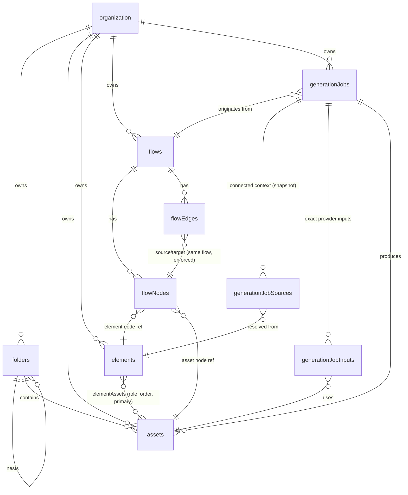

# TaleLabs — Database Design v2 (PostgreSQL)

Supersedes `db-design-planning.md`. Designed from the current product vision: **Assets → Elements → Flows → Generated Assets → Continued Iteration**, built in that order.

In scope: the three core entities, folders, the flow graph, and multi-context generation jobs executed through Trigger.dev.

Out of scope (deferred, with seams noted in [Future-proofing](#future-proofing)): billing/credits enforcement (though **costs are recorded from day one** — see `generationJobs`), Recipes, Tools, Storyboard, collaboration, projects, tags/favorites, public galleries.

Whole-graph execution ("run flow") is a **planned capability**, not a hypothetical: the first shipped experience is run-one-node, but the schema is designed so graph runs slot in without redesign — see [Graph execution](#11-graph-execution-flow-runs--designed-ahead-migrated-when-the-feature-ships). Credit-system design has its own planning document: `credits-planning.md`.

Retired from v1 — these do not return: `brands`, `products`, `characters`, `brand_characters`, `project_*` tables, job-level `character_id`, `credit_source`, `featured_at`, tags, favorites. Elements replace the per-entity context products; Flows replace Projects as the creative document.

Requires PostgreSQL 15+ (`unique nulls not distinct`, column-targeted `on delete set null`).

---

## How the tools shape the persistence layer

**React Flow (`@xyflow/react` v12)** serializes a canvas as `{ nodes, edges, viewport }`, where a node is `{ id, type, position: {x, y}, data }` and an edge is `{ id, source, target, sourceHandle?, targetHandle? }`. React Flow is UI only — it is not the source of truth. The DB stores the graph in **normalized `flowNodes` / `flowEdges` tables**, not one jsonb document, because the product requires relational answers React Flow can't give:

- "Where is this Element used?" (vision requirement) → `select "flowId" from "flowNodes" where "elementId" = $1`
- Server-side upstream context resolution at run time → walk `flowEdges` in SQL, no document parsing
- Autosave = per-node upserts (position changes touch one small row, not a rewritten megabyte document under TOAST)
- Referential integrity: a node's `elementId`/`assetId` are real FKs; deleting an Element nulls the reference instead of leaving silent dangling ids inside jsonb
- Collaboration later = per-row updates merge; a whole-document write is last-writer-wins by construction

Node/edge **ids are client-generated cuid2** (same `@paralleldrive/cuid2` lib runs in the browser) — React Flow creates nodes locally before any server round trip, and stable ids are the vision's prerequisite for future collaboration. The server validates format and uniqueness on write.

**Trigger.dev (v4)** owns queueing, retries, concurrency, cancellation, and run observability on its platform — we do not rebuild any of that in Postgres. What the DB owns is the **domain job record** (`generationJobs`): tenancy, provenance, immutable input snapshots, and the resulting Asset. The integration contract:

```txt
1. API validates + resolves context, INSERTs the job row (status 'pending') and its
   snapshot rows in one transaction
2. After commit: tasks.trigger("generate-image", { jobId }, { idempotencyKey: jobId })
   — payload carries ids only, the task loads state from the DB
3. The run id has two writers so it can never be permanently lost: the API stores
   the returned handle id, AND the task's first action persists its own ctx.run.id
   with the transition to 'running' — an API crash after triggering cannot leave a
   running job without its triggerRunId (cancellation/observability stay intact)
4. Provider submission is write-ahead: set providerSubmittedAt, call the provider
   (passing jobId as the provider-side idempotency key where supported), then
   persist providerJobId. On task retry:
     providerJobId set                          -> resume polling, never resubmit
     providerSubmittedAt set, providerJobId null -> outcome UNCERTAIN: query the
       provider by client reference if it supports one; otherwise fail the job
       with errorCode 'submission_uncertain' — never auto-resubmit expensive media
5. Output uploads use deterministic keys (generations/{jobId}/{outputIndex}), so a
   retried upload overwrites its own partial object instead of orphaning a new one
6. Completion is one transaction: insert output Asset(s) + guarded status update
   UPDATE ... SET status = 'succeeded' WHERE id = $1 AND status IN ('pending','running')
   — if that update affects zero rows the job was canceled meanwhile: roll back
   the Asset insert and delete the uploaded objects. Cancel racing completion
   resolves to exactly one outcome, never both.
7. Cancellation = runs.cancel(triggerRunId) + the same guarded update
8. Reconciliation sweeps: (a) redispatch status = 'pending' AND triggerRunId IS NULL
   AND createdAt < now() - interval '1 minute' — safe because idempotencyKey = jobId
   makes redispatch a no-op if the original trigger landed (running jobs never need
   this sweep thanks to step 3); (b) delete storage objects under generations/{jobId}/
   for terminally failed/canceled jobs — cleans orphans from crashes between upload
   and commit.
9. Run-status UI: poll our API, or subscribe via Trigger.dev Realtime with a
   public access token — either way the DB row is the domain truth
```

Duplicate protection, one mechanism per boundary: the DB idempotency key stops a retried _user_ request from creating two job rows; `idempotencyKey: jobId` stops a retried _dispatch_ from creating two runs; the write-ahead `providerSubmittedAt` + `providerJobId` pair (plus the unique `(provider, providerJobId)` index) stops a retried _task_ from creating or claiming two provider generations. True exactly-once at the provider is only possible where the provider supports idempotency keys — everywhere else the contract degrades to "at-most-once with explicit uncertainty", never "maybe twice".

---

## Conventions

- Better Auth tables `"user"`, `"organization"`, `"session"`, `"account"`, etc. exist already (singular, quoted — `user` is a reserved word).
- **Identifiers are quoted camelCase**, matching the existing database exactly: Better Auth created camelCase columns (`"createdAt"`, `"activeOrganizationId"`), the repo's migrations are raw SQL with quoted camelCase, and Kysely runs **without** `CamelCasePlugin` — so TS property names and SQL column names are the same string, no mapping layer. New tables follow suit (`"flowNodes"`, `"organizationId"`). Do not introduce `CamelCasePlugin` now: it would remap the existing Better Auth tables and break them.
- Primary keys: `text` holding cuid2. Server-generated everywhere except `flowNodes.id` / `flowEdges.id` (client-generated, validated).
- Every table is tenant-scoped by `"organizationId"`; `"createdBy"` (`on delete set null`) for attribution.
- `timestamptz` everywhere; `"createdAt"`/`"updatedAt"` on mutable tables.
- Archive (`"deletedAt"`) and purge (`"purgedAt"`) exist **only on `assets`** — see the two-tier deletion note there. Everything else hard-deletes.
- Enum-like values: `text` + `check` — except where the vocabulary is owned by a **code registry** (element types, node types, provider input roles), which get no check so a registry change never requires a migration. App-layer validation against the registry is the contract there.
- Migration order: `folders` → `flows` → `generationJobs` → `assets` → `elements` → `elementAssets` → `flowNodes` → `flowEdges` → `generationJobSources` → `generationJobInputs`.

---

## Entity relationship overview



---

## Schema

### 1. Folders — manual asset organization

Adjacency-list tree, org-wide.

```sql
create table "folders" (
  "id" text primary key,
  "organizationId" text not null references "organization"("id") on delete cascade,
  "parentId" text,
  "name" text not null,
  "createdAt" timestamptz not null default now(),
  "updatedAt" timestamptz not null default now(),
  unique ("id", "organizationId"),    -- composite target for org-scoped FKs
  foreign key ("parentId", "organizationId")
    references "folders" ("id", "organizationId") on delete cascade
);

create index "foldersOrgIdx" on "folders" ("organizationId");
create index "foldersParentIdx" on "folders" ("parentId");
```

**Cycle guard (app-layer, documented contract):** the adjacency list permits a folder to become its own descendant. Every folder _move_ must run inside the write transaction a recursive CTE walking the new parent's ancestor chain and reject the move if it contains the folder being moved. Creation can't produce cycles; only re-parenting can.

### 2. Flows — the creative document

Thin by design: the graph lives in the node/edge tables. `"viewport"` is the one piece of canvas state that belongs to the document (React Flow's `{ x, y, zoom }`).

`"revision"` is the autosave concurrency guard: debounced writes from two tabs can arrive out of order, so every graph write is compare-and-swap — the client sends the revision it based its change on, the server runs `update "flows" set "revision" = "revision" + 1, "updatedAt" = now() where "id" = $1 and "revision" = $2` in the same transaction as the node/edge upserts, and zero rows affected → `409`, client refetches and replays. This also gives "recently edited" sorting for free.

```sql
create table "flows" (
  "id" text primary key,
  "organizationId" text not null references "organization"("id") on delete cascade,
  "createdBy" text references "user"("id") on delete set null,
  "name" text not null,
  "viewport" jsonb not null default '{"x": 0, "y": 0, "zoom": 1}',
  "revision" bigint not null default 0,
  "createdAt" timestamptz not null default now(),
  "updatedAt" timestamptz not null default now(),
  unique ("id", "organizationId")     -- composite target for org-scoped FKs
);

create index "flowsOrgUpdatedIdx" on "flows" ("organizationId", "updatedAt" desc, "id" desc);
```

### 3. Generation jobs — the durable domain record of one node execution

One row per generation-node execution — whether the user ran that node directly or a future flow run executed it as part of the graph. The job is always the atomic unit: single provider, single model, one node. Everything the provider will see is snapshotted at create time (the vision's immutable-provenance rule); Trigger.dev executes it.

```sql
create table "generationJobs" (
  "id" text primary key,
  "organizationId" text not null references "organization"("id") on delete cascade,
  "createdBy" text references "user"("id") on delete set null,

  "flowId" text,                    -- history survives flow deletion (org-scoped FK below)
  "nodeId" text not null,           -- generation node id at run time; no FK — it's a snapshot,
                                    -- the node may be deleted or reused later

  "mediaType" text not null check ("mediaType" in ('image', 'video', 'audio')),
  "status" text not null default 'pending'
           check ("status" in ('pending', 'running', 'succeeded', 'failed', 'canceled')),

  "provider" text not null,
  "model" text not null,
  "settings" jsonb not null default '{}',  -- aspect ratio, resolution, seed, ... (model-shaped)
  "resolvedPrompt" text,            -- final instructions composed at create from all text/element sources

  "idempotencyKey" text not null,   -- required API header; unique per org below
  "requestHash" text not null,      -- detects same-key/different-body misuse
  "triggerRunId" text,              -- Trigger.dev run id; written by API on dispatch AND by the
                                    -- task itself (ctx.run.id) at start — never permanently lost
  "providerSubmittedAt" timestamptz,-- write-ahead marker set BEFORE the provider call; with
                                    -- providerJobId null it means outcome-uncertain: never resubmit
  "providerJobId" text,             -- provider execution id, persisted immediately after submission;
                                    -- task retries resume polling instead of resubmitting

  "creditCost" integer,             -- credits this execution cost, recorded from day one (no balance
                                    -- enforcement yet); pricing rules in credits-planning.md
  "providerCostUsd" numeric(12, 6), -- raw provider spend, captured at execution time

  "errorCode" text,                 -- stable failure class: 'content_policy', 'provider_timeout', ...
  "errorMessage" text,              -- safe to display; raw provider payloads go to logs only

  "createdAt" timestamptz not null default now(),
  "startedAt" timestamptz,
  "completedAt" timestamptz,

  unique ("id", "organizationId"),    -- composite target for org-scoped FKs
  foreign key ("flowId", "organizationId")
    references "flows" ("id", "organizationId") on delete set null ("flowId")
);

create index "generationJobsOrgCreatedIdx"
  on "generationJobs" ("organizationId", "createdAt" desc, "id" desc);
create index "generationJobsFlowIdx" on "generationJobs" ("flowId");
create index "generationJobsActiveIdx" on "generationJobs" ("status")
  where "status" in ('pending', 'running');
create unique index "generationJobsIdempotencyIdx"
  on "generationJobs" ("organizationId", "idempotencyKey");
create unique index "generationJobsTriggerRunIdx"
  on "generationJobs" ("triggerRunId") where "triggerRunId" is not null;
create unique index "generationJobsProviderJobIdx"
  on "generationJobs" ("provider", "providerJobId") where "providerJobId" is not null;
```

Notes:

- **No `characterId`, no `elementId`, no single `assetId`.** Context is plural by design and lives entirely in `generationJobSources` / `generationJobInputs` below.
- **No prompt column for user input.** In the Flow model, text arrives from connected Text nodes (plural); the raw texts are snapshotted per source, and `"resolvedPrompt"` is the composed result.
- **No retry/attempt/queue columns.** Trigger.dev owns retries, concurrency, and queueing; duplicating its state machine in Postgres would drift. `"status"` is the _domain_ outcome, written under the guarded-update rule (see the integration contract, including the atomic completion-vs-cancel transaction).
- **No `cancelRequestedAt`.** With `runs.cancel(triggerRunId)` doing the actual interruption, a single guarded status write suffices — if the task already finished, the update affects zero rows and the terminal status stands.
- `"mediaType"` includes video/audio from day one because the vision requires those nodes to reuse this exact foundation — same table, same snapshot model, no parallel systems.
- **Costs are recorded before billing exists.** `"creditCost"` and `"providerCostUsd"` are execution-time facts that cannot be faithfully reconstructed later (provider pricing changes, settings-dependent pricing). Recording them from the first shipped generation produces the real usage dataset the credit system will be calibrated against — the ledger and enforcement attach later (see `credits-planning.md`), the measurements start now.
- **No `"flowRunId"` yet.** Graph runs are designed ahead (section 11) and the column arrives with that migration; single-node execution never needs it.
- **Provider exactly-once is honest, not assumed.** `"providerSubmittedAt"` (write-ahead) + `"providerJobId"` (write-behind) bracket the provider call; the gap between them is the uncertainty window a retry must respect (contract step 4). The unique `(provider, "providerJobId")` index guarantees two job rows can never claim the same provider execution.
- The composite FK on `("flowId", "organizationId")` makes a cross-org flow reference structurally impossible — see [Tenant isolation](#tenant-isolation).

### 4. Assets — the canonical media library

The foundation, built first. Every upload and every successful generation output lands here.

```sql
create table "assets" (
  "id" text primary key,
  "organizationId" text not null references "organization"("id") on delete cascade,
  "createdBy" text references "user"("id") on delete set null,

  "name" text not null,
  "type" text not null check ("type" in ('image', 'video', 'audio', 'document')),
  "source" text not null check ("source" in ('upload', 'generation')),

  "storageKey" text not null unique,  -- R2 object key; never exposed to clients.
                                      -- unique: two rows must never share one object,
                                      -- or purging one silently breaks the other
  "thumbnailKey" text,                -- pre-rendered preview (video poster, image thumb)
  "mimeType" text not null,
  "sizeBytes" bigint,
  "width" integer,                    -- image/video
  "height" integer,                   -- image/video
  "durationSeconds" numeric(10, 3),   -- video/audio

  "folderId" text,
  "generationJobId" text,
  "outputIndex" smallint,             -- position within the producing job's outputs; preserves
                                      -- provider ordering and makes completion retries deterministic
  "uploadId" text,                    -- one-time upload-grant id (never the signed token itself)

  "metadata" jsonb not null default '{}',  -- codec, fps, color profile, exif, ...

  "createdAt" timestamptz not null default now(),
  "updatedAt" timestamptz not null default now(),
  "deletedAt" timestamptz,            -- tier 1: archive (reversible)
  "purgedAt" timestamptz,             -- tier 2: permanent (storage destroyed, row tombstoned)

  unique ("id", "organizationId"),    -- composite target for org-scoped FKs
  check ("source" <> 'generation' or "generationJobId" is not null),
  foreign key ("folderId", "organizationId")
    references "folders" ("id", "organizationId") on delete set null ("folderId"),
  foreign key ("generationJobId", "organizationId")
    references "generationJobs" ("id", "organizationId") on delete set null ("generationJobId")
);

create index "assetsOrgCreatedIdx" on "assets" ("organizationId", "createdAt" desc, "id" desc)
  where "deletedAt" is null and "purgedAt" is null;
create index "assetsOrgTypeIdx" on "assets" ("organizationId", "type")
  where "deletedAt" is null and "purgedAt" is null;
create index "assetsFolderIdx" on "assets" ("folderId")
  where "deletedAt" is null and "purgedAt" is null;
create unique index "assetsJobOutputIdx" on "assets" ("generationJobId", "outputIndex")
  where "generationJobId" is not null;
create unique index "assetsUploadIdIdx" on "assets" ("uploadId") where "uploadId" is not null;
```

Notes:

- **Two-tier deletion, and rows are never hard-deleted.** Archive sets `"deletedAt"` (reversible). Permanent deletion — the vision's explicit-confirmation action — deletes the R2 objects and sets `"purgedAt"`, leaving a tombstone row. This is what reconciles "permanent deletion" with "immutable generation provenance": the media is genuinely gone, but `generationJobInputs`, `elementAssets`, and `flowNodes` references stay intact and render as a tombstone placeholder instead of silently vanishing from history. Because rows persist, no cascade ever erases provenance; `generationJobInputs."assetId"` deliberately has **no** `on delete cascade`, so an accidental hard `DELETE` fails loudly on the FK instead of quietly rewriting job history.
- `"generationJobId"` on the asset (not `outputAssetId` on the job): one run can produce multiple outputs; uploads have `null`. Full provenance (model, settings, resolved prompt, inputs, elements) is one join away — never duplicated onto the asset. The `check` makes the link mandatory for `source = 'generation'` — a generated asset without its job is a contract violation, not a nullable edge case.
- `"outputIndex"` + the unique `("generationJobId", "outputIndex")` index give generated outputs a stable identity: provider ordering survives, and a retried completion transaction upserts the same rows instead of duplicating them. Storage keys derive from the same identity (`generations/{jobId}/{outputIndex}`), which is what makes upload retries overwrite-safe and orphan cleanup a prefix listing.
- `"storageKey"` is globally unique. If an asset-duplicate feature ever ships, it must copy the object, not share the key.
- `"uploadId"` keeps the replay-safe presigned-upload flow: signed stateless grant (binds org, user, object key, mime, size, expiry); registering the same grant twice returns the existing asset via the unique index. Upload object keys are deterministic per grant (`uploads/{grantId}`), so abandoned uploads (PUT completed, never registered) are sweepable: delete `uploads/` objects older than the grant TTL with no matching `"uploadId"` row — the storage-side twin of the generation-orphan sweep.
- Search: `ilike` on `"name"` first; `pg_trgm` GIN index when it hurts — no schema change either way.
- v1's `visibility`, tags, favorites, and `featured_at` are gone — the new vision doesn't include the public showcase, tagging, or favoriting. All delivery is signed-URL private for now; see [Future-proofing](#future-proofing) for the seams.

### 5. Elements — reusable creative context

One generic table for all element types. The **type registry lives in code** (validation schema, form component, asset roles, `buildContext`) — the DB stores the registry key and the type-shaped payload, and deliberately does not constrain the key, so shipping a `location` or `style` type is a registry change, not a migration.

**`"type"` is immutable after creation.** Changing a character into a product would orphan its `data` payload and asset roles; the product action for "wrong type" is creating a new element. Enforce in the app layer (no `update` path for the column).

`"schemaVersion"` records which version of the registry's schema wrote `"data"`. Registry schemas will evolve; the version lets the app upcast old payloads deterministically instead of guessing shape.

```sql
create table "elements" (
  "id" text primary key,
  "organizationId" text not null references "organization"("id") on delete cascade,
  "createdBy" text references "user"("id") on delete set null,
  "type" text not null,               -- registry key: 'character', 'product', later 'location', ...
                                      -- no check: vocabulary owned by the code registry, validated app-side
  "name" text not null,
  "instructions" text,                -- description / generation instructions (the shared field)
  "data" jsonb not null default '{}', -- type-specific fields, validated by the registry's Zod schema
  "schemaVersion" smallint not null default 1,
  "createdAt" timestamptz not null default now(),
  "updatedAt" timestamptz not null default now(),
  unique ("id", "organizationId")     -- composite target for org-scoped FKs
);

create index "elementsOrgTypeIdx" on "elements" ("organizationId", "type");
```

### 6. Element ↔ Asset — the relationship that carries meaning

Role, ordering, and primary-reference priority, exactly as the vision specifies. Roles are validated app-side against the registry's `assetRoles` for the element's type (including the accepted media types, e.g. `voice` accepts only `audio`).

```sql
create table "elementAssets" (
  "organizationId" text not null references "organization"("id") on delete cascade,
  "elementId" text not null,
  "assetId" text not null,
  "role" text not null,               -- registry-defined per element type: 'appearance', 'packshot', ...
  "sortOrder" smallint not null default 0,
  "isPrimary" boolean not null default false,
  "createdAt" timestamptz not null default now(),
  primary key ("elementId", "assetId", "role"),
  foreign key ("elementId", "organizationId")
    references "elements" ("id", "organizationId") on delete cascade,
  foreign key ("assetId", "organizationId")
    references "assets" ("id", "organizationId") on delete cascade
);

create index "elementAssetsAssetIdx" on "elementAssets" ("assetId");
create unique index "elementAssetsPrimaryIdx"
  on "elementAssets" ("elementId", "role") where "isPrimary";
```

The partial unique index makes "primary" mean something: at most one primary asset per role per element, enforced by the database rather than UI discipline.

Removing a row never deletes the asset; deleting an element cascades only the rows. `/elements/:id/assets` is the global asset library filtered through this table — one asset system.

### 7. Flow nodes — normalized graph, half relational, half document

The split rule: **anything the server queries or enforces is a column; anything only the canvas renders is `"data"`.**

```sql
create table "flowNodes" (
  "id" text primary key,              -- client-generated cuid2; stable for provenance + future collab
  "organizationId" text not null references "organization"("id") on delete cascade,
  "flowId" text not null,
  "type" text not null,               -- 'text' | 'asset' | 'element' | 'imageGeneration' — code registry, no check
  "positionX" double precision not null,
  "positionY" double precision not null,
  "elementId" text,                   -- set for element nodes
  "assetId" text,                     -- set for asset nodes (and generation outputs)
  "data" jsonb not null default '{}', -- node-type payload: text content, model+settings draft, ui state
  "schemaVersion" smallint not null default 1,  -- registry schema version that wrote "data"
  "createdAt" timestamptz not null default now(),
  "updatedAt" timestamptz not null default now(),
  unique ("flowId", "id"),            -- composite target for flow-scoped edge FKs below
  foreign key ("flowId", "organizationId")
    references "flows" ("id", "organizationId") on delete cascade,
  foreign key ("elementId", "organizationId")
    references "elements" ("id", "organizationId") on delete set null ("elementId"),
  foreign key ("assetId", "organizationId")
    references "assets" ("id", "organizationId") on delete set null ("assetId")
);

create index "flowNodesFlowIdx" on "flowNodes" ("flowId");
create index "flowNodesElementIdx" on "flowNodes" ("elementId") where "elementId" is not null;
create index "flowNodesAssetIdx" on "flowNodes" ("assetId") where "assetId" is not null;
```

- `"elementId"`/`"assetId"` as real FK columns (not buried in `"data"`) buy the two things jsonb can't: the "where is this Element used?" query, and `set null` behavior so deleting an Element leaves a visibly-unresolved node instead of a silently broken reference.
- `"positionX"/"positionY"` as columns because drag-autosave is the hottest write path — a two-float HOT update per node beats rewriting a document.
- A generation node's _draft_ config (chosen model, settings) lives in `"data"`; the run-time truth is snapshotted onto `generationJobs`. Draft and provenance never share storage.
- Autosave protocol (API concern, stated here because it shapes the tables): the client sends batched node upserts + deletes and edge inserts + deletes per debounce tick, wrapped in the flow-revision compare-and-swap described on `flows`. No whole-graph replacement endpoint.

### 8. Flow edges

```sql
create table "flowEdges" (
  "id" text primary key,              -- client-generated cuid2
  "flowId" text not null,
  "sourceNodeId" text not null,
  "targetNodeId" text not null,
  "sourceHandle" text,                -- React Flow sets these only when handles are named
  "targetHandle" text,
  "createdAt" timestamptz not null default now(),
  foreign key ("flowId", "sourceNodeId") references "flowNodes"("flowId", "id") on delete cascade,
  foreign key ("flowId", "targetNodeId") references "flowNodes"("flowId", "id") on delete cascade,
  unique nulls not distinct ("flowId", "sourceNodeId", "sourceHandle", "targetNodeId", "targetHandle")
);

create index "flowEdgesFlowIdx" on "flowEdges" ("flowId");
create index "flowEdgesTargetIdx" on "flowEdges" ("targetNodeId");
```

- **Cross-flow edges are impossible at the DB level**: both endpoint FKs are composite over `("flowId", nodeId)`, so an edge can only reference nodes of its own flow — no application check to forget. (The `flows` FK is implied transitively through the node FKs.)
- The `nulls not distinct` unique constraint prevents duplicate connections even when handles are unset — plain `unique` would treat two `null` handles as distinct and allow doubles.
- `"flowEdgesTargetIdx"` is the run-time resolution index: "give me everything connected _into_ this generation node" is one indexed lookup, then recurse upstream if node-output chaining needs it.
- Deleting a node cascades its edges — matching React Flow's canvas behavior exactly, no orphan cleanup.

### 9. Generation job sources — every connected context source, snapshotted

The vision's first provenance level: _all context sources connected to the generation node_, with deterministic ordering, resolved element text, and the candidate references considered — frozen at create time. Later edits to flows, elements, or element-asset links must never rewrite these rows.

```sql
create table "generationJobSources" (
  "id" text primary key,
  "organizationId" text not null references "organization"("id") on delete cascade,
  "jobId" text not null,
  "sortOrder" smallint not null,
  "sourceType" text not null
               check ("sourceType" in ('text', 'element', 'asset', 'nodeOutput')),
  "nodeId" text not null,             -- flow node this source came from (snapshot, no FK)
  "elementId" text,                   -- live pointer for "jobs using this element"
  "assetId" text,                     -- for raw-asset / node-output sources
  "resolvedText" text,                -- text node content, or the element's buildContext output
  "snapshot" jsonb not null default '{}',
               -- frozen payload: element type, candidate asset refs {assetId, role, priority},
               -- exclusions + input-limit decisions. Snapshot data — queried never, replayed always.
  unique ("jobId", "sortOrder"),
  unique ("jobId", "id"),             -- composite target for job-scoped input FK below
  foreign key ("jobId", "organizationId")
    references "generationJobs" ("id", "organizationId") on delete cascade,
  foreign key ("elementId", "organizationId")
    references "elements" ("id", "organizationId") on delete set null ("elementId"),
  foreign key ("assetId", "organizationId")
    references "assets" ("id", "organizationId") on delete set null ("assetId")
);

create index "generationJobSourcesJobIdx" on "generationJobSources" ("jobId");
create index "generationJobSourcesElementIdx" on "generationJobSources" ("elementId")
  where "elementId" is not null;
```

The column/jsonb split is deliberate: `"elementId"` and `"assetId"` stay relational because "which runs used this element/asset as context" is a product query; the candidate list and exclusion decisions go into `"snapshot"` because they are read back only to display provenance — normalizing them would add a fourth table for zero query value.

Two resolution rules the vision requires but React Flow does not provide, defined here so `"sortOrder"` is never arbitrary:

- **Source ordering:** React Flow edges are an unordered set, but the vision demands deterministic context ordering (it affects prompt composition). Default order = `(flowEdges."createdAt", "id")` of the incoming connections — stable and reproducible. The generation node's `"data"` may store an explicit user-defined ordering that overrides the default. Whichever rule applied, the job's `"sortOrder"` freezes the outcome — provenance never depends on re-deriving it.
- **`nodeOutput` resolution:** a generation node consumed as a source resolves, by default, to the outputs of its **latest succeeded job** (ordered by `"outputIndex"`). The consuming node's `"data"` may pin a specific output instead. Either way, resolution happens at job create and the concrete `"assetId"` lands on the source row — a later re-run of the upstream node never rewrites what this job actually consumed.

### 10. Generation job inputs — the exact provider subset

The second provenance level: _the exact text and Asset inputs submitted to the provider_, after model-capability filtering and user selection. Distinct from sources: a job may have five connected sources contributing twelve candidate assets, of which the model accepted three.

```sql
create table "generationJobInputs" (
  "organizationId" text not null references "organization"("id") on delete cascade,
  "jobId" text not null,
  "assetId" text not null,
  "sourceId" text,
  "role" text not null default 'reference',           -- model-capability vocabulary ('reference',
                                                      -- 'firstFrame', 'mask', 'controlImage', ...)
                                                      -- owned by the model registry, validated app-side —
                                                      -- no check, new model capabilities need no migration
  "sortOrder" smallint not null default 0,
  primary key ("jobId", "assetId", "role"),
  foreign key ("jobId", "organizationId")
    references "generationJobs" ("id", "organizationId") on delete cascade,
  foreign key ("assetId", "organizationId")
    references "assets" ("id", "organizationId"),     -- NO cascade: provenance must survive;
                                                      -- assets tombstone via "purgedAt", never hard-delete
  foreign key ("jobId", "sourceId") references "generationJobSources"("jobId", "id")
    on delete set null ("sourceId")   -- job-scoped: an input can only cite a source of its own job
);

create index "generationJobInputsAssetIdx" on "generationJobInputs" ("assetId");
```

Text inputs need no row here: the submitted text _is_ `generationJobs."resolvedPrompt"`. This table exists for the binary inputs, where "which exact files went to the provider" and the reverse question "which runs used this asset" both matter.

---

### 11. Graph execution (flow runs) — designed ahead, migrated when the feature ships

Running a whole flow is a planned product capability. The design principle that makes it cheap: **a flow run is an orchestration record, not a new kind of execution.** Every node execution inside a run is still an ordinary `generationJobs` row — same snapshot model, same provenance, same Trigger.dev task, same cost columns. The run adds coordination on top.

```sql
-- ships with the run-flow feature, not in the initial migration
create table "flowRuns" (
  "id" text primary key,
  "organizationId" text not null references "organization"("id") on delete cascade,
  "createdBy" text references "user"("id") on delete set null,
  "flowId" text,
  "status" text not null default 'pending'
           check ("status" in ('pending', 'running', 'succeeded', 'partial', 'failed', 'canceled')),
  "plan" jsonb not null default '{}',   -- execution-plan snapshot: generation node ids, dependency
                                        -- levels, skip decisions — frozen at run start
  "triggerRunId" text,                  -- parent orchestration task run
  "creditCost" integer,                 -- aggregate of child job costs
  "errorCode" text,
  "errorMessage" text,
  "createdAt" timestamptz not null default now(),
  "startedAt" timestamptz,
  "completedAt" timestamptz,

  unique ("id", "organizationId"),
  foreign key ("flowId", "organizationId")
    references "flows" ("id", "organizationId") on delete set null ("flowId")
);

create index "flowRunsOrgCreatedIdx" on "flowRuns" ("organizationId", "createdAt" desc, "id" desc);
create index "flowRunsFlowIdx" on "flowRuns" ("flowId");

-- same migration (org-scoped, matching the tenant-isolation pattern):
alter table "generationJobs" add column "flowRunId" text;
alter table "generationJobs" add constraint "generationJobsFlowRunFk"
  foreign key ("flowRunId", "organizationId")
  references "flowRuns" ("id", "organizationId") on delete set null ("flowRunId");
create index "generationJobsFlowRunIdx" on "generationJobs" ("flowRunId") where "flowRunId" is not null;
```

Execution semantics (the parent Trigger.dev task):

- **Plan at start:** topologically sort the flow's generation nodes from `flowEdges`, snapshot the plan into `"plan"` — later canvas edits don't affect a running run.
- **Child jobs are created just-in-time, level by level** — not all at run start. This is forced by the snapshot model, and it's a feature: a downstream node's context includes upstream _outputs_ (`sourceType = 'nodeOutput'`, already in the sources vocabulary), which don't exist until the upstream job succeeds. Create-time snapshotting is preserved per node.
- **Parallel branches** run concurrently (`batchTriggerAndWait` on the level's jobs); Trigger.dev owns the waiting.
- **Child idempotency:** `idempotencyKey = flowRunId + ':' + nodeId` — a retried parent orchestration never double-creates a node's job.
- **Partial failure:** a failed node skips its downstream dependents (recorded in `"plan"`); the run ends `'partial'` if some jobs succeeded, `'failed'` if none did. Succeeded outputs are already durable assets — a partial run loses nothing that completed.
- **Cancel** cancels the parent run and cascades `runs.cancel` + guarded updates to active children.
- **Costs:** each child records its own `"creditCost"`; the run's aggregate is the sum, denormalized onto the run row at completion for cheap history lists. Credit reservation strategy for whole runs (reserve aggregate up front vs. per node) is a credits-system decision — analyzed in `credits-planning.md`, not constrained by this schema.

Tools (vision's later layer) reuse this exact model: a tool run is a `flowRuns` row over an immutable internal graph snapshot instead of a live flow — which is why no separate `toolRuns` table is planned.

---

## How the product loop maps to this schema

**Run one generation node:**

1. API loads the node, walks `flowEdges` into it, loads connected text/asset/element nodes
2. Resolves each element via the code registry's `buildContext` + `elementAssets`
3. Applies model capability limits, selects/asks about references, composes `"resolvedPrompt"`
4. One transaction: insert `generationJobs` (+ `generationJobSources`, + `generationJobInputs`)
5. After commit: `tasks.trigger("generate-image", { jobId }, { idempotencyKey: jobId })`, store `"triggerRunId"` (reconciliation sweep covers a crash in between)
6. Task submits to provider → persists `"providerJobId"` → polls → uploads output to R2 → one transaction: insert asset (`source = 'generation'`) + guarded status update to `succeeded`
7. Canvas exposes the output **by derivation, never by copying**: the node's result display queries the latest jobs + output assets for `("flowId", "nodeId")` — storing output asset ids inside `"data"` would dangle when an asset is archived or purged, and would duplicate what one indexed query answers. The user may additionally materialize an output as a real asset node (that node's `"assetId"` FK then behaves like any asset reference: `set null` on delete, tombstone on purge)

**Simple flow (prompt → generate):** two `flowNodes`, one `flowEdges` row, one run. No ceremony — the schema's minimum matches the vision's minimum.

**Element detail / assets tab:** `elementAssets where "elementId"` joined to live assets — the same asset components, filtered.

**"Where is this Element used?":** `flowNodes where "elementId" = $1` (canvases) ∪ `generationJobSources where "elementId" = $1` (runs).

**Iteration/branching:** outputs are assets; assets are nodes; nodes connect onward. Provenance chains are walkable: asset → `"generationJobId"` → sources → upstream asset/element ids → their jobs, recursively.

---

## Tenant isolation

Tenant integrity is **DB-enforced, not application-promised**. Because this is a fresh schema, the composite-FK pattern that v1 deferred costs nothing to include from day one: every parent table carries `unique ("id", "organizationId")`, every intra-schema reference pairs the id with `"organizationId"`, and nullable references use PostgreSQL 15's column-targeted `on delete set null ("<col>")` so a delete never nulls the tenant key. A missed application check can therefore no longer associate another organization's asset, element, folder, flow, or job — Postgres rejects the row.

DB-enforced, by mechanism:

```txt
same-org   folders."parentId", assets."folderId"/."generationJobId",
           generationJobs."flowId", flowNodes (flow/element/asset),
           elementAssets (element/asset), generationJobSources (job/element/asset),
           generationJobInputs (job/asset)          -> composite org FKs
same-flow  flowEdges endpoints                      -> composite ("flowId", nodeId) FKs
           (org implied transitively through the node FKs)
same-job   generationJobInputs."sourceId"           -> composite ("jobId", id) FK
```

The service layer still owns _authorization_ (is this caller allowed to touch this org's rows?) and returns `404` for cross-org lookups — another org's resource stays indistinguishable from a missing one. What it no longer owns is referential tenant _integrity_.

---

## Future-proofing

Seams that exist without speculative tables:

- **Video/audio generation nodes:** already absorbed — `generationJobs."mediaType"`, the same sources/inputs model, new node `"type"` values in the code registry. Zero migrations.
- **New element types** (`location`, `style`, `brand`…) and **new provider input roles** (`mask`, `controlImage`…): registry entries + app validation. Zero migrations — that's why those columns have no checks.
- **Registry schema evolution:** `"schemaVersion"` on `elements` and `flowNodes` lets new registry schemas upcast old payloads deterministically.
- **Graph execution:** fully designed in section 11 — `flowRuns` + `generationJobs."flowRunId"` ship as one migration when the run-flow feature does. Nothing in the initial schema needs to change for it.
- **Recipes:** a `recipes` table holding a _cloned graph snapshot_ (jsonb is right there, since a template is a document, not a queried graph) + insertion logic that re-ids nodes/edges. The stable-id + normalized-graph design makes "save selection as recipe" a `select` and "add to flow" a batch insert with fresh cuid2s.
- **Tools:** reuse the `flowRuns` orchestration model (section 11) over an immutable internal graph snapshot — a tool run spans providers and media types, so it is an orchestration record, never a `generationJobs` row; jobs stay single-provider, single-model execution units.
- **Collaboration:** stable client-generated node/edge ids and per-row graph writes are the prerequisites, already in place; the flow `"revision"` CAS is the single-writer serialization point a sync layer would replace. Presence is ephemeral (never in Postgres); durable state is these tables.
- **Billing/credits:** `"creditCost"` and `"providerCostUsd"` are already recorded per execution — the calibration dataset accumulates from launch. The ledger, balances, and reservation lifecycle attach to `generationJobs."id"` / `flowRuns."id"` later; full analysis in `credits-planning.md`.
- **Public delivery / showcase:** if a public bucket returns, `assets` gains a `"visibility"` column (write-time snapshot, as designed in v1) — additive.
- **Tags/favorites/projects:** deliberately dropped with the new vision; each returns as one small table or column _if_ usage proves the need. Folders + element filters are the bet.
- **Simple Generate page:** per the vision, it would create a lightweight flow (or one-off job rows with `"flowId"` null — the column is already nullable). No parallel generation architecture.

## What was deliberately not built

- **No jsonb graph document** — normalized nodes/edges for queries, integrity, autosave granularity, and collab-readiness (rationale in the React Flow section).
- **No Trigger.dev state mirror** — no attempts/queue/retry columns; their platform owns execution mechanics, our row owns the domain outcome (`"providerJobId"` is provider state, not Trigger state — it's what makes task retries resume instead of resubmit).
- **No outbox table** — the reconciliation sweep over the existing active-status index redispatches undispatched jobs; idempotent dispatch makes it safe without new schema.
- **No element-type / node-type / input-role tables or checks** — the code registries own those vocabularies; the DB stores keys and validated payloads.
- **No hard asset deletion path** — purge tombstones satisfy both "permanent deletion" and "immutable provenance"; a cascade that rewrites job history is not a feature.
- **No `flowRuns` in the initial migration** — graph execution is fully designed (section 11, DDL ready) but ships with the run-flow feature; single-node execution carries zero orchestration overhead until then.
- **No recipe, tool, or collaboration tables yet** — seams documented above, built when their layer ships.
- **No graph-history/versioning tables** — autosave overwrites under revision CAS; version history is a later product layer.
- **No projects** — the vision retires them; flows are the document, folders organize assets.

---

## Appendix — base features exercised against the schema

Every query the vision's build order (Assets → Elements → Flows → generation loop) needs, written out. If a base feature required a query this schema couldn't serve from an index, that would be a design bug — this appendix is the proof of coverage and doubles as the implementer's cookbook. `$n` are bind parameters; all queries implicitly carry the session's `"organizationId"`.

### Assets (build step 1)

```sql
-- Library page: type filter + folder filter + search + cursor pagination, one index path
select *
from "assets"
where "organizationId" = $1
  and "deletedAt" is null and "purgedAt" is null
  and ($2::text[] is null or "type" = any ($2))          -- media-type filter
  and ($3::text is null or "folderId" = $3)              -- folder filter
  and ($4::text is null or "name" ilike '%' || $4 || '%') -- search
  and ($5::timestamptz is null or ("createdAt", "id") < ($5, $6))  -- cursor
order by "createdAt" desc, "id" desc
limit 50;

-- Folder tree (small per org; client assembles)
select "id", "parentId", "name" from "folders" where "organizationId" = $1;

-- Rename / move / archive / restore: single-row updates on "name", "folderId", "deletedAt"

-- Permanent delete = purge (rows never hard-delete):
update "assets" set "purgedAt" = now(), "updatedAt" = now()
where "id" = $1 and "organizationId" = $2 and "purgedAt" is null;
-- then delete R2 objects for "storageKey"/"thumbnailKey"
```

### Elements (build step 2)

```sql
-- Element list with card preview (primary asset of the registry's preview role)
select e.*, a."thumbnailKey"
from "elements" e
left join "elementAssets" ea
  on ea."elementId" = e."id" and ea."isPrimary" and ea."role" = $2  -- preview role per type, from the registry
left join "assets" a on a."id" = ea."assetId" and a."purgedAt" is null
where e."organizationId" = $1
order by e."updatedAt" desc, e."id" desc;

-- Element assets tab = the global library filtered through the link table
select a.*, ea."role", ea."sortOrder", ea."isPrimary"
from "elementAssets" ea
join "assets" a on a."id" = ea."assetId"
where ea."elementId" = $1 and a."deletedAt" is null and a."purgedAt" is null
order by ea."role", ea."sortOrder", a."id";

-- Attach / set primary / reorder / detach: writes on "elementAssets"
-- (partial unique index enforces one primary per role; app validates role against the registry)

-- "Where is this Element used?" (vision requirement): canvases ∪ runs
select distinct "flowId" from "flowNodes" where "elementId" = $1
union
select j."flowId"
from "generationJobSources" s
join "generationJobs" j on j."id" = s."jobId"
where s."elementId" = $1 and j."flowId" is not null;
```

### Flows (build step 3)

```sql
-- Open canvas: three indexed reads
select * from "flowNodes" where "flowId" = $1;
select * from "flowEdges" where "flowId" = $1;
select "id", "nodeId", "status" from "generationJobs"
where "flowId" = $1 and "status" in ('pending', 'running');   -- live node badges

-- Autosave tick (one transaction): CAS first, then batched upserts/deletes
update "flows" set "revision" = "revision" + 1, "updatedAt" = now()
where "id" = $1 and "organizationId" = $2 and "revision" = $3;  -- 0 rows -> 409, client refetches
-- insert ... on conflict ("id") do update  for nodes; insert/delete for edges

-- Node result display (derived, never stored — see product-loop step 7)
select j."id" as "jobId", j."status", j."createdAt", a."id" as "assetId", a."outputIndex", a."thumbnailKey"
from "generationJobs" j
left join "assets" a on a."generationJobId" = j."id" and a."purgedAt" is null
where j."flowId" = $1 and j."nodeId" = $2
order by j."createdAt" desc, a."outputIndex"
limit 20;
```

### Run one generation node (build step 4)

```sql
-- Resolve upstream context: everything connected INTO the node, deterministic default order
select n.*, e."sourceHandle", e."targetHandle", e."createdAt" as "connectedAt", e."id" as "edgeId"
from "flowEdges" e
join "flowNodes" n on n."id" = e."sourceNodeId"
where e."flowId" = $1 and e."targetNodeId" = $2
order by e."createdAt", e."id";
-- then per element node: elementAssets rows; per nodeOutput source: latest succeeded job's
-- outputs for that node (rules in section 9); compose resolvedPrompt; insert job + sources
-- + inputs in one transaction; dispatch (integration contract steps 2-4)

-- Poll job status (or Trigger.dev Realtime)
select "id", "status", "errorCode", "errorMessage" from "generationJobs"
where "id" = $1 and "organizationId" = $2;
```

### Provenance and iteration (the loop's second half)

```sql
-- Asset detail: full generation provenance, one join chain
select j.*, s."sortOrder", s."sourceType", s."elementId", s."assetId" as "sourceAssetId",
       s."resolvedText", s."snapshot"
from "assets" a
join "generationJobs" j on j."id" = a."generationJobId"
left join "generationJobSources" s on s."jobId" = j."id"
where a."id" = $1
order by s."sortOrder";

-- "Which runs used this asset as an input?" (reverse provenance)
select i."jobId", i."role", j."createdAt", j."status"
from "generationJobInputs" i
join "generationJobs" j on j."id" = i."jobId"
where i."assetId" = $1
order by j."createdAt" desc;

-- Save a generated result back to an Element (vision requirement): one insert
insert into "elementAssets" ("organizationId", "elementId", "assetId", "role")
values ($1, $2, $3, $4);
```

Coverage verdict: every listed base feature resolves to indexed single-digit-millisecond queries; nothing requires a table scan, a jsonb unpack in a hot path, or schema the doc doesn't define. The three contracts that needed defining beyond DDL (source ordering, `nodeOutput` resolution, derived node results) are specified in sections 9 and the product-loop mapping.
