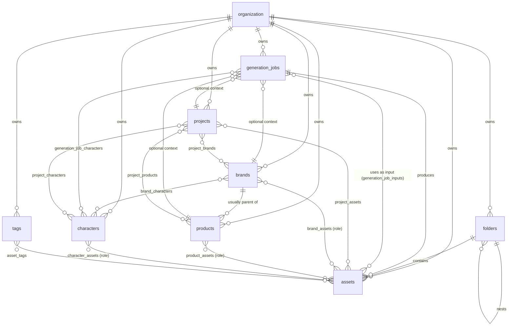

# TaleLabs — MVP Database Structure (PostgreSQL)

Scope: the first billable creative loop — **Brands + Products + Characters → Generate → Assets → Projects**.

Assumed to already exist (not modeled here): the Better Auth tables `"organization"` and `"user"` (singular names, as Better Auth creates them — do not rename auth-library-managed tables). All DDL below quotes them; `user` is a reserved keyword in Postgres, so the quotes on `"user"` are mandatory, not style. Every table below is tenant-scoped by `organization_id`; `created_by` references `"user"` where creator attribution matters.

Deliberately out of scope for this schema (per current direction): organization/membership modeling, billing, credit ledger/reservations, boards, workflows, voices, studio, public gallery, team collaboration. The design leaves clean seams for all of them (see [Future-proofing](#future-proofing)).

Apps, models, presets, and pricing rules are **static config (YAML/TS)**, not database rows. The database only stores *references* to them (slugs/ids as text), per the product's configuration strategy.

---

## Design principles

1. **Assets are global (org-wide), relations are links.** Nothing "owns" an asset except the organization. Projects, brands, products, and characters *relate* to assets through join tables. This directly implements the product rule "Assets should remain global."
2. **Explicit join tables, no polymorphism.** There are only 4 context entities (brand, product, character, project). Four small join tables with real foreign keys beat one polymorphic `entity_type/entity_id` table that Postgres can't enforce. Fewer bugs, honest constraints, trivial queries.
3. **Generation truth lives on the job, not the asset.** Prompt, model, settings, and context selections are recorded once on `generation_jobs`. An asset points at the job that produced it. No duplication, and the "inspect generation settings / copy prompt" feature is a single join.
4. **`jsonb` only where the shape is genuinely provider/model-dependent** (generation settings, asset technical metadata). Everything the product filters or displays on gets a real column.
5. **`text` + `CHECK` instead of Postgres `ENUM` types.** Same integrity, painless to extend in a migration (no `ALTER TYPE` locking dance).
6. **`organization_id` on every table, including join tables' parents.** All list queries lead with the org key; child rows inherit tenancy through their parent FKs, so join tables don't repeat it.

---

## Entity relationship overview



---

## Conventions

- Primary keys: `text`, holding cuid2 ids (`@paralleldrive/cuid2`) generated in application code at insert time. No DB-side default — the app always supplies the id. All FK columns are `text` to match. (cuid2's random distribution means b-tree inserts scatter rather than append; a non-issue at MVP scale and an accepted trade-off of the id scheme.)
- All timestamps `timestamptz`, `created_at`/`updated_at` on every mutable table (`updated_at` maintained by app code or one shared trigger).
- `created_by text REFERENCES "user"(id)` on user-authored entities — the vision's asset metadata explicitly includes "creator". `ON DELETE SET NULL` so departing users never take content with them.
- Migration order matters once: `generation_jobs` before `assets` (assets point at their producing job), `assets` before `generation_job_inputs` (inputs reference both). Everything else follows the section order below.
- Soft delete (`deleted_at`) **only on `assets`** — it's the one entity with an explicit archive/restore product behavior and irreplaceable content. Everything else hard-deletes; join-table rows disappear via `ON DELETE CASCADE`.
- Naming: `snake_case`, plural table names.

---

## Schema

### 1. Brands — reusable identity context

MVP fields straight from the vision (name, description, tone, visual style, do/don't rules). Logos and reference images are **assets** linked through `brand_assets` with a `role` — never a single `logo_url` column, because real brands have many logo variants.

```sql
CREATE TABLE brands (
    id              text PRIMARY KEY,
    organization_id text NOT NULL REFERENCES "organization"(id) ON DELETE CASCADE,
    created_by      text REFERENCES "user"(id) ON DELETE SET NULL,
    name            text NOT NULL,
    description     text,
    tone_of_voice   text,
    visual_style    text,
    do_rules        text,   -- "always show the product in daylight"
    dont_rules      text,   -- "never use competitor colors"
    colors          jsonb NOT NULL DEFAULT '[]',  -- [{ "name": "Primary", "hex": "#FF5A00" }, ...]
    created_at      timestamptz NOT NULL DEFAULT now(),
    updated_at      timestamptz NOT NULL DEFAULT now()
);

CREATE INDEX brands_org_idx ON brands (organization_id);
```

`colors` is an ordered jsonb array of `{ name, hex }` objects rather than `text[]` of hex codes, because brand palettes are labeled (Primary, Secondary, Accent) and both the UI and prompt assembly want those labels. Validate shape app-side (Zod) on write; nothing filters on colors, so no index.

Later fields (audience, competitors, CTA examples) are plain `ALTER TABLE ... ADD COLUMN` migrations — don't pre-add them.

### 2. Products — reusable product context

Products *usually* belong to a brand, but the FK is nullable so a standalone product doesn't force fake brand creation. Product images are assets linked via `product_assets`.

```sql
CREATE TABLE products (
    id              text PRIMARY KEY,
    organization_id text NOT NULL REFERENCES "organization"(id) ON DELETE CASCADE,
    created_by      text REFERENCES "user"(id) ON DELETE SET NULL,
    brand_id        text REFERENCES brands(id) ON DELETE SET NULL,
    name            text NOT NULL,
    description     text,
    features        text[] NOT NULL DEFAULT '{}',
    benefits        text[] NOT NULL DEFAULT '{}',
    created_at      timestamptz NOT NULL DEFAULT now(),
    updated_at      timestamptz NOT NULL DEFAULT now()
);

CREATE INDEX products_org_idx   ON products (organization_id);
CREATE INDEX products_brand_idx ON products (brand_id);
```

`features`/`benefits` are bullet lists the UI renders and prompts consume — `text[]` is the simplest honest shape. Landing-page URL, audience, positioning: add columns when the feature ships.

### 3. Characters — reusable character identity

Global (org-wide) by default. Never exclusively owned by a brand or project — both linkages are many-to-many (`brand_characters`, `project_characters` below), because the vision says a character can be global, brand-specific, or reused across brands and projects (the agency case: one mascot serving several client brands). Reference images / sample videos / voice refs are assets via `character_assets`.

Note the deliberate asymmetry with products: `products.brand_id` is a single FK because products *belong to* a brand (ownership), while characters *relate to* brands (reuse).

```sql
CREATE TABLE characters (
    id              text PRIMARY KEY,
    organization_id text NOT NULL REFERENCES "organization"(id) ON DELETE CASCADE,
    created_by      text REFERENCES "user"(id) ON DELETE SET NULL,
    name            text NOT NULL,
    role            text,   -- "spokesperson", "brand mascot", "AI influencer"
    description     text,
    personality     text,
    visual_notes    text,
    created_at      timestamptz NOT NULL DEFAULT now(),
    updated_at      timestamptz NOT NULL DEFAULT now()
);

CREATE INDEX characters_org_idx ON characters (organization_id);
```

### 4. Projects — workspace/campaign containers

Simple containers and filters for MVP. They group reusable objects without owning them.

```sql
CREATE TABLE projects (
    id              text PRIMARY KEY,
    organization_id text NOT NULL REFERENCES "organization"(id) ON DELETE CASCADE,
    created_by      text REFERENCES "user"(id) ON DELETE SET NULL,
    name            text NOT NULL,
    description     text,
    created_at      timestamptz NOT NULL DEFAULT now(),
    updated_at      timestamptz NOT NULL DEFAULT now()
);

CREATE INDEX projects_org_idx ON projects (organization_id);
```

### 5. Folders — manual asset organization (tree)

Folders are org-wide (one shared drive per organization), matching the Drive-like mental model.

```sql
CREATE TABLE folders (
    id              text PRIMARY KEY,
    organization_id text NOT NULL REFERENCES "organization"(id) ON DELETE CASCADE,
    parent_id       text REFERENCES folders(id) ON DELETE CASCADE,
    name            text NOT NULL,
    created_at      timestamptz NOT NULL DEFAULT now(),
    updated_at      timestamptz NOT NULL DEFAULT now()
);

CREATE INDEX folders_org_idx    ON folders (organization_id);
CREATE INDEX folders_parent_idx ON folders (parent_id);
```

Adjacency list (`parent_id`) is enough: folder trees are shallow and small per org; a recursive CTE handles breadcrumbs. No ltree/closure tables until proven necessary.

### 6. Generation jobs — the async work record

One row per generation request. This is where prompt, model, settings, context selections, and cost live. Apps are static config, so `app_id` is just the config slug (e.g. `scene-builder`).

```sql
CREATE TABLE generation_jobs (
    id              text PRIMARY KEY,
    organization_id text NOT NULL REFERENCES "organization"(id) ON DELETE CASCADE,
    created_by      text REFERENCES "user"(id) ON DELETE SET NULL,

    media_type      text NOT NULL CHECK (media_type IN ('image', 'video', 'audio')),
    status          text NOT NULL DEFAULT 'pending'
                    CHECK (status IN ('pending', 'running', 'succeeded', 'failed', 'canceled')),

    provider        text NOT NULL,           -- 'openrouter', 'fal', 'direct:openai', ...
    model           text NOT NULL,           -- 'bytedance/seedance-2.0'
    app_id          text,                    -- static-config app slug, NULL for free Generate
    prompt          text,                    -- the user's prompt exactly as typed
    resolved_prompt text,                    -- final provider prompt, composed at job creation (see notes)
    settings        jsonb NOT NULL DEFAULT '{}',  -- aspect_ratio, duration, seed, quality, ...

    -- context selections (all optional; snapshot of what was picked in Generate)
    -- characters are many-per-job via generation_job_characters below
    brand_id        text REFERENCES brands(id)   ON DELETE SET NULL,
    product_id      text REFERENCES products(id) ON DELETE SET NULL,
    project_id      text REFERENCES projects(id) ON DELETE SET NULL,

    idempotency_key text NOT NULL,           -- client-supplied; unique per org below
    request_hash    text NOT NULL,           -- hash of the create body; detects key reuse with a different payload
    credit_source   text NOT NULL DEFAULT 'unmetered'
                    CHECK (credit_source IN ('unmetered', 'promotional', 'subscription', 'top_up')),
                    -- funding snapshot; drives output visibility (see notes)
    credit_cost     integer,                 -- final charged cost; ledger comes later
    error_code      text,                    -- stable failure class: 'content_policy', 'provider_timeout', ...
    error_message   text,                    -- human-readable, safe to display; raw provider payloads go to logs only
    provider_job_id text,                    -- upstream async job reference for polling/webhooks
    cancel_requested_at timestamptz,         -- set when cancel hits a running job; worker resolves final status

    created_at      timestamptz NOT NULL DEFAULT now(),
    started_at      timestamptz,
    completed_at    timestamptz
);

CREATE INDEX generation_jobs_org_created_idx ON generation_jobs (organization_id, created_at DESC);
CREATE INDEX generation_jobs_active_idx ON generation_jobs (status)
    WHERE status IN ('pending', 'running');
CREATE UNIQUE INDEX generation_jobs_idempotency_idx
    ON generation_jobs (organization_id, idempotency_key);
```

Characters are the one context that is genuinely many-per-job — a scene with two characters interacting is a core creative case, not an edge case — so they get a join table instead of a FK:

```sql
CREATE TABLE generation_job_characters (
    job_id       text NOT NULL REFERENCES generation_jobs(id) ON DELETE CASCADE,
    character_id text NOT NULL REFERENCES characters(id) ON DELETE CASCADE,
    created_at   timestamptz NOT NULL DEFAULT now(),
    PRIMARY KEY (job_id, character_id)
);

CREATE INDEX generation_job_characters_character_idx ON generation_job_characters (character_id);
```

Notes:

- One brand and one product per job matches the Generate form: a generation runs under a single brand identity and a single product's context. If a real multi-brand/multi-product case ever appears, the promotion path is the same join-table pattern.
- `settings` is the one legitimately polymorphic blob: its shape is defined by provider catalog + app config, validated app-side (Zod) before insert.
- The partial index on active statuses keeps the worker's "what needs polling" query fast forever, no matter how many millions of finished jobs accumulate.
- **Provenance = `resolved_prompt`, composed at job creation.** `prompt` is the user's raw input; `resolved_prompt` is the final provider prompt, assembled from brand/product/character context **at `POST /generations` time** and stored on the row. This is deliberate: the user gets exactly the context they saw when they clicked Generate; editing or deleting a brand while the job is queued cannot change what runs; and the worker becomes a dumb executor of a stored payload. Together with `settings` and `generation_job_inputs` (image context, pinned to immutable objects), that is the complete provider request. A full `context_snapshot` jsonb of entity rows was considered and rejected: create-time prompt resolution already snapshots everything the provider will see, without duplicating entity data on every job. If entity edit *history* ever becomes a product need, that's an entity-versioning feature, not a job column.
- **`credit_source` is the funding snapshot, decided server-side at create.** `'unmetered'` is the Phase 1 value: while the core loop ships without a credit system, every job defaults to it and outputs stay **private** — the engineering phase is not coupled to a billing model that doesn't exist yet. When credits launch (Phase 2), welcome-credit generations become `'promotional'` (→ public outputs); `subscription`/`top_up` → private. One credit bucket per job — never split across promotional and paid, or output visibility becomes ambiguous; if promotional credits don't cover a job, it runs entirely on paid credits.
- **Idempotency:** the unique `(organization_id, idempotency_key)` index makes retried creates return the original job. `request_hash` distinguishes a retry (same body → same job) from key misuse (same key, different body → API `409`).
- **Cancellation is two-phase.** A `pending` job cancels immediately (worker never started). A `running` job only gets `cancel_requested_at` stamped; the worker observes it, attempts provider-side cancellation, and writes the terminal status — because the upstream model may keep running (and billing) regardless of what our row says. `status` never claims `canceled` before it's true.
- Input reference images are a separate table because a job can use several, each with a meaning:

```sql
CREATE TABLE generation_job_inputs (
    job_id     text NOT NULL REFERENCES generation_jobs(id) ON DELETE CASCADE,
    asset_id   text NOT NULL REFERENCES assets(id) ON DELETE CASCADE,
    role       text NOT NULL DEFAULT 'reference'
               CHECK (role IN ('reference', 'first_frame', 'last_frame', 'source_image', 'audio_reference')),
    sort_order smallint NOT NULL DEFAULT 0,
    PRIMARY KEY (job_id, asset_id, role)
);

CREATE INDEX generation_job_inputs_asset_idx ON generation_job_inputs (asset_id);
```

The reverse index answers the asset-detail question "where has this been used as a reference?".

**Why asset-only inputs are enough (brands/characters included):** every piece of media in the system is an asset — brands, products, and characters never own media directly, they only link to assets through their kit tables. So "use this character's reference image as the first frame" is just a `generation_job_inputs` row whose `asset_id` happens to also appear in `character_assets`. Entity-level context ("this job used brand X / characters Y and Z") is not an input file and lives on the job's `brand_id`/`product_id` columns and `generation_job_characters` rows, where prompt assembly consumes it.

What this table deliberately does not store is provenance — whether an input was auto-attached from a selected character/brand kit or manually added by the user, and (with multiple characters on a job) which character an input belongs to. Both are reconstructable at read time by joining `asset_id` against the kit tables for the job's selected entities — a reference image identifies its character through `character_assets`. Only promote to stored columns (`context_source`, `character_id`) if the UI needs the distinction and the joins prove awkward.

### 7. Assets — the global media library

The heart of the system. Every generated output and every upload becomes a row here. Generation metadata is *not* duplicated — it lives on the job.

```sql
CREATE TABLE assets (
    id                text PRIMARY KEY,
    organization_id   text NOT NULL REFERENCES "organization"(id) ON DELETE CASCADE,
    created_by        text REFERENCES "user"(id) ON DELETE SET NULL,

    name              text NOT NULL,
    type              text NOT NULL
                      CHECK (type IN ('image', 'video', 'audio', 'document', 'font')),
    source            text NOT NULL
                      CHECK (source IN ('upload', 'generation', 'export')),

    storage_key       text NOT NULL,      -- R2 object key
    visibility        text NOT NULL DEFAULT 'private'
                      CHECK (visibility IN ('public', 'private')),  -- which bucket; see note
    thumbnail_key     text,               -- pre-rendered preview (video poster, image thumb)
    mime_type         text NOT NULL,
    size_bytes        bigint,
    width             integer,            -- image/video
    height            integer,            -- image/video
    duration_seconds  numeric(10,3),      -- video/audio

    folder_id         text REFERENCES folders(id) ON DELETE SET NULL,
    generation_job_id text REFERENCES generation_jobs(id) ON DELETE SET NULL,
    upload_id         text,               -- one-time upload-grant id; unique below → replay-safe registration

    favorite          boolean NOT NULL DEFAULT false,
    featured_at       timestamptz,          -- curated landing-gallery placement; public ≠ featured (see note)
    metadata          jsonb NOT NULL DEFAULT '{}',  -- codec, fps, color profile, exif, ...

    created_at        timestamptz NOT NULL DEFAULT now(),
    updated_at        timestamptz NOT NULL DEFAULT now(),
    deleted_at        timestamptz          -- archive; NULL = live
);

CREATE INDEX assets_org_created_idx ON assets (organization_id, created_at DESC)
    WHERE deleted_at IS NULL;
CREATE INDEX assets_org_type_idx ON assets (organization_id, type)
    WHERE deleted_at IS NULL;
CREATE INDEX assets_folder_idx ON assets (folder_id) WHERE deleted_at IS NULL;
CREATE INDEX assets_job_idx    ON assets (generation_job_id);
CREATE UNIQUE INDEX assets_upload_id_idx ON assets (upload_id) WHERE upload_id IS NOT NULL;
CREATE INDEX assets_favorite_idx ON assets (organization_id)
    WHERE favorite AND deleted_at IS NULL;
```

Notes:

- `visibility` records **which bucket the object was written to** — the public showcase bucket or the private bucket behind signed URLs. The rule is driven by **the generation's credit funding source, never the user's plan**:

  ```txt
  Uploads                                  -> always private
  Unmetered generations (pre-credit phase) -> private
  Promotional-credit generations           -> public (workspace-owned, showcase-eligible)
  Subscription-credit generations          -> private
  Top-up-credit generations                -> private
  ```

  It is a write-time snapshot (from `generation_jobs.credit_source`), not a live lookup: funding and plans change but objects don't move, so URL construction derives from this column only. Obligations that travel with this design: (1) **the Generate UI must state up front that promotional-credit generations are public and may be featured**, and the ToS must grant TaleLabs display permission while the user keeps ownership — consent, not just infrastructure; (2) privatizing existing public assets (e.g. a courtesy on upgrade) is an explicit background migration (move object, flip column), never implicit. A future opt-in publish/unpublish flow layers on top without changing this column's meaning. Bucket-name mapping per visibility value lives in static config.
- `featured_at` separates **public from featured**: every promotional output is public and gallery-*eligible*, but landing-page placement is curated — an internal action stamps `featured_at`, and the gallery queries `WHERE visibility = 'public' AND featured_at IS NOT NULL AND deleted_at IS NULL` — archiving an asset removes it from the gallery immediately. This keeps low-quality, unsafe, or copyright-risky generations off the landing page by default. If curation ever needs a real review pipeline, a `gallery_status` enum (`pending`/`approved`/`rejected`) replaces this column then — not now.
- `generation_job_id` on the asset (rather than `output_asset_id` on the job) is deliberate: one job can produce multiple outputs (n-image batches, video + poster frame), and uploads simply have `NULL`.
- One job → multiple assets also means "duplicate/copy asset" is a plain row copy pointing at the same job.
- `favorite` is org-wide for MVP. If per-user favorites become a requirement, replace the boolean with a `user_asset_favorites(user_id, asset_id)` table — don't build it speculatively.
- `upload_id` is the durable one-time-use record for the presigned-upload flow. The column stores the **short grant id carried inside the signed token — never the token itself** (no capability tokens at rest). The token is stateless (binds grant id, org, user, object key, mime, size, expiry); the partial unique index on the grant id makes registration replay-safe — re-registering the same grant returns the existing asset instead of minting duplicates. `NULL` for generated/exported assets.
- The `source = 'export'` value is ready for future Studio cuts with zero migration.
- Search for MVP: `ILIKE` on `name` is fine. When it gets slow, add `CREATE EXTENSION pg_trgm;` and a trigram GIN index on `name` — no schema change needed, so don't add it day one.

### 8. Tags

```sql
CREATE TABLE tags (
    id              text PRIMARY KEY,
    organization_id text NOT NULL REFERENCES "organization"(id) ON DELETE CASCADE,
    name            text NOT NULL,
    created_at      timestamptz NOT NULL DEFAULT now(),
    UNIQUE (organization_id, name)
);

CREATE TABLE asset_tags (
    asset_id   text NOT NULL REFERENCES assets(id) ON DELETE CASCADE,
    tag_id     text NOT NULL REFERENCES tags(id) ON DELETE CASCADE,
    created_at timestamptz NOT NULL DEFAULT now(),
    PRIMARY KEY (asset_id, tag_id)
);

CREATE INDEX asset_tags_tag_idx ON asset_tags (tag_id);
```

### 9. Relationship tables (the "workspace relationship layer")

These tables are what make projects "organize without owning" and let brands/products/characters carry their own asset kits. Rows cascade away when either side is deleted; the assets themselves survive.

**Known tradeoff — cross-org integrity is service-layer only for MVP.** Nothing at the DB level prevents a `project_assets` row pairing a project from org A with an asset from org B; every write that links two entities must verify both sides share the caller's `organization_id`. This is acceptable at MVP scale with a single service codepath doing the inserts, but the discipline must be exhaustive. The full checklist of writes needing the org check:

Join-table inserts (both sides same org):

```txt
project_assets, project_brands, project_products, project_characters
brand_characters, brand_assets, product_assets, character_assets
asset_tags
generation_job_inputs, generation_job_characters
```

Plain FK columns on insert/update (referenced row same org as the new row):

```txt
products.brand_id
assets.folder_id, assets.generation_job_id
generation_jobs.brand_id, generation_jobs.product_id, generation_jobs.project_id
folders.parent_id
```

The DB-enforced upgrade path, when warranted: add `UNIQUE (id, organization_id)` to each parent table, repeat `organization_id` on the join tables, and declare composite FKs like `FOREIGN KEY (project_id, organization_id) REFERENCES projects (id, organization_id)` — then Postgres itself rejects cross-tenant rows (and covers the plain-FK cases the same way). Purely additive migration; don't pay the column/index overhead until there's more than one write path.

```sql
-- Brand ↔ Character: a character can be global, brand-specific, or shared across brands.
CREATE TABLE brand_characters (
    brand_id     text NOT NULL REFERENCES brands(id) ON DELETE CASCADE,
    character_id text NOT NULL REFERENCES characters(id) ON DELETE CASCADE,
    created_at   timestamptz NOT NULL DEFAULT now(),
    PRIMARY KEY (brand_id, character_id)
);
CREATE INDEX brand_characters_character_idx ON brand_characters (character_id);
```

```sql
-- Project ↔ Asset: attach any asset to any number of projects.
CREATE TABLE project_assets (
    project_id text NOT NULL REFERENCES projects(id) ON DELETE CASCADE,
    asset_id   text NOT NULL REFERENCES assets(id) ON DELETE CASCADE,
    created_at timestamptz NOT NULL DEFAULT now(),
    PRIMARY KEY (project_id, asset_id)
);
CREATE INDEX project_assets_asset_idx ON project_assets (asset_id);

-- Project ↔ context objects (reusable across projects, so many-to-many).
CREATE TABLE project_brands (
    project_id text NOT NULL REFERENCES projects(id) ON DELETE CASCADE,
    brand_id   text NOT NULL REFERENCES brands(id) ON DELETE CASCADE,
    created_at timestamptz NOT NULL DEFAULT now(),
    PRIMARY KEY (project_id, brand_id)
);
CREATE INDEX project_brands_brand_idx ON project_brands (brand_id);

CREATE TABLE project_products (
    project_id text NOT NULL REFERENCES projects(id) ON DELETE CASCADE,
    product_id text NOT NULL REFERENCES products(id) ON DELETE CASCADE,
    created_at timestamptz NOT NULL DEFAULT now(),
    PRIMARY KEY (project_id, product_id)
);
CREATE INDEX project_products_product_idx ON project_products (product_id);

CREATE TABLE project_characters (
    project_id   text NOT NULL REFERENCES projects(id) ON DELETE CASCADE,
    character_id text NOT NULL REFERENCES characters(id) ON DELETE CASCADE,
    created_at   timestamptz NOT NULL DEFAULT now(),
    PRIMARY KEY (project_id, character_id)
);
CREATE INDEX project_characters_character_idx ON project_characters (character_id);
```

```sql
-- Brand ↔ Asset with a role: the multi-logo Brand Kit.
CREATE TABLE brand_assets (
    brand_id   text NOT NULL REFERENCES brands(id) ON DELETE CASCADE,
    asset_id   text NOT NULL REFERENCES assets(id) ON DELETE CASCADE,
    role       text NOT NULL DEFAULT 'reference'
               CHECK (role IN (
                   'logo_primary', 'logo_horizontal', 'logo_icon', 'logo_wordmark',
                   'logo_light', 'logo_dark', 'logo_mono',
                   'reference', 'approved_output'
               )),
    created_at timestamptz NOT NULL DEFAULT now(),
    PRIMARY KEY (brand_id, asset_id, role)
);
CREATE INDEX brand_assets_asset_idx ON brand_assets (asset_id);

-- Product ↔ Asset with a role.
CREATE TABLE product_assets (
    product_id text NOT NULL REFERENCES products(id) ON DELETE CASCADE,
    asset_id   text NOT NULL REFERENCES assets(id) ON DELETE CASCADE,
    role       text NOT NULL DEFAULT 'reference'
               CHECK (role IN ('source_image', 'packaging', 'lifestyle', 'reference', 'approved_output')),
    created_at timestamptz NOT NULL DEFAULT now(),
    PRIMARY KEY (product_id, asset_id, role)
);
CREATE INDEX product_assets_asset_idx ON product_assets (asset_id);

-- Character ↔ Asset with a role.
CREATE TABLE character_assets (
    character_id text NOT NULL REFERENCES characters(id) ON DELETE CASCADE,
    asset_id     text NOT NULL REFERENCES assets(id) ON DELETE CASCADE,
    role         text NOT NULL DEFAULT 'reference'
                 CHECK (role IN (
                     'reference_image', 'expression_sheet', 'pose_sheet',
                     'sample_video', 'sample_audio', 'voice_reference', 'approved_output'
                 )),
    created_at   timestamptz NOT NULL DEFAULT now(),
    PRIMARY KEY (character_id, asset_id, role)
);
CREATE INDEX character_assets_asset_idx ON character_assets (asset_id);
```

The `role` CHECK lists mirror the vision doc verbatim. Extending a CHECK constraint is a one-line migration; that friction is a feature — it keeps roles a deliberate product vocabulary instead of free-text drift.

---

## How the product flows map to this schema

**Generate an image with brand + product + character context inside a project:**

1. `INSERT INTO generation_jobs (..., brand_id, product_id, project_id, status='pending')` + one `generation_job_characters` row per selected character
2. Reference uploads → rows in `assets` (`source='upload'`) + `generation_job_inputs`
3. Worker runs the job, uploads output to storage
4. `INSERT INTO assets (source='generation', generation_job_id=...)`
5. Because the job had `project_id`, also `INSERT INTO project_assets` — this is the "anything generated inside a project auto-relates to it" rule, enforced in the service layer

**`/assets` (global library):** `SELECT ... FROM assets WHERE organization_id = $1 AND deleted_at IS NULL ORDER BY created_at DESC` + optional predicates on `type`, `folder_id`, `favorite`, `source`, tag join, or context joins.

**`/projects/:id/assets`:** the same query joined through `project_assets` — one asset system, filtered, exactly as the vision demands.

**Asset detail panel:** `assets` row + join `generation_jobs` (prompt/model/settings/cost/context) + `generation_job_inputs` (references used) + tag/project/brand/product/character joins for the relationship chips.

**Brand Kit screen:** `brand_assets WHERE brand_id = $1` grouped by `role`.

**"Where is this character used?":** `generation_job_characters WHERE character_id = $1` and `character_assets WHERE character_id = $1`.

---

## Future-proofing

Seams that are already in place — none require speculative tables today:

- **Credits/billing:** `generation_jobs.credit_cost` already records spend per job. When billing ships, the lifecycle is: estimate (advisory) → **atomically reserve credits and create the job** → provider execution → capture on success / release on failure or cancel — with reservation and ledger tables attaching to `generation_jobs.id`. Price is always computed server-side from the create body; a client-displayed estimate is never the charged amount. Policy needed then (not now): provider-accepted jobs that later fail, cancellation after provider spend, and actual cost diverging from estimate.
- **Apps:** `generation_jobs.app_id` records which static-config app produced a job; when apps move to DB-managed config, this text slug becomes an FK.
- **Boards / Studio cuts / Workflows:** each becomes a new entity plus one `project_x` join table and (for cuts) `source='export'` assets — the asset and project models absorb them without change.
- **Voices:** a `voices` table + `character_id` FK later; `character_assets.role='voice_reference'` already stores raw material.
- **Multi-brand/multi-product jobs:** characters are already many-per-job via `generation_job_characters`; if brand or product ever needs the same, promote the FK with the identical join-table pattern.
- **DB-enforced tenant isolation:** composite-FK recipe documented in the relationship-tables section; apply when write paths multiply.
- **Per-user favorites:** swap `assets.favorite` for a `user_asset_favorites` join table if org-wide favorites prove wrong.

## What was deliberately not built

- No polymorphic `entity_links` table — Postgres can't FK-check it, and we have exactly four link types.
- No `asset_versions` table — "duplicate" is a new asset row; version trees are a later product idea.
- No DB-stored model/app/preset catalogs — static config + provider APIs, per the configuration strategy.
- No full-text search infrastructure — `ILIKE` first, `pg_trgm` when it hurts, both without schema changes.
- No per-table audit/history tables — `created_at`/`updated_at` plus job rows already tell the MVP story.
