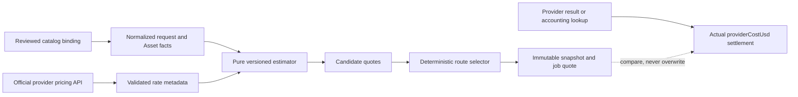

# Provider Cost Estimation And Cost-Aware Routing

**Status:** research and implementation plan only; not approved implementation
scope.

**Last researched:** 2026-07-20.

This document plans a runtime function that estimates the provider-side cost of
one reviewed generation request and can later use comparable estimates to choose
between exact provider bindings. It covers OpenRouter and fal, with Seedance 2.0
as the detailed configuration-sensitive example.

Research in this file does not enable credit enforcement, change provider
selection, expose provider prices in the UI, or add a feature to the active MVP.
Those changes require their own approval and must update the binding product and
API/database documents before implementation.

## Decision Summary

Runtime provider-cost estimation is feasible, but it is not universally exact.
Both providers expose current prices; neither provider exposes one general API
that accepts a complete generation request and returns its exact preflight cost.
TaleLabs must therefore combine current provider rates with a small, versioned,
pure billable-quantity calculator.

The recommended design is:

1. Do **not** add a required `pricingBasis` object to every catalog binding.
2. Keep the catalog authoritative for reviewed model identity, operation,
   endpoint, request profile, runtime support, and fallback priority.
3. Fetch mutable rates from official provider pricing APIs at runtime.
4. Keep provider-specific quantity formulas in `@talelabs/providers`, versioned
   in code and selected from the already captured provider/native-model facts.
5. Return `unavailable` instead of guessing whenever the rate, unit semantics,
   request facts, or provider rounding rule is incomplete.
6. Capture any quote that affects routing in the immutable run snapshot and on
   its generated job. Keep actual `providerCostUsd` settlement independent.
7. Initially use cost-aware routing only for managed live execution and only
   when every eligible candidate has a comparable deterministic estimate.
8. Preserve current catalog priority for ties, missing estimates, pricing API
   failures, browser BYOK, and deterministic debug execution.

This removes broad manual rate duplication. A small amount of reviewed provider
logic remains irreducible when a provider's machine-readable pricing response
does not describe how request configuration becomes billable units. Seedance
2.0 on fal is one such exception.

## Goals

- Estimate the advertised provider API charge before a paid request when the
  provider's rate and billable quantity are determinable.
- Account for settings such as duration, resolution, aspect ratio, audio,
  output count, and relevant input-media facts.
- Compare exact bindings for the same canonical creative model and operation.
- Keep selection deterministic, auditable, and immutable after admission.
- Reuse the same server function later for preflight and credit estimation,
  without copying formulas into the dashboard.
- Compare estimates with settled provider cost so estimator drift is visible.
- Keep provider pricing metadata from becoming a second model catalog.

## Non-Goals

- No credit ledger, balance, reservation, capture, refund, or `402` behavior.
- No provider-cost or USD UI in this phase. TaleLabs credits remain the future
  user-facing cost language defined by `docs/credits-planning.md`.
- No browser BYOK cost routing. The TaleLabs server does not receive browser
  credentials, and fal may return account-specific prices for a BYOK key.
- No post-admission provider fallback or retry-time rerouting.
- No live provider response may add a model, capability, operation, endpoint,
  setting, or route to the catalog.
- No web-page scraping or checked-in discovery/pricing snapshot.
- No attempt to predict actual compute time, generated token count, or an
  automatic provider choice when the provider does not publish enough facts.
- No adjusted COGS, TaleLabs margin, infrastructure allocation, tax, foreign
  exchange, or provider-credit purchase fee. This plan estimates the advertised
  API usage charge only. A future credit-pricing policy is a separate layer.

## Terminology

| Term              | Meaning                                                                                                                                             |
| ----------------- | --------------------------------------------------------------------------------------------------------------------------------------------------- |
| Binding           | One exact private catalog route for a canonical model operation.                                                                                    |
| Rate              | Provider-advertised price for one billing unit, fetched from an official API or, only for a documented provider gap, a narrowly reviewed exception. |
| Billable quantity | Number of images, seconds, megapixels, characters, video-token blocks, or another provider unit implied by the exact request.                       |
| Provider estimate | `rate × billable quantity`, before the provider request.                                                                                            |
| Quote             | A provider estimate plus its rate source, formula version, timestamp, unit, and confidence.                                                         |
| Settlement        | Actual cost returned by or reconciled from the provider after execution.                                                                            |
| Credit quote      | Future TaleLabs product pricing derived from provider cost plus a separately versioned business policy.                                             |

An estimate is never settlement. A deterministic estimate means that TaleLabs
can reproduce the amount from the provider's advertised rule and the captured
request facts. It does not guarantee that a provider will never round
differently, change a rate, or return a different final charge.

## Provider Research

### OpenRouter

OpenRouter exposes useful machine-readable pricing surfaces, but they differ by
protocol.

#### Video

[`GET /api/v1/videos/models`](https://openrouter.ai/api/v1/videos/models)
returns each video model's supported resolutions, aspect ratios, dimensions,
durations, and `pricing_skus`. The official
[video-generation guide](https://openrouter.ai/docs/guides/overview/multimodal/video-generation)
documents this discovery response and shows actual `usage.cost` on a completed
job.

Current SKU keys include several shapes, for example:

```txt
duration_seconds
duration_seconds_1080p
duration_seconds_with_audio_4k
text_to_video_duration_seconds_720p
image_to_video_duration_seconds_1080p
video_tokens
video_tokens_without_audio
cents_per_video_output_second_720p
```

The values are sufficient for many deterministic estimates, but the keys are
not one universal scalar. TaleLabs needs a strict versioned SKU matcher. An
unknown key must make estimation unavailable rather than silently selecting a
nearby SKU.

On 2026-07-20, the live Seedance 2.0 record advertised:

```json
{
  "id": "bytedance/seedance-2.0",
  "supported_resolutions": ["480p", "720p", "1080p", "4K"],
  "supported_durations": [4, 5, 6, 7, 8, 9, 10, 11, 12, 13, 14, 15],
  "pricing_skus": {
    "video_tokens": "0.000007",
    "video_tokens_without_audio": "0.000007"
  }
}
```

OpenRouter's
[Seedance 2.0 performance page](https://openrouter.ai/bytedance/seedance-2.0/performance)
documents the video-token formula as:

```txt
video tokens = width × height × duration seconds × 24 / 1024
```

#### Image

The official
[image-generation guide](https://openrouter.ai/docs/guides/overview/multimodal/image-generation)
documents a model list and an endpoint-specific resource at:

```txt
GET /api/v1/images/models/{author}/{slug}/endpoints
```

Each exact provider endpoint has a `provider_tag`, capability descriptors, and
pricing lines containing:

```txt
billable = output_image | input_image | input_reference | ...
unit     = image | megapixel | token
cost_usd = decimal rate
variant  = optional resolution tier such as 2k or 4k
```

Per-image and per-megapixel lines are usually deterministic when output count
and exact dimensions are known. Token-priced image lines are not necessarily
predictable before generation because the response does not always publish the
billable token quantity implied by a requested resolution.

The endpoint record, not a model-level lowest-price summary, must be matched to
the binding's captured `providerTag`. Otherwise the estimate can describe a
different OpenRouter execution endpoint than the one TaleLabs pinned.

#### Text, speech, and future protocols

OpenRouter's general model pricing describes token and request rates, but text
completion length remains unknown before execution. A configured maximum can
produce an upper bound, not a deterministic actual estimate. Speech and any
new protocol need the same per-protocol review before they are eligible for
cost-aware routing. The initial implementation must not infer estimability from
the mere presence of a numeric price.

### fal

fal's official
[`GET /v1/models/pricing`](https://fal.ai/docs/platform-apis/v1/models/pricing)
returns `endpoint_id`, `unit_price`, `unit`, and `currency` for up to 50 exact
endpoint IDs. Authentication is required, and fal explicitly states that
custom account pricing or discounts may be applied. Managed estimation must
therefore use the same platform-account credential scope used for managed
execution.

fal also exposes
[`POST /v1/models/pricing/estimate`](https://fal.ai/docs/platform-apis/v1/models/pricing/estimate),
but it does not accept model request settings. The caller must already supply
either:

- a historical call quantity; or
- a quantity in the endpoint's billing unit.

That endpoint can multiply units by rates, but it does not determine how a
Seedance request's resolution, duration, references, or other settings become
those units. It does not replace TaleLabs' billable-quantity function.

A read-only query of the 52 fal endpoints currently bound in the local catalog
on 2026-07-20 returned these unit labels:

```txt
1000 characters
compute seconds
credits
images
megapixels
minutes
processed megapixels
seconds
units
```

This observation is research evidence only. The response is not checked into
the repository and cannot change production capabilities or routing by itself.

The labels vary in preflight usefulness:

| fal unit               | Preflight status                                                                                               |
| ---------------------- | -------------------------------------------------------------------------------------------------------------- |
| `images`               | Deterministic when it means generated output count and the endpoint has no additional variant multiplier.      |
| `seconds`              | Deterministic only after documentation identifies whether output duration, input duration, or both are billed. |
| `minutes`              | Same requirement as seconds, with explicit provider rounding.                                                  |
| `megapixels`           | Deterministic when the billed image dimensions and rounding rule are known.                                    |
| `processed megapixels` | Endpoint-specific; the unit label alone does not say which input/output pixels are included.                   |
| `1000 characters`      | Potentially deterministic from the submitted text after the billing rounding rule is reviewed.                 |
| `units`                | Opaque without an endpoint-specific documented formula.                                                        |
| `credits`              | Opaque without a documented request-to-credit rule.                                                            |
| `compute seconds`      | Not deterministic before execution unless fal publishes a request-derived upper bound.                         |

The general fal
[pricing guide](https://fal.ai/docs/documentation/model-apis/pricing)
confirms that billing may be per image, megapixel, video second, or GPU time and
that only successful inference work is billed. A numeric `unit_price` is not,
by itself, proof that TaleLabs can predict `unit_quantity`.

### Seedance 2.0: the important exception

fal's
[Seedance text-to-video page](https://fal.ai/models/bytedance/seedance-2.0/text-to-video)
documents these rules:

- 480p, 720p, and 1080p use `$0.014 / 1,000 tokens`;
- 4K uses `$0.008 / 1,000 tokens`;
- tokens are `width × height × duration × 24 / 1024`;
- audio does not change the price.

The live fal pricing API returned `unit_price: 0.014` and `unit: "units"` for
the standard Seedance endpoints. It did not expose the 4K rate tier or explain
that one unit represents a thousand video tokens.

fal's
[Seedance reference-to-video page](https://fal.ai/models/bytedance/seedance-2.0/reference-to-video)
adds two more rules:

- video-token duration includes input-video duration plus output duration; and
- requests containing video input use a `0.6×` price multiplier.

The public page does not unambiguously state how the duration of several video
references is aggregated. Until fal clarifies that behavior, a deterministic
estimate should support zero or one exact-duration video reference and return
`unavailable` for multiple video references rather than inventing a rule.

These facts demonstrate why a broad `pricingBasis` on every binding would be
the wrong default, but also why zero reviewed formula code is impossible. The
recommended exception is one provider-owned calculator:

```txt
seedance-video-tokens-v1
```

It is selected from the captured provider and native Seedance identity, not
from a second model registry. It owns:

- provider-specific resolution/aspect-ratio to pixel dimensions;
- video-token conversion;
- fal's thousand-token unit conversion;
- fal's documented 4K rate exception while the pricing API omits it;
- the single-video reference-duration rule and documented multiplier;
- OpenRouter's current video-token SKU matching.

If TaleLabs does not want to maintain even this small exception, the honest
alternative is to return `unavailable` for fal Seedance cost estimation and use
catalog priority. There is no fully automatic source for these missing facts
today.

## Illustrative Seedance Comparison

The following examples use an 8-second, 16:9 output, no video references,
standard dimensions, and the documented token formulas. They illustrate the
estimator; they are not promised invoice amounts.

| Resolution | Dimensions | Video tokens | fal advertised rule | fal estimate | OpenRouter advertised rule | OpenRouter estimate |
| ---------- | ---------: | -----------: | ------------------: | -----------: | -------------------------: | ------------------: |
| 720p       |   1280×720 |      172,800 |  $0.014 / 1K tokens |      $2.4192 |          $0.000007 / token |             $1.2096 |
| 1080p      |  1920×1080 |      388,800 |  $0.014 / 1K tokens |      $5.4432 |          $0.000007 / token |             $2.7216 |
| 4K         |  3840×2160 |    1,555,200 |  $0.008 / 1K tokens |     $12.4416 |          $0.000007 / token |            $10.8864 |

Under those current advertised rules, OpenRouter is cheaper for all three
examples. That agrees with the current product preference for Seedance to
resolve through OpenRouter. Catalog priority remains the deterministic
tie-breaker and fallback; it is not rewritten by live pricing.

fal's pages currently show small inconsistencies between some rounded
per-second copy and the published token formula. The estimator must record
which machine rate and formula produced the quote, compare it with actual
settlement in shadow mode, and never present the example table as a guarantee.

## Estimability Contract

The estimator must distinguish three outcomes:

```ts
type ProviderCostEstimate =
  | {
      status: "estimated";
      kind: "deterministic" | "upper_bound";
      amountUsd: string;
      currency: "USD";
      billableQuantity: string;
      billingUnit: string;
      unitRateUsd: string;
      formulaVersion: string;
      rateFetchedAt: string;
      rateSource: string;
    }
  | {
      status: "unavailable";
      reason:
        | "ambiguous_billing_rule"
        | "automatic_output_configuration"
        | "incomplete_input_metadata"
        | "pricing_metadata_stale"
        | "pricing_metadata_unavailable"
        | "unsupported_currency"
        | "unsupported_pricing_unit"
        | "unsupported_sku"
        | "variable_provider_compute";
    };
```

Rules:

- Use decimal strings and decimal/rational arithmetic. Do not route on binary
  floating-point comparisons.
- `unavailable` is data, not an exception, for an unsupported pricing rule.
- Unknown is never converted to zero.
- A provider-advertised zero rate is valid only when the parsed response
  explicitly contains zero.
- Automatic duration, automatic aspect ratio, unknown output dimensions, or
  missing source duration make a dependent estimate unavailable.
- `upper_bound` may support a future credit reservation or advisory UI, but the
  first cost-aware router uses only deterministic estimates.
- Every amount has one currency. V1 supports USD only and does not perform
  foreign exchange.

## Estimator Inputs

The pure calculator needs request facts, not a provider payload and not a Flow
graph:

```ts
interface GenerationCostFacts {
  binding: CatalogProviderBinding;
  operationId: string;
  output: {
    count: number;
    durationSeconds?: string;
    height?: number;
    width?: number;
  };
  settings: Readonly<Record<string, boolean | number | string>>;
  inputs: readonly {
    slotId: string;
    mediaType: "audio" | "image" | "video";
    items: readonly {
      durationSeconds: null | string;
      height: null | number;
      width: null | number;
    }[];
  }[];
}
```

The exact implementation type should reuse existing provider-neutral planner
and Asset facts rather than introduce a second request schema. The important
boundary is that the estimator receives:

- the exact candidate binding;
- normalized settings already validated by the model operation;
- output count and predictable output geometry/duration;
- input role, count, dimensions, and duration when billing depends on them.

It must not receive credentials, signed URLs, prompts unless a documented
character/token rule needs the final submitted text, or mutable provider
discovery as a capability source.

## Architecture



### Ownership

#### `@talelabs/models-catalog`

The catalog continues to own:

- canonical creative model and operation;
- exact provider/native endpoint identity;
- request profile and setting/input mappings;
- supported execution runtimes;
- route priority and evidence;
- current `costCapture` settlement policy.

It does not store copied provider rates or a required `pricingBasis`. Live
prices do not mutate the catalog and do not become model availability.

An optional estimator discriminator should be added only if provider/native
identity plus operation and request profile prove insufficient. It is not part
of the initial design.

#### `@talelabs/providers`

The provider package owns:

- strict response schemas for official pricing endpoints;
- bounded authenticated pricing clients;
- normalization of provider pricing metadata;
- OpenRouter SKU matching;
- fal unit interpretation;
- small provider-specific formula exceptions;
- decimal calculation and the `ProviderCostEstimate` result.

This is protocol behavior, not a second route/model catalog. A calculator may
branch on the already captured native model ID, but it may not define that
model's capabilities, availability, endpoint, or priority.

#### TaleLabs API run domain

The API owns:

- obtaining currently eligible candidate bindings;
- loading/caching rates outside database transactions;
- deriving estimate facts from the provider-neutral plan and locked Assets;
- asking the provider package for one quote per candidate;
- applying managed routing policy;
- capturing the selected quote with the immutable binding;
- later exposing a sanitized credit estimate, not raw private provider rates.

#### `@talelabs/flows`

Flows stays provider-neutral. Existing plan, runtime-item, input-role, settings,
and snapshot contracts may expose neutral media facts needed by the API, but
Flows must not import pricing clients, provider SKU shapes, credentials, or
provider-specific calculators.

#### Dashboard

The dashboard must not implement formulas or fetch managed pricing metadata.
A future UI calls a server estimate/preflight endpoint. Browser BYOK estimation,
if approved later, is a separate trust-boundary design because only the browser
can use the user's fal key.

### Suggested module layout

The exact filenames can adapt during implementation, but ownership should stay
direct and cohesive:

```txt
packages/providers/src/server/pricing/contracts.ts
packages/providers/src/server/pricing/decimal.ts
packages/providers/src/server/pricing/estimate.ts
packages/providers/src/fal/server/pricing-client.ts
packages/providers/src/fal/server/pricing-estimator.ts
packages/providers/src/openrouter/server/pricing-client.ts
packages/providers/src/openrouter/server/image-pricing-estimator.ts
packages/providers/src/openrouter/server/video-pricing-estimator.ts

apps/api/src/domain/runs/provider-cost-estimation.service.ts
apps/api/src/domain/runs/provider-cost-routing.ts
```

Do not create a package per pricing unit, one class per model, a database-backed
pricing registry, or a generic rule engine.

## Split I/O From Calculation

The implementation should expose two narrow layers.

### Impure rate loading

```ts
interface ProviderPricingSource {
  loadRates(
    bindings: readonly CatalogProviderBinding[],
  ): Promise<ReadonlyMap<string, ProviderRateMetadata>>;
}
```

Responsibilities:

- call only official JSON APIs;
- authenticate with the existing injected managed credential;
- batch fal endpoint IDs in groups of at most 50;
- match OpenRouter image pricing to the exact `providerTag`;
- apply strict response byte limits, timeouts, and schemas;
- return a source timestamp and the provider endpoint used;
- never log a credential, authorization header, complete response, or account
  identifier.

### Pure estimation

```ts
function estimateProviderCost(
  facts: GenerationCostFacts,
  rate: ProviderRateMetadata,
): ProviderCostEstimate;
```

The pure function performs no network, database, clock, environment, or global
catalog read. Deterministic fixtures can therefore cover every formula and
route-selection edge case.

A small façade may combine rate loading and pure calculation for API callers,
but tests and admission must retain this separation.

## Rate Cache And Failure Policy

Pricing metadata changes more often than catalog routes, but fetching it for
every candidate on every click is unnecessary and would make admission depend
on provider latency.

Recommended initial policy, owned as typed code constants rather than new
environment variables:

```txt
successful cache TTL       5 minutes
maximum routing age       15 minutes
negative/error cache TTL  15 seconds
pricing request timeout    2 seconds
```

Implementation rules:

- Coalesce concurrent reads for the same provider/rate scope with one in-flight
  promise.
- Key fal cache entries by managed provider/account scope in memory without
  persisting or logging a key fingerprint.
- Cache OpenRouter video metadata as one list and image endpoint metadata by
  exact model ID.
- Do not persist a general rate table in PostgreSQL initially.
- Do not use a response older than the maximum routing age to change providers.
- A timeout, `401`, `429`, schema drift, missing endpoint, or stale rate makes
  that estimate unavailable. It does not make the generation binding itself
  unavailable.
- When estimation cannot compare every eligible route, fall back to catalog
  priority and continue normal admission.

Provider pricing network calls must never occur while holding the organization
admission lock or Asset row locks.

## Cost-Aware Selection Policy

Cost routing is a policy layered on top of current eligibility. It never makes
an unavailable credential or unsupported runtime eligible.

```txt
1. Load exact bindings for the canonical model operation.
2. Filter by execution runtime and currently configured credential.
3. If zero bindings remain, preserve the existing route-unavailable error.
4. If one binding remains, select it without requiring a price lookup.
5. Estimate every remaining binding from the same normalized request facts.
6. If every candidate has a deterministic comparable USD estimate, select the
   lowest amount.
7. If amounts tie, select the higher catalog priority.
8. If amount and priority tie, preserve original catalog binding order.
9. If any candidate is unavailable or only an upper bound, use the existing
   priority ordering for the whole candidate set.
```

The first version deliberately avoids clever partial comparisons. Selecting a
known `$1.00` route over an unknown route is not proof that the known route is
cheaper. Priority remains the reviewed safe fallback.

Two equal estimates therefore do not make routing ambiguous: priority wins,
then checked-in catalog order. The selector must use exact decimal comparison,
not a floating-point epsilon or random ordering.

After selection, the complete binding and quote are immutable. Trigger retries,
polling, cancellation settlement, and reconciliation must use the captured
binding even if prices or current priority later change.

## Execution-Mode Policy

### Managed live execution

Managed platform execution is the initial eligible mode because:

- TaleLabs controls the provider accounts being charged;
- the API can use the same injected account credential scope to query fal's
  account-specific rates;
- minimizing provider-side spend benefits TaleLabs directly;
- the resulting quote is server-authoritative enough for routing and shadow
  comparison.

### Browser BYOK

Browser execution keeps current catalog-priority behavior in V1.

- The API sees only non-secret `byokProviders`, not the user's credentials.
- fal custom pricing may differ per user account.
- Asking the server to quote with TaleLabs' key would compare the wrong rates.
- Accepting a client-supplied quote as server-authoritative would add a new
  admission and provenance contract.
- Browser-side provider preference was explicitly deferred.

A future browser estimator could query providers directly with the local key
and send a selected reviewed binding identifier to admission, but that needs a
separate security and product decision. It must not be smuggled into the managed
implementation.

### Deterministic debug execution

Debug runs preserve existing highest-priority binding selection and mock cost
facts. They do not call pricing APIs and must remain usable offline.

## Admission And Snapshot Integration

Current admission resolves all execution contracts and builds the snapshot
artifact before entering the transaction. Configuration-sensitive cost routing
may depend on exact Asset duration or dimensions, so the routing phase must use
the same locked facts that admission validates.

Recommended sequence:

```txt
lock-free idempotency replay check
-> load and validate provider-neutral plan
-> collect eligible candidate bindings
-> load fresh provider rate metadata outside the transaction
-> begin admission transaction and acquire organization lock
-> authoritative idempotency replay check
-> revalidate Flow revision
-> lock exact existing Assets and select width/height/duration with readiness
-> derive normalized estimate facts using locked Asset metadata
-> calculate candidate quotes with no network I/O
-> select exact bindings by managed cost policy or priority fallback
-> build/hash immutable snapshot using selected bindings and quotes
-> insert run, nodes, items, sources, inputs, and initial jobs
-> commit and dispatch IDs only
```

The implementation must not increase the transaction's external-I/O surface.
Snapshot hashing and pure decimal calculation are bounded local work and may run
inside the transaction.

### Same-run upstream outputs

Some downstream jobs bill from source-media duration or dimensions that do not
exist until an upstream node succeeds. TaleLabs currently pins exact bindings
for the full plan at admission; deferring provider selection until job creation
would weaken immutable provenance.

Therefore:

- cost-route only when every required billable fact is known at admission;
- use catalog priority for a node whose estimate depends on an unknown same-run
  output;
- do not infer output metadata from an upstream setting unless the model
  contract guarantees that exact fact;
- do not capture several providers and choose later;
- do not reroute a downstream node after an upstream result arrives.

A whole-Flow preflight must return a partial result when any planned job is
unestimable. It must not present the sum of known jobs as the complete run cost.

## Immutable Quote Capture

When a quote changes the selected provider, it is part of the admission
decision and must be auditable. Capture a compact normalized record such as:

```ts
interface CapturedProviderCostQuote {
  amountUsd: string;
  billingUnit: string;
  billableQuantity: string;
  currency: "USD";
  estimatedAt: string;
  formulaVersion: string;
  kind: "deterministic" | "upper_bound";
  rateFetchedAt: string;
  rateSource: string;
  unitRateUsd: string;
}
```

Routing implementation should:

- add the selected quote to its execution contract in `graphSnapshot`;
- copy the same validated quote onto each generated job as a derived projection;
- bump the Flow-run snapshot version and allow old snapshots to read with no
  quote;
- leave historical jobs null rather than backfilling them from current prices;
- never put credentials, provider response bodies, or a general live pricing
  table in the snapshot.

The exact database shape should be decided with the implementation. One nullable
`providerCostEstimate` JSONB object on `generationJobs` is the simplest faithful
projection; a separate numeric generated/query column is justified only by a
proven reporting query. Do not hide the quote inside user generation settings.

Actual `providerCostUsd` remains the authoritative settlement field. Completion
or reconciliation may compare actual and estimated values, but it must never
overwrite the captured estimate.

## OpenRouter Calculation Rules

### Video SKU selection

The video estimator receives normalized operation, audio choice, resolution,
duration, output count, and input kind. It matches only recognized SKU shapes.
Specific keys take precedence over generic keys:

```txt
operation + audio + resolution
operation + resolution
audio + resolution
resolution
operation + audio
operation
audio
generic duration
```

`cents_per_*` keys are converted to USD before comparison. If two matching keys
at the same specificity disagree, return `unsupported_sku` rather than choosing
one by object order.

For `video_tokens`, use a model calculator only when the official model record
or reviewed model documentation defines the token formula and exact output
dimensions. Otherwise return `unavailable`.

### Image pricing lines

1. Fetch the exact model endpoint resource.
2. Match one endpoint whose `provider_tag` equals the captured binding tag.
3. Select pricing lines whose optional variant matches normalized resolution.
4. Compute billable input/output quantities from exact request facts.
5. Sum all applicable lines with decimal arithmetic.

An unsupported billable label, unknown token quantity, ambiguous variant, or
missing endpoint tag makes the estimate unavailable.

## fal Calculation Rules

The fal estimator first matches the pricing response's `endpoint_id` to the
binding's exact `nativeModelId` and rejects any non-USD response.

Generic unit handling is allowed only where documentation and request facts
make the quantity unambiguous. Unit labels must not trigger assumptions across
unrelated endpoints. For example, a voice-changing endpoint's billed minutes
may derive from source duration while a music endpoint's minutes may derive
from requested output duration.

Provider-native identity, operation, request profile, and model settings are
already available inputs. Keep any exceptional dispatch as a small explicit
switch inside the fal pricing estimator. It must not become a list that defines
which fal models TaleLabs supports.

For Seedance:

```txt
output tokens = output width × output height × output seconds × 24 / 1024
reference tokens = documented input-duration contribution when unambiguous
fal billing units = tokens / 1000
estimated USD = billing units × applicable unit price × documented multiplier
```

The quote records whether its rate came from the pricing API or the reviewed 4K
documentation exception. When fal exposes the missing tier through its pricing
API, remove the static exception in a new formula version after shadow
comparison.

## Future Credit And UI Reuse

The provider estimator is intentionally below product pricing:

```txt
provider request facts
-> advertised provider cost estimate
-> future TaleLabs pricing policy
-> integer credit quote shown to the user
```

A future estimate endpoint can reuse the same planner and estimator, but it must:

- recompute server-side at admission;
- return the captured Flow revision and plan hash;
- distinguish complete, partial, upper-bound, and unavailable results;
- return localized credit-facing data to ordinary users;
- keep provider USD, account discounts, binding priority, and margins private;
- avoid promising that an advisory preflight is a final reservation.

Adopting live provider cost as an input to credit pricing would change the
current static `(model, settings) -> credits` statement in
`docs/credits-planning.md`. That product decision belongs to the explicitly
deferred credit phase and must update the binding credit contract before code is
implemented.

## Observability And Shadow Rollout

Do not switch routing immediately after adding the calculator.

First run it in managed shadow mode while existing priority continues to select
the provider. Record only bounded structural facts:

```txt
provider
canonical model and operation
formula version
estimate status/reason
estimate amount
rate age
actual settled amount when available
absolute and relative variance
whether cost routing would have changed the provider
```

Do not record prompts, credentials, signed URLs, media, provider response
bodies, or user-supplied text used to derive a character count.

Review shadow results by provider, operation, resolution, and formula version.
Enable cost routing only for formula families whose actual settlement confirms
the documented calculation and whose missing-estimate rate is understood.

If a provider changes metadata shape or actual costs drift materially, disable
that formula family for routing in code and fall back to priority. Do not disable
the generation binding itself unless execution is also unsafe.

## Implementation Phases

### Phase 0 — approve the contract

- Confirm provider API usage cost, rather than adjusted COGS, is the comparison
  metric.
- Confirm managed-only routing and priority fallback.
- Confirm the minimal Seedance exception is acceptable; otherwise mark fal
  Seedance unavailable.
- Update binding product/API/database documents only after approval.

### Phase 1 — estimator foundation, no behavior change

- Add normalized pricing metadata schemas and bounded clients.
- Add decimal arithmetic and the estimate result union.
- Implement OpenRouter video SKU and image-line calculators.
- Implement conservative fal unit handling.
- Implement `seedance-video-tokens-v1` if approved.
- Add deterministic fixtures and coverage reports.
- Keep provider selection entirely priority-based.

### Phase 2 — managed shadow evaluation

- Derive estimate facts for admitted managed jobs.
- Compute and record shadow estimates without changing routing.
- Compare estimates with existing actual-cost settlement.
- Resolve provider rounding, multi-reference duration, and metadata-drift gaps.

### Phase 3 — managed cost-aware routing

- Move binding selection and snapshot construction to the locked-fact portion
  of admission while keeping rate I/O outside the transaction.
- Apply cost selection only when all eligible quotes are deterministic.
- Persist the selected quote in snapshot and job projection.
- Verify retries and reconciliation never reroute.
- Keep a code-owned kill switch that restores priority selection; do not add an
  environment variable for it.

### Phase 4 — advisory estimate API and UI

- Design a server estimate/preflight response.
- Aggregate multi-job plans without hiding unknown jobs.
- Convert private provider estimates through the future credit policy.
- Add localized UI only when credits are approved.

### Phase 5 — credit reservation

- Recompute the quote under the admission lock.
- Reserve the approved credit amount atomically with job creation.
- Capture/release according to `docs/credits-planning.md`.
- Keep actual provider settlement and user credit charge as separate facts.

## Verification Plan

All automated provider tests must use captured official-response fixtures or
injected fake HTTP. No generation request is required.

### Pure estimator cases

- decimal parsing, multiplication, division, rounding, overflow, and equality;
- per-image, per-second, per-minute, per-megapixel, and per-character units;
- recognized and unknown OpenRouter SKU keys;
- exact provider-tag selection for OpenRouter image endpoints;
- zero rate versus missing rate;
- USD versus unsupported currency;
- automatic configuration and incomplete input metadata;
- unsupported fal `units`, `credits`, and compute-based routes;
- every unavailable reason is stable and bounded.

### Seedance cases

- OpenRouter and fal at 720p, 1080p, and 4K;
- landscape, portrait, square, and ultrawide pixel mappings;
- 4 through 15 seconds;
- audio enabled and disabled;
- zero video references;
- one exact-duration video reference and the fal multiplier;
- multiple video references return unavailable until the aggregation rule is
  verified;
- fal 4K uses the documented exception and records its source;
- formula-version changes never rewrite captured quotes.

### Routing cases

- only one eligible provider;
- cheaper fal and cheaper OpenRouter fixtures;
- equal amount selects higher priority;
- equal amount and priority preserves catalog order;
- missing/stale/ambiguous quote falls back to priority for all candidates;
- absent credential is filtered before comparison;
- browser BYOK remains priority-based;
- debug remains offline and priority-based;
- captured provider never changes on retry or reconciliation;
- different operations of one model can resolve independently.

### Admission and persistence cases

- provider rate I/O finishes before any transaction lock;
- locked Asset dimensions/durations feed the pure estimator;
- Flow revision or Asset-state drift rolls admission back;
- unknown same-run output facts use priority fallback;
- snapshot hash includes the selected quote;
- old snapshot readers accept an absent quote;
- job quote equals the snapshot projection;
- actual settlement never overwrites the estimate;
- no credential or complete pricing response reaches logs, snapshots, jobs, or
  API responses.

### Repository gates for an implementation

- model catalog validation;
- focused pricing and provider-selection scenarios;
- planner and snapshot checks;
- provider output/accounting reconciliation checks;
- SDK generation if an estimate endpoint is added;
- all workspace type checks;
- i18n validation if user-facing copy is added;
- TSDoc validation;
- repository lint;
- forced production build;
- Trigger.dev deployment dry run when task contracts change;
- `git diff --check`.

## Acceptance Criteria

The estimator foundation is complete when:

- every attempted quote returns a validated estimate or an explicit unavailable
  reason;
- no rate is manually copied into every catalog binding;
- pricing APIs cannot alter catalog model/capability/routing membership;
- Seedance examples reproduce with decimal arithmetic and captured sources;
- unknown or stale pricing never becomes zero;
- actual cost settlement remains unchanged.

Managed cost-aware routing is complete only when:

- shadow evidence supports every enabled formula family;
- every eligible candidate is compared from the same immutable request facts;
- ties and missing estimates behave deterministically;
- the exact selected binding and quote are captured before dispatch;
- retries, cancellation, and reconciliation never route again;
- a pricing metadata outage safely restores existing priority behavior.

## Open Questions Requiring Provider Or Product Confirmation

1. How does fal aggregate `input_duration` when Seedance reference-to-video
   receives more than one video reference?
2. What exact rounding/minimum rules apply to fal units such as minutes,
   thousand characters, and processed megapixels?
3. Will fal expose Seedance's 4K tier and unit scale through the pricing API, so
   the documented exception can be removed?
4. Which OpenRouter token-priced image endpoints publish enough information to
   determine output-token quantity before generation?
5. Should later provider routing compare advertised API usage only, or adjusted
   COGS including provider-credit purchase fees and infrastructure? This plan
   recommends advertised usage only for the first implementation.
6. What shadow variance threshold is acceptable before a formula family can
   influence managed routing?

## TaleLabs Sources Consulted

- [`docs/assets-flows-mvp-contract.md`](../assets-flows-mvp-contract.md)
- [`docs/talelabs-product-vision.md`](../talelabs-product-vision.md)
- [`docs/flow-nodes-planning.md`](../flow-nodes-planning.md)
- [`docs/provider-execution-modes.md`](../provider-execution-modes.md)
- [`docs/m6-real-provider-integration.md`](../m6-real-provider-integration.md)
- [`docs/credits-planning.md`](../credits-planning.md)
- [`packages/models-catalog/src/provider-binding.ts`](../../packages/models-catalog/src/provider-binding.ts)
- [`packages/models-catalog/src/providers/contracts.ts`](../../packages/models-catalog/src/providers/contracts.ts)
- [`apps/api/src/domain/runs/generation-execution-contracts.ts`](../../apps/api/src/domain/runs/generation-execution-contracts.ts)
- [`apps/api/src/domain/runs/admission.service.ts`](../../apps/api/src/domain/runs/admission.service.ts)

## Official Provider References

### OpenRouter

- [Video generation guide](https://openrouter.ai/docs/guides/overview/multimodal/video-generation)
- [Video model API reference](https://openrouter.ai/docs/api/api-reference/video-generation/list-videos-models)
- [Live video model metadata](https://openrouter.ai/api/v1/videos/models)
- [Image generation guide](https://openrouter.ai/docs/guides/overview/multimodal/image-generation)
- [General model pricing fields](https://openrouter.ai/docs/guides/overview/models)
- [Seedance 2.0 pricing and token formula](https://openrouter.ai/bytedance/seedance-2.0/performance)
- [Video model-selection cookbook](https://openrouter.ai/docs/cookbook/video-generation/choose-video-model)

### fal

- [Pricing API](https://fal.ai/docs/platform-apis/v1/models/pricing)
- [Pricing estimate API](https://fal.ai/docs/platform-apis/v1/models/pricing/estimate)
- [Model API billing guide](https://fal.ai/docs/documentation/model-apis/pricing)
- [Seedance 2.0 text-to-video API and pricing](https://fal.ai/models/bytedance/seedance-2.0/text-to-video)
- [Seedance 2.0 reference-to-video API and pricing](https://fal.ai/models/bytedance/seedance-2.0/reference-to-video)
- [Seedance 2.0 model API reference](https://fal.ai/docs/model-api-reference/video-generation-api/bytedance-seedance-2.0-text-to-video)

Provider facts are time-sensitive. Recheck the official JSON and documentation
before implementation, record the retrieval timestamp in captured quotes, and
rely on actual provider settlement for final accounting.
