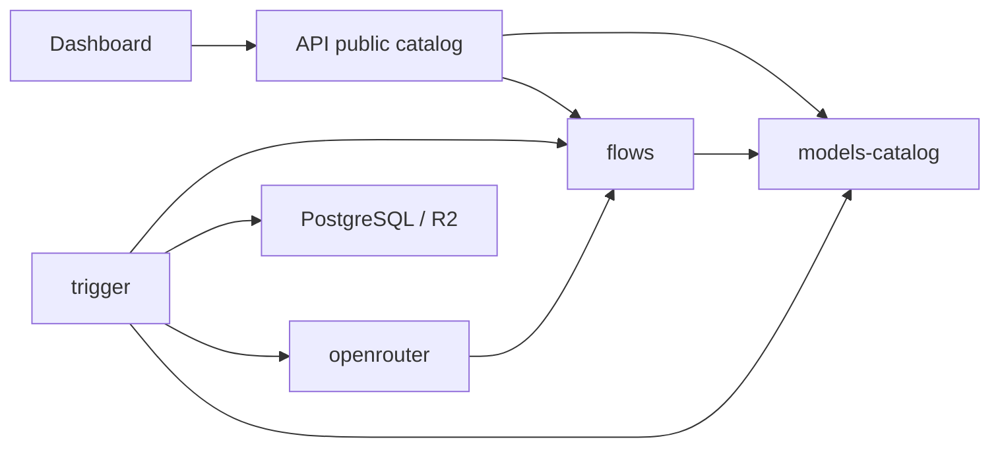

# TaleLabs Generation Runtime Simplification Plan

Status: Proposed
Research date: 2026-07-16
Scope: `packages/flows`, `packages/openrouter`, `packages/trigger`, and the model catalog consumed by the API/dashboard

## 1. Decision

Refactor the generation system around one deliberately plain mental model:

```txt
models.json          what TaleLabs offers and where it runs
flows                what the graph means and what must execute
openrouter           how OpenRouter protocols are called
trigger              when durable work executes
PostgreSQL snapshot  the exact immutable facts used by a run
```

The goal is not the most flexible or sophisticated architecture. The goal is a
system that a competent developer can trace, change, and debug without AI help.

A developer should be able to answer these questions quickly:

1. Which models does TaleLabs offer? Open `models.json`.
2. What inputs and settings does a model accept? Read that model record.
3. How is the graph planned? Follow the small provider-neutral Flow planner.
4. How is OpenRouter called? Open one of four protocol files.
5. What exactly did a historical run use? Read its immutable PostgreSQL snapshot.
6. Where are retries, cancellation, and wake-up behavior? Read the Trigger task
   and its narrowly owned orchestration modules.

This refactor must preserve the working product. It is an incremental
replacement, not a rewrite delivered in one merge.

## 2. Why This Refactor Is Needed

The current implementation is operational and contains important production
behavior. Its maintenance model is nevertheless too distributed.

Current measured surface:

| Area | TypeScript files | Physical lines |
| --- | ---: | ---: |
| `packages/flows/src/generation` | 72 | 9,422 |
| `packages/flows/src/runtime` | 37 | 2,786 |
| `packages/openrouter/src/routes` | 19 | 1,593 |
| `packages/openrouter/src/transport` | 10 | 516 |
| `packages/trigger/src/generation` | 43 | 2,589 |
| `packages/trigger/src/flow-runs` | 40 | 3,655 |
| **Total** | **221** | **20,561** |

Line count alone is not the problem. The problem is the number of places a
developer must inspect or edit for one product decision.

Examples from the current tree:

- `nano-banana-2` is represented across model definitions, selectable registry,
  presentation registry, scenarios, OpenRouter routes, and Trigger verification.
- `seedance-2.0` appears across current, major, and historical registries and
  routes in addition to scenarios and Trigger verification.
- Historical global registry versions copy complete catalogs even when a change
  concerns one model.
- Trigger resolves a provider route, validates the route again against the Flow
  registry, then chooses a shared protocol adapter.

The current implementation has already discovered the right low-level reuse:
models should share protocol adapters. The simplification should keep that
decision and remove the duplicate layers around it.

## 3. Design Principles

### 3.1 Optimize for reading

Prefer the code path with fewer concepts and fewer jumps, even when a more
generic design could support hypothetical future behavior.

Target trace for a new run:

```txt
models.json model record
  -> Flow planner
  -> immutable run binding
  -> provider registry
  -> OpenRouter protocol adapter
```

The common path should require at most four conceptual module transitions.

### 3.2 Isolate what changes

- Model inventory and capabilities change together: keep them in the catalog.
- Provider HTTP protocols change together: keep them in provider packages.
- Graph semantics change together: keep them in Flows.
- Durable orchestration changes together: keep it in Trigger.
- Historical execution facts never change: keep them in run snapshots.

Do not organize modules around broad labels such as `utils`, `common`, `major`,
`current`, or numbered fragments.

### 3.3 Do not build for imagined requirements

Do not add a plugin framework, dependency-injection container, arbitrary rules
language, model database, admin catalog editor, or live production discovery.
Add a new abstraction only after two real implementations demonstrate the same
stable behavior.

### 3.4 Preserve durable behavior

Simplification must not weaken:

- tenant isolation;
- immutable snapshots;
- all five approved run modes;
- retries, cancellation, idempotency, and reconciliation;
- Trigger waitpoints and webhook recovery;
- exact input and output lineage;
- provider cost accounting;
- canonical generated Assets and managed folders;
- persisted canvas outputs;
- public generated-output storage policy.

## 4. Smallest Useful Domain Model

Only four concepts are required.

### 4.1 Product model definition

What the user selects and what the canvas is allowed to expose:

- stable canonical model ID using `vendor/model`, normally matching the model's
  established upstream identity;
- label and description translation keys;
- media/node family;
- supported operations;
- typed inputs;
- settings and defaults;
- cross-field constraints;
- output contract;
- active, deprecated, or retired status;
- per-model revision.

### 4.2 Private provider binding

How an operation is executed:

- provider;
- shared protocol;
- native provider model ID;
- endpoint;
- lifecycle;
- adapter version;
- priority/fallback order when applicable.

Provider bindings are server-only. They may live in the same checked-in JSON
record because native model IDs and endpoints are configuration, not secrets.
The API must remove them from its public projection.

### 4.3 Shared protocol adapter

Code that translates a normalized TaleLabs request to one provider protocol and
normalizes the response.

OpenRouter initially needs only:

```txt
image
video
speech
chat
```

There must not be one adapter per model. Add an adapter only for a truly new
wire protocol or lifecycle.

### 4.4 Immutable run binding

The exact provider/model/operation facts captured at admission and persisted in
the run snapshot. Workers execute this binding. They do not rediscover current
catalog state after admission.

## 5. Central Model Catalog

Create one intentionally small package:

```txt
packages/models-catalog/
  models.json
  package.json
  src/
    schema.ts
    catalog.ts
    public-catalog.ts
    provider-binding.ts
    index.ts
  scripts/
    check.ts
```

This is a library, not a service or framework. It owns the only manually
maintained model inventory.

### 5.1 Source-of-truth rule

`models.json` is the only file in which a developer manually adds, removes,
retires, or changes a current model.

Code may contain:

- the JSON schema;
- generic validation;
- catalog indexes and lookups;
- public/private projections;
- protocol implementations;
- exceptional named validators when a simple declarative constraint cannot
  express a real provider rule.

Code must not repeat model IDs, settings, capabilities, routes, or presentation
metadata in separate registries.

### 5.2 Proposed record

Keep the schema readable rather than maximally normalized:

```json
{
  "catalogVersion": 1,
  "models": [
    {
      "id": "bytedance/seedance-2.0",
      "revision": 1,
      "status": "active",
      "labelKey": "generation.models.seedance20.label",
      "descriptionKey": "generation.models.seedance20.description",
      "nodeType": "videoGeneration",
      "mediaType": "video",
      "defaultOperation": "textToVideo",
      "operations": {
        "textToVideo": {
          "inputs": {
            "prompt": { "type": "text", "required": true },
            "references": { "type": "image", "maxItems": 3 }
          },
          "settings": {
            "aspectRatio": {
              "type": "enum",
              "values": ["16:9", "9:16"],
              "default": "16:9"
            },
            "durationSeconds": {
              "type": "enum",
              "values": [4, 6, 8],
              "default": 6
            },
            "resolution": {
              "type": "enum",
              "values": ["480p", "720p", "1080p"],
              "default": "720p"
            }
          },
          "outputs": { "type": "video", "maxItems": 1 }
        }
      },
      "bindings": [
        {
          "provider": "openrouter",
          "protocol": "video",
          "model": "bytedance/seedance-2.0",
          "endpoint": "/api/v1/videos",
          "lifecycle": "async-webhook-poll",
          "adapterVersion": 1,
          "priority": 100
        }
      ]
    }
  ]
}
```

The exact migrated values must come mechanically from the current reviewed
registry. This example defines shape, not final provider facts.

### 5.3 Canonical model identity

Do not prefix model IDs with `talelabs/`. TaleLabs does not gain a useful
abstraction from renaming `bytedance/seedance-2.0` to
`talelabs/seedance-2.0`.

Use the canonical `vendor/model` identity in the catalog, mutable Flow drafts,
and new immutable snapshots:

```txt
bytedance/seedance-2.0
google/gemini-3.1-flash-image
openai/gpt-image-2
```

Model identity and execution routing remain separate concepts. A binding may
initially execute `bytedance/seedance-2.0` through OpenRouter and later execute
the same canonical model through a direct ByteDance integration with a
different provider-native identifier. Changing the provider binding must not
change the model selected by the user.

The current database and stored snapshots are development-only and will be
reset before production. Therefore this refactor must perform a hard rename:

- update current and copied development registries directly;
- update fixtures, scenarios, defaults, presentations, and routes directly;
- reset the development database after cutover;
- do not add a database migration for model IDs;
- do not add `talelabs/*` aliases, fallback resolution, or compatibility code;
- do not preserve pre-production snapshot contracts solely for these IDs.

After the production reset, canonical IDs and admitted immutable snapshots are
stable contracts. Future renames or model replacements must preserve production
data through an explicit compatibility decision.

### 5.4 Constraint vocabulary

Use a small fixed vocabulary:

- required input;
- media type;
- `maxItems`;
- enum and bounded-number settings;
- `oneOf`;
- mutually exclusive inputs;
- conditional visibility/availability;
- output count and type.

Do not invent a generic expression language. If a provider has a real rule that
cannot fit this vocabulary, the catalog may reference one named validator such
as `seedanceReferenceMode`. Named validators are exceptions and must remain
short, tested, and co-located by node family.

### 5.5 Validation

Parse the JSON with a runtime schema during:

- catalog package import/startup;
- `generation:check`;
- API startup;
- production build.

Fail when:

- model IDs are duplicated;
- revisions are invalid;
- an active operation has no provider binding;
- binding priorities conflict;
- a binding names an unsupported protocol/lifecycle;
- defaults violate their own settings;
- public operations cannot be resolved;
- a retired model is accidentally selectable;
- public projection contains private binding or provider policy.

TypeScript's JSON-module support supplies structural inference, but runtime
schema parsing remains necessary because JSON content is external data from the
compiler's perspective.

### 5.6 Provider discovery

OpenRouter discovery APIs are research tools, not production configuration.
They can be used manually or by a read-only verification command when reviewing
a model change. They must never rewrite `models.json` or silently alter runtime
behavior.

The reviewed decision is encoded in JSON and ships with the application.

## 6. Target Package Responsibilities

### 6.1 `packages/models-catalog`

Owns:

- current model inventory;
- capabilities and defaults;
- provider bindings;
- catalog validation;
- public sanitized projection;
- exact server-side binding lookup.

Does not own HTTP, PostgreSQL, Trigger tasks, graph planning, or UI components.

### 6.2 `packages/flows`

Owns only provider-neutral creative graph behavior:

- node and edge types;
- typed runtime values;
- graph validation;
- command selection;
- topological planning;
- input materialization;
- job expansion and multiplicity;
- execution-contract and snapshot assembly;
- plan/snapshot limits and serialization.

It reads model definitions through the catalog API. It must not contain
OpenRouter-specific model files, provider routes, native endpoints, or copied
catalog histories.

Recommended readable organization:

```txt
packages/flows/src/
  graph/
  nodes/
    image/
    video/
    llm/
    audio/
    inputs/
  runtime/
    command-selection.ts
    input-materialization.ts
    job-expansion.ts
    plan-assembly.ts
    snapshots/
    values/
```

Split by actual responsibility, not by arbitrary file size or numbered parts.

### 6.3 `packages/openrouter`

Owns only OpenRouter transport and protocol translation:

```txt
packages/openrouter/src/
  client.ts
  image.ts
  video.ts
  speech.ts
  chat.ts
  webhook.ts
  errors.ts
  types.ts
  index.ts
```

Each protocol module accepts:

```txt
normalized request + immutable provider binding
```

and returns:

```txt
normalized immediate/async result + provider metadata
```

It must not own TaleLabs presentation metadata, historical product registries,
Flow semantics, database access, Trigger tasks, or one adapter per model.

The four existing shared protocol adapters are the right abstraction. Preserve
their behavior while moving request shaping and response normalization into this
package.

### 6.4 `packages/trigger`

Owns durable execution:

- thin task entrypoints under `src/tasks`;
- run/job state transitions;
- bounded orchestration and queues;
- waitpoint creation and completion;
- webhook wake-up coordination;
- retries, cancellation, and reconciliation;
- provider cost reconciliation;
- output finalization and canonical Asset ingestion.

Trigger receives IDs, loads the immutable snapshot, and invokes a provider from
one small provider registry:

```txt
provider name -> provider adapter
```

It must not know OpenRouter request fields, per-model settings, endpoint
histories, or presentation metadata.

Suggested trace:

```txt
orchestrator task
  -> generation job service
  -> provider registry
  -> OpenRouter protocol adapter
  -> output finalizer
```

Keep Trigger.dev because it still supplies durable retries, waitpoints,
concurrency, cancellation, and recovery around provider-owned asynchronous jobs.
OpenRouter's job system does not replace the TaleLabs run, lineage, ingestion,
and recovery state machine.

### 6.5 API and dashboard

- API returns the catalog's sanitized public projection.
- Dashboard renders from that public definition.
- Dashboard never receives provider bindings, credentials, fallback policy, or
  internal cost policy.
- Adding a model using an existing node family must not require a new React
  component.

## 7. Dependency Direction



The OpenRouter package may depend on provider-neutral normalized execution
contracts in Flows. Do not create another package merely to make the diagram
more theoretically pure.

Forbidden directions:

- Flows importing OpenRouter;
- OpenRouter importing Trigger or database code;
- catalog importing Flow planning or provider clients;
- dashboard importing private catalog bindings;
- Trigger reconstructing model capabilities already captured in the snapshot.

## 8. Historical Compatibility Without Permanent Duplication

### 8.1 New runs

New run snapshots must contain the complete resolved execution binding:

- canonical `vendor/model` ID and model revision;
- operation and normalized settings;
- provider and protocol;
- native model and endpoint;
- lifecycle and adapter version;
- route/binding revision if needed;
- exact selected inputs and payload order;
- registry/catalog version for diagnostics.

The worker validates and executes this snapshot. It does not query a historical
catalog to rediscover the route.

### 8.2 Pre-production reset

There are no production Flows or runs to preserve during this refactor. Delete
the development-only `talelabs/*` identity and historical route duplication
instead of carrying a legacy resolver into production. Reset the development
database once the canonical catalog and execution path are ready.

This exception applies only before the first production database. After launch,
retries must always preserve the original immutable binding and supported
snapshot formats must not be deleted without an explicit migration or
compatibility plan.

### 8.3 Versioning model

Stop copying the complete global catalog for every change.

Use:

- stable model ID;
- integer per-model `revision`;
- catalog format version only when JSON structure changes;
- snapshot format version only when execution shape changes;
- full resolved binding in every new snapshot.

Adding one model must not create a new historical copy of every other model.

## 9. Retain, Move, and Delete Map

### Retain

- typed Flow graph and runtime-value contracts;
- approved adaptive node UX and settings behavior;
- graph command selection and all five run modes;
- immutable run snapshots;
- PostgreSQL run/job/source/input/output persistence;
- Trigger waitpoints, webhook wake-up, fallback polling, retries, cancellation,
  reconciliation, and queue limits;
- four shared OpenRouter protocol adapters;
- output validation, finalization, lineage, managed folders, and canonical Assets;
- provider accounting and later cost reconciliation.

### Move and simplify

- current model capabilities and presentation data -> `models.json`;
- current private routes -> each model's `bindings`;
- OpenRouter request/response logic currently under Trigger -> OpenRouter
  protocol modules;
- catalog public projection -> models-catalog;
- oversized Flow planning logic -> named pipeline responsibilities.

### Delete after cutover

- copied global dated model registries for new runs;
- separate active selectable, presentation, and route registries;
- `current`, `major`, and duplicated historical route builders for new runs;
- model-specific adapters;
- provider-specific request shaping in Trigger;
- temporary old-vs-new parity scripts;
- pre-production compatibility code and `talelabs/*` aliases;
- stale docs describing TypeScript registries as the maintained model source.

## 10. Incremental Execution Plan

### Phase 0 - Freeze and measure behavior

Goal: establish a trustworthy baseline before structural changes.

1. Inventory every currently selectable model, operation, setting, provider
   route, lifecycle, and adapter.
2. Confirm that all persisted runs are development-only and record the database
   reset requirement.
3. Capture representative normalized requests/results with fake HTTP for:
   image, video, speech, chat, webhook completion, and polling recovery.
4. Preserve scenarios for all five run modes.
5. Record current module and line counts as a comparison baseline.
6. Do not make paid provider calls.

Exit gate: current behavior is mechanically observable without relying on the
old implementation's internal shape.

### Phase 1 - Add the catalog in parallel

Goal: create one validated model source without switching runtime behavior.

1. Add `packages/models-catalog`.
2. Translate current active models and bindings mechanically into `models.json`.
3. Add runtime schema parsing and uniqueness/coverage checks.
4. Add public/private projection checks.
5. Add a temporary parity script comparing old and new active catalog outputs.
6. Do not hand-edit both systems after the initial translation; catalog changes
   pause until cutover or are applied mechanically to both.

Exit gate: new catalog represents current behavior exactly and passes offline
checks.

### Phase 2 - Switch catalog readers

Goal: make one source drive product behavior.

1. API config endpoints read the public catalog projection.
2. Dashboard consumes the unchanged public API shape or a deliberately versioned
   replacement.
3. Flow resolution receives model definitions from the catalog.
4. Remove duplicated active selectable and presentation registries.
5. Keep old snapshot execution untouched.

Exit gate: canvas model selection, handles, settings, and validation match the
approved UI behavior using only the JSON catalog.

### Phase 3 - Write self-contained snapshots

Goal: prevent new work from depending on historical route catalogs.

1. At admission, resolve one exact provider binding from the catalog.
2. Store the full binding in the immutable snapshot/job contract.
3. Validate snapshots at admission and worker start.
4. New workers execute the captured binding directly.
5. Development-only old snapshots are discarded in the planned database reset.

Exit gate: changing or retiring the current catalog cannot alter an admitted
run, and new retries do not query historical route copies.

### Phase 4 - Simplify OpenRouter

Goal: make provider code readable by protocol.

1. Consolidate image request/response handling in `image.ts`.
2. Consolidate video submit/status/webhook handling in `video.ts`.
3. Consolidate speech byte handling in `speech.ts`.
4. Consolidate chat handling in `chat.ts`.
5. Keep one client, error mapper, webhook verifier, and narrow shared types.
6. Delete route builders and route catalogs no longer used by new snapshots.

Exit gate: tracing an OpenRouter call requires opening one protocol module plus
the client, not a model route family and a Trigger adapter family.

### Phase 5 - Simplify Trigger ownership

Goal: leave Trigger responsible for durability, not provider translation.

1. Keep task entrypoints thin.
2. Replace OpenRouter-specific adapter trees with one provider registry call.
3. Pass normalized request and immutable binding to `packages/openrouter`.
4. Preserve waitpoints, wake-up, fallback polling, cancellation, and recovery.
5. Preserve output validation, cost capture/reconciliation, and Asset ingestion.
6. Keep task payloads ID-only.

Exit gate: Trigger code can orchestrate another provider without knowing its
HTTP request shape.

### Phase 6 - Simplify Flow internals

Goal: reduce the reading path without changing graph semantics.

1. Keep the planner as a visible pipeline:
   command selection -> materialization -> job expansion -> snapshot assembly.
2. Organize generation resolution by node family, not provider or catalog era.
3. Extract only cohesive responsibilities.
4. Respect the 600-line and three-function authored-source limits.
5. Reject thin wrappers, generic helper dumping grounds, and numbered fragments.

Exit gate: a developer can explain planner stages from filenames and trace one
job without searching provider-specific registries.

### Phase 7 - Remove migration scaffolding

Goal: finish the refactor rather than leave two architectures.

1. Remove temporary parity code.
2. Remove unused current/major/history registries and routes.
3. Remove development-only legacy route and model-ID compatibility code.
4. Update package READMEs and dependency diagrams.
5. Update root/package `AGENTS.md` rules.
6. Update active product/runtime/API/database/execution docs.
7. Reset the development database and verify new Flows persist canonical model
   IDs and self-contained snapshots.

Exit gate: one maintained catalog and one execution path exist for all new work.

## 11. Maintenance Workflows After Refactor

### Add a model using an existing protocol

1. Research official provider/OpenRouter capability evidence.
2. Add one model record to `models.json`.
3. Run catalog and fake-provider checks.
4. Add translations only when new label/description keys are required.

No adapter, route-builder, Trigger, or Flow file should change.

### Change a model capability

1. Edit its JSON record.
2. Increment that model's revision.
3. Run checks.

Production snapshots created after the reset keep their captured contract.

### Retire a model

After production launch, set `status` to `retired`. Do not delete the record
while drafts or supported historical behavior still reference it. New nodes
cannot select it; admitted runs remain executable from snapshots.

### Add a direct provider later

Add an ordered binding. If it uses an existing protocol and transport contract,
reuse the adapter. If its wire protocol genuinely differs, add one cohesive
provider protocol module. Do not add model-specific adapters.

### Add a truly new operation or protocol

Only then update the schema vocabulary and implement one new protocol adapter.
Keep the change focused on the new product behavior.

## 12. Verification Matrix

Every migration phase must run relevant checks, and the final cutover must run
all of them.

### Catalog

- schema parsing;
- stable ID and revision uniqueness;
- active operation/binding coverage;
- adapter/lifecycle compatibility;
- defaults and constraints;
- retired-model exclusion;
- public projection privacy;
- no duplicate manually maintained catalog.

### Runtime

- all five run modes;
- immutable snapshot validation;
- image immediate output;
- speech immediate/byte output;
- chat output;
- video async submit, webhook wake-up, and fallback polling;
- multi-output ordering;
- retry, cancellation, idempotency, and reconciliation;
- same-run and prior-run lineage;
- generated output persisted as a canonical Asset;
- managed folder placement and public storage policy;
- provider cost capture and successful-null-cost reconciliation.

### Repository

- catalog check;
- planner/snapshot scenarios;
- provider adapter scenarios using fake HTTP only;
- SDK generation;
- all workspace type checks;
- i18n validation for all supported locales;
- repository lint;
- forced production build;
- Trigger.dev deployment dry run;
- `git diff --check`;
- no temporary generated directories;
- no new non-sensitive environment variables.

## 13. Readability and Maintainability Acceptance Gates

The refactor is not complete merely because behavior passes.

It must also satisfy:

1. A current existing-protocol model is added by editing one model record.
2. No model-specific adapter is needed for that change.
3. A developer can trace a run through no more than four conceptual modules.
4. No authored source file exceeds 600 physical lines.
5. No authored source file defines more than three functions.
6. Flows contains no provider-specific routes or native model IDs.
7. Trigger contains no OpenRouter request-shaping knowledge.
8. OpenRouter contains no TaleLabs product presentation registry.
9. The active model catalog is not duplicated in TypeScript, JSON snapshots, or
   generated code that developers must maintain manually.
10. Existing run state transitions and output lineage remain unchanged in
    deterministic fake-provider scenarios.
11. Package/module count and line count are measured before and after; reductions
    must come from deleted concepts, not compressed or hidden code.
12. Package READMEs explain ownership, one common trace, and one extension trace
    in language a new developer can follow.

## 14. Non-Goals

This refactor does not include:

- a microservice split;
- a plugin framework;
- dependency injection;
- a model database or admin UI;
- live model discovery controlling production;
- billing or credits;
- Elements;
- canvas UX redesign;
- new provider integrations;
- new run modes or iteration nodes;
- changes to user-approved run semantics;
- new environment variables;
- paid provider verification.

## 15. Main Risks and Controls

| Risk | Control |
| --- | --- |
| Big-bang rewrite breaks working runs | Incremental parallel catalog and strangler cutover |
| Pre-production data shapes leak into production | Hard canonical-ID cutover followed by a deliberate development database reset |
| JSON becomes an untyped dumping ground | Small schema, runtime validation, fixed constraint vocabulary |
| Public API leaks provider policy | Explicit sanitized projection with fail-closed check |
| New abstraction recreates complexity | No framework/DSL/DI; require demonstrated repetition |
| Trigger behavior regresses while moving adapters | Preserve lifecycle scenarios and fake HTTP boundaries |
| Provider costs disappear after successful output | Preserve durable accounting reconciliation as a release gate |
| Two sources remain after migration | Final phase deletes temporary parity and old active registries |

## 16. Research Basis

This design intentionally follows a small number of practical sources:

- [OpenRouter Models API](https://openrouter.ai/docs/guides/overview/models):
  model discovery exposes modalities and supported parameters. TaleLabs uses it
  for research, then checks reviewed decisions into its catalog.
- [OpenRouter image generation](https://openrouter.ai/docs/guides/overview/multimodal/image-generation):
  the provider exposes a normalized image protocol and endpoint-level capability
  descriptors, supporting one shared image adapter.
- [OpenRouter video generation](https://openrouter.ai/docs/guides/overview/multimodal/video-generation):
  video is an asynchronous normalized protocol, supporting one shared video
  adapter with webhook/poll behavior.
- [Trigger.dev waitpoints](https://trigger.dev/docs/wait-for-token): durable
  tasks can pause for external callbacks instead of occupying a worker.
- [Trigger.dev queues and concurrency](https://trigger.dev/docs/queue-concurrency):
  Trigger remains useful for TaleLabs-owned orchestration even when providers
  own their internal media-generation jobs.
- [Google engineering review guidance](https://google.github.io/eng-practices/review/reviewer/looking-for.html):
  avoid over-engineering and require code to be understandable rather than
  accepting complexity hidden behind comments.
- [AWS Strangler Fig guidance](https://docs.aws.amazon.com/prescriptive-guidance/latest/cloud-design-patterns/strangler-fig.html):
  incrementally replace a working system instead of accepting big-bang rewrite
  risk.
- [TypeScript JSON modules](https://www.typescriptlang.org/tsconfig/resolveJsonModule.html):
  JSON imports can participate in TypeScript builds, while TaleLabs still adds
  explicit runtime schema validation.

## 17. Final Recommendation

Proceed with this refactor before adding more providers or expanding the model
inventory substantially.

Do not begin by moving files. Begin with Phase 0 behavior baselines and Phase 1
parallel catalog validation. The first runtime switch should happen only after
the new catalog proves parity with the current active behavior.

The desired result is not an impressive architecture. It is a boring one:

```txt
one catalog
one planner
one immutable binding
one adapter per protocol
one durable orchestrator
```

That is sufficient for the current product and leaves a clear extension path
when real product usage requires more.
