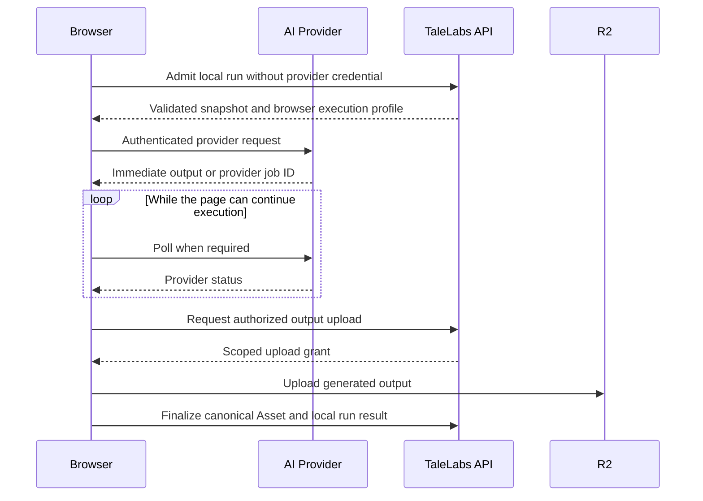
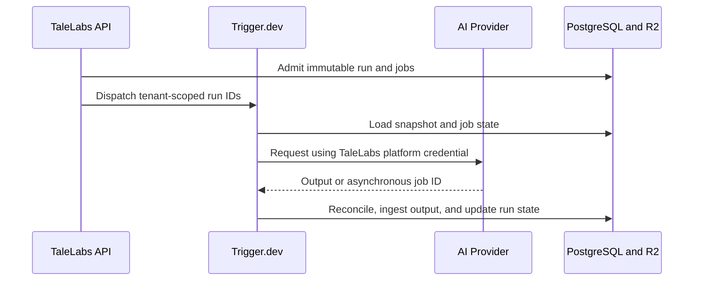
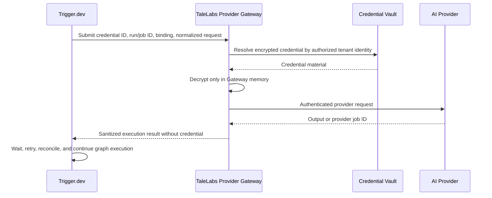

# TaleLabs Provider Execution Modes

This document defines how TaleLabs executes provider requests across local BYOK,
managed platform credits, and future managed BYOK. It is an architecture and
trust-boundary contract. It does not, by itself, approve billing, managed BYOK,
or a general-purpose credential service.

The central rule is:

```txt
The runtime that sends an authenticated provider request must see the plaintext
provider credential while making that request.
```

TaleLabs therefore cannot truthfully claim that a credential never reaches a
runtime while also asking that runtime to call the provider. The product must
choose the execution runtime explicitly and describe the resulting trust model
honestly.

## Goals

1. Ship browser-local BYOK as a low-infrastructure-cost V1 execution mode.
2. Preserve the existing durable managed execution path for TaleLabs credits.
3. Keep a safe path to managed BYOK without exposing user credentials to
   Trigger.dev task payloads, logs, metadata, or worker memory.
4. Reuse provider protocol behavior across browser and server runtimes.
5. Keep Trigger.dev as one durable orchestration engine, not duplicate it inside
   a credential service.

## Non-Goals

- Do not claim that browser-local execution has the same durability as managed
  execution.
- Do not make every provider or protocol available in the browser without
  verifying CORS, request delivery, polling, cancellation, and output handling.
- Do not pass provider credentials through Trigger.dev payloads.
- Do not build a second queue, retry engine, DAG runner, or reconciliation
  system inside a Provider Gateway.
- Do not expose an endpoint that returns decrypted provider credentials.

## Execution Modes

| Mode             | Provider credential                  | Provider request runs in  | Trigger.dev | Intended product use                     |
| ---------------- | ------------------------------------ | ------------------------- | ----------- | ---------------------------------------- |
| Local BYOK       | User-controlled browser credential   | Browser                   | No          | Free/local-first V1                      |
| Managed platform | TaleLabs platform credential         | Trigger.dev worker today  | Yes         | Paid credits and durable cloud execution |
| Managed BYOK     | User credential in a dedicated vault | TaleLabs Provider Gateway | Yes         | Future paid managed convenience          |

The selected mode is part of execution provenance. A run must never silently
move between local and managed execution because the trust model, durability,
credential source, and cost ownership differ.

### Funding preference versus execution runtime

The visible Generation Mode preference is a funding-source choice, not the
managed-runtime selector:

```txt
Credits -> managed platform execution with TaleLabs provider credentials
BYOK    -> the user's BYOK runtime preference; browser-local today
```

The Credits/BYOK preference is browser-local, scoped to the authenticated user,
and defaults to BYOK so existing users never silently move onto platform-funded
execution. Choosing Credits does not upload or use browser-stored keys. Choosing
BYOK currently resolves to local browser execution because managed BYOK and its
server-side key synchronization remain unavailable.

These must remain separate product concepts. The managed BYOK runtime selector
stays hidden until the Provider Gateway and credential vault exist. Enabling it
later may change where a BYOK request executes without changing whether the user
selected Credits or BYOK as the funding source.

## Mode 1: Local BYOK



### Credential boundary

The provider credential remains in the browser and is sent only to the selected
provider. It must never be included in:

- TaleLabs API requests;
- PostgreSQL or R2 objects;
- Trigger.dev tasks, payloads, metadata, or logs;
- analytics, error reporting, traces, or session replay;
- Flow graphs, snapshots, model catalog records, or generated Assets.

Browser persistence is a product choice, not a security guarantee. Encryption
at rest can reduce accidental disclosure from copied browser storage, but code
running in the same compromised browser origin can access an unlocked key.
TaleLabs must continue to defend against XSS, malicious dependencies, browser
extensions, compromised devices, and accidental telemetry capture.

### Browser credential storage

TaleLabs implements the credential-persistence boundary for OpenRouter and fal
and uses it only from the local execution driver. The browser package uses
one versioned IndexedDB database with separate stores for encrypted credentials
and a single non-extractable 256-bit AES-GCM `CryptoKey` persisted by structured
clone. Each credential write uses a unique 96-bit initialization vector and
authenticates `{ schemaVersion, userId, providerId }` as additional data.

Credential records are scoped by the immutable Better Auth user ID and provider
ID. Every stored value is treated as untrusted and validated before status or
decryption. Invalid records, invalid keys, missing cryptographic support, and
storage failures produce a fixed non-secret error and fail closed. Explicit
sign-out deletes all credential records for the current user before the Better
Auth session is ended.

The Settings UI can show non-secret status and can store, replace, or remove a
supported provider key. It never resolves the plaintext key. Plaintext
resolution occurs only inside the browser job runner immediately before its
direct provider call.
Run admission, manifests, checkpoints, recovery records, and output finalization
contain no credential material.

For a live local run, the browser sends only the provider IDs whose keys are
currently connected. Admission selects exact compatible bindings from that set
and freezes each selected provider in the immutable snapshot. The manifest
projects only the provider ID required by each job. Before claiming work, the
coordinator re-reads browser credential status and requires every provider in
the manifest: a fal-only run needs only fal, while a mixed run needs both fal
and OpenRouter. Removing a required key blocks the run with
`credential_required`; storing it again restarts local recovery.

BYOK does not request or display TaleLabs provider-cost estimates. Admission
selects the first eligible binding in catalog-priority order without loading
pricing metadata, requiring a quote, or persisting estimate evidence. Cost
preflight belongs exclusively to the separate Credits funding mode.

### Local run behavior

Local execution uses the same server admission, canonical planner, immutable
snapshot, ownership checks, run identity, prerequisite semantics, aggregation,
and canonical output Asset registration as managed execution. The browser is a
second execution driver for jobs in that admitted plan; it does not traverse the
mutable Flow or reinterpret the selected command.

The approved commands keep identical semantics in both runtimes:

```txt
Run node
Run from here
Run till here
Run selection
Run all
```

A small browser queue bounds provider-job concurrency and schedules only jobs
already selected by the server planner. PostgreSQL remains authoritative, and
the API atomically validates prerequisites before a browser claims a job. This
browser scheduler is not part of the Provider Gateway and is not a second Flow
planner or durable workflow system.

Local runs have explicit limitations:

- closing the page can interrupt submission, polling, download, or upload;
- provider webhooks cannot target the browser;
- background execution is constrained by browser lifecycle and throttling;
- a missing browser credential prevents recovery on another device;
- client-reported cost and provider metadata cannot be trusted for billing;
- client-reported provider cost and generation identifiers are persisted only
  as unverified browser reports and never settle accounting or replace trusted
  managed-provider facts;
- provider support is enabled per protocol only after browser compatibility is
  verified.

The complete local scheduler, lease, recovery, command-parity, and acceptance
contract is defined in `browser-execution-mode-execution-plan.md`. Browser mode
is not approved until every run command passes in both browser and managed
drivers under deterministic debug execution.

If the browser persists a provider job ID before interruption, a later session
may resume polling when the same credential is available. TaleLabs must present
this as recovery assistance, not managed durability.

### Local security claim

When implementation and telemetry have been verified, TaleLabs may claim:

> Your provider key stays in this browser and is sent only to the provider you
> select. TaleLabs and Trigger.dev never receive it.

This claim applies only to local BYOK execution.

## Mode 2: Managed Platform Execution



This is the current durable managed path. Trigger.dev owns orchestration and the
worker making the provider request receives the TaleLabs platform credential in
memory. Trigger.dev is therefore a trusted subprocesser for managed execution.
Managed admission considers only policy-approved providers whose existing
server/worker credentials are currently configured and fails closed when none
can execute an operation. When the explicit funding source is Credits, managed
live admission estimates every eligible binding from the same locked request
facts. When all candidates have
comparable deterministic USD estimates, the lowest estimated provider cost is
the primary selector. Equal costs retain catalog priority and checked-in order;
any missing or incomparable estimate restores catalog priority for the whole
candidate set. This selection fallback does not authorize unquoted spend:
Credits-funded managed admission fails closed unless the selected binding has a
complete quote. The exact binding, selection policy, and quote are resolved
once before the immutable snapshot is written. Debug execution remains
priority-based.

Managed execution retains:

- durable queues and bounded concurrency;
- retries, backoff, waitpoints, and asynchronous polling;
- cancellation and reconciliation;
- immutable snapshots and provider bindings;
- graph progression and disconnected branch handling;
- output ingestion, lineage, status, and realtime updates.

The local-BYOK security claim must never be applied to this mode.

## Mode 3: Future Managed BYOK

Managed BYOK adds a thin TaleLabs-controlled Provider Gateway so Trigger.dev can
coordinate a run without receiving the user's plaintext provider credential.



### Gateway responsibilities

The Provider Gateway may perform only credential-bearing provider operations:

```txt
submit
poll
cancel
download authenticated output
retrieve provider accounting facts
```

It may:

- authenticate an internal TaleLabs execution request;
- authorize organization, credential, run, job, and immutable binding together;
- retrieve and decrypt a credential from a dedicated vault;
- inject provider authorization into one bounded operation;
- return a sanitized normalized result;
- enforce idempotency for the requested provider operation;
- redact credentials, signed URLs, prompts, and provider payloads from logs.

It must not:

- expose credential retrieval or decryption APIs;
- return plaintext credentials to Trigger.dev, the API, or the browser;
- traverse a Flow graph;
- own queues, workflow retries, waitpoints, or run aggregation;
- continue downstream nodes;
- become the source of truth for TaleLabs run state;
- replace Trigger.dev orchestration or PostgreSQL run persistence.

### Managed BYOK request shape

Trigger.dev sends identifiers and an immutable normalized request, never secret
material:

```json
{
  "credentialId": "cred_123",
  "flowRunId": "run_456",
  "generationJobId": "job_789",
  "bindingRevision": "binding_revision",
  "requestHash": "request_hash",
  "request": {}
}
```

The Gateway returns only non-secret execution data:

```json
{
  "executionId": "exec_123",
  "providerJobId": "provider_job_456",
  "status": "submitted",
  "pollAfterMs": 5000
}
```

Provider callbacks terminate at TaleLabs-controlled infrastructure. The callback
updates authoritative state or completes a durable Trigger.dev waitpoint using
run/job identifiers. Callback payloads never need to contain a user credential.

### Managed BYOK security claim

TaleLabs may claim:

> Provider keys are encrypted in a dedicated secrets vault and decrypted only
> during execution inside TaleLabs-controlled infrastructure. They are never
> stored in PostgreSQL, included in Trigger.dev payloads, or written to logs.

TaleLabs must not claim that its own infrastructure is cryptographically unable
to access managed credentials. The Gateway must decrypt them to call a provider.

## Trigger.dev Trust Boundary

Trigger.dev adds a trust boundary whenever a task receives sensitive data. A
secret marked hidden in its dashboard is still available to the worker process
that needs it. Therefore:

- platform credentials used directly by managed tasks treat Trigger.dev as a
  trusted subprocesser;
- user credentials must never be passed as task payloads because payloads are
  visible in execution systems and logs;
- fetching a user credential from a vault inside a Trigger.dev task still makes
  the plaintext credential available to that task runtime;
- only moving the credential-bearing provider call into TaleLabs-controlled
  infrastructure removes Trigger.dev from the user-credential boundary.

Self-hosting Trigger.dev can move the worker into TaleLabs-controlled
infrastructure, but also transfers security, scaling, upgrades, and reliability
responsibility to TaleLabs. It is an operational alternative, not a prerequisite
for V1.

## Provider Package Boundary

The `@talelabs/providers` package supports these execution modes through explicit
entry points:

```txt
@talelabs/providers/core     universal browser-safe protocol behavior
@talelabs/providers/browser  browser-safe local composition
@talelabs/providers/server   managed credentials, registry, webhooks, accounting
```

Rules:

1. Request shaping, normalized responses, safe errors, and bounded fetch behavior
   should be reusable between browser and server runtimes.
2. Browser-safe entry points must not import Node built-ins, environment access,
   Trigger.dev, PostgreSQL, vault clients, webhook verification, or accounting.
3. Server composition owns private routing, managed credentials, callbacks, and
   accounting.
4. Runtime-specific Asset resolution is injected. Managed execution may resolve
   a canonical Asset to a signed URL; browser execution may use a provider-safe
   remote URL, `Blob`, `File`, object URL, or bytes when the protocol supports it.
5. Browser eligibility is explicit per provider protocol. Browser compatibility
   must not be inferred merely because the shared package bundles successfully.

## Product Policy

Recommended initial positioning:

```txt
Free/local plan     -> browser-local BYOK, limited TaleLabs storage
Managed paid plan   -> TaleLabs credits and durable Trigger.dev execution
Future managed BYOK -> paid convenience using the Provider Gateway
```

Local BYOK reduces generation infrastructure and provider-cost exposure, but
TaleLabs still pays for authentication, admission, database operations, Asset
storage, signed uploads, and product APIs. Storage and abuse limits remain
necessary.

## Implementation Sequence

1. Preserve and verify the browser-safe provider package boundaries.
2. Define browser eligibility separately from model availability.
3. Implement local credential entry and browser-only storage without sending the
   value to TaleLabs. **Implemented for OpenRouter and fal.**
4. Add local run admission, browser execution, progress, interruption states,
   and canonical output upload. **Implemented for reviewed bindings.**
5. Validate every supported provider protocol for CORS and browser lifecycle.
6. Keep current managed platform execution unchanged.
7. Add managed BYOK and the Provider Gateway only after product demand justifies
   the additional vault, gateway, audit, and incident-response surface.

## Required Security Verification Before Local BYOK Release

- Confirm provider CORS behavior for every enabled browser protocol.
- Confirm credentials never appear in API traffic, telemetry, errors, session
  replay, source maps, or application logs.
- Apply a strict Content Security Policy and review third-party scripts.
- Keep credential-bearing code out of server rendering and shared persistence.
- Verify logout, key removal, browser-storage clearing, and device-switch UX.
- Ensure generated-output upload grants remain tenant-scoped and cannot upload
  arbitrary object keys or media beyond product limits.
- Label local interruption and recovery behavior honestly.

## References

- [Trigger.dev environment variables](https://trigger.dev/docs/deploy-environment-variables)
- [Trigger.dev self-hosting overview](https://trigger.dev/docs/self-hosting/overview)
- [Trigger.dev security](https://trigger.dev/security)
- [OpenRouter OAuth PKCE](https://openrouter.ai/docs/guides/overview/auth/oauth)
- [Node.js package entry points](https://nodejs.org/api/packages.html#package-entry-points)
- [Web Crypto `SubtleCrypto`](https://developer.mozilla.org/en-US/docs/Web/API/SubtleCrypto)
