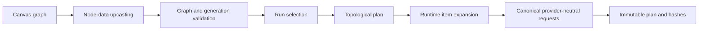

# `@talelabs/flows`

This package is the provider-neutral contract and deterministic planning engine for TaleLabs Flows. It answers four questions:

1. What nodes, handles, and values can exist on a Flow canvas?
2. What can each generation model accept and produce?
3. Is a graph valid and executable?
4. What immutable work should a run execute?

It does not render the canvas, access PostgreSQL, call OpenRouter, or execute Trigger.dev tasks.

## Start here

Read the package in this order:

1. [`src/index.ts`](src/index.ts) — public API and startup registry validation.
2. [`src/graph/types.ts`](src/graph/types.ts) — graph nodes, edges, handles, and validation contracts.
3. [`src/nodes/registry/index.ts`](src/nodes/registry/index.ts) — node-type registry entry point.
4. [`src/generation/registry/index.ts`](src/generation/registry/index.ts) — model registry entry point.
5. [`src/generation/registry/current/index.ts`](src/generation/registry/current/index.ts) — active model contract assembled from the curated declarations.
6. [`src/generation/resolution/`](src/generation/resolution/) — pure capability and operation resolution.
7. [`src/runtime/planning/planner.ts`](src/runtime/planning/planner.ts) — graph-to-run-plan entry point.
8. [`src/runtime/snapshots/contracts.ts`](src/runtime/snapshots/contracts.ts) — immutable snapshot versions consumed by execution.

## Package map

```text
src/
├── graph/                  Graph vocabulary, handles, ordering, limits, validation
├── nodes/
│   ├── data/               Node data schemas, defaults, and readers
│   ├── migrations/         Historical node-data upcasters
│   └── registry/           Node declarations and registry validation
├── generation/
│   ├── contracts/          Provider-neutral execution contracts
│   ├── models/             Curated model declarations
│   ├── outputs/            Generated-output compatibility and validation
│   ├── registry/
│   │   ├── current/        Current active model contract
│   │   ├── history/        Immutable historical model contracts
│   │   ├── queries/        Registry lookups and derived views
│   │   └── validation/     Registry invariants
│   ├── resolution/         Pure model/operation/input/setting resolution
│   └── scenarios/          Executable capability examples and drift checks
└── runtime/
    ├── planning/           Selection, topology, item expansion, final run plan
    ├── serialization/      Canonical JSON and deterministic hashes
    ├── snapshots/          Versioned immutable execution artifacts
    └── values/             Runtime collections, items, and provider requests
```

## How a Flow becomes executable work



The planner never chooses a provider. It freezes the creative contract—model ID, operation, inputs, settings, runtime dimensions, request identity, and output expectations. The API later attaches a private provider route, and Trigger.dev executes the resulting snapshot.

## Active and historical generation contracts

The distinction under `generation/registry/` is intentional:

- `current/` is what new and edited nodes may select today.
- `history/` preserves contracts already stored in Flows and run snapshots.
- `models/` contains reusable declarations from which current contracts are assembled.
- `queries/` is the read API used by the dashboard, API, and planner.

A model disappearing from the active catalog does not erase the historical contract needed to read old Flows.

## Where to make a change

| Change | Primary location | Follow through |
| --- | --- | --- |
| Add or edit a node type | `src/nodes/registry/` | data schema, migration, graph handles, scenarios |
| Add a generation model | `src/generation/models/` and `registry/current/` | resolution, capability scenarios, private provider route |
| Change model inputs/settings | `src/generation/models/` | resolution, registry validation, historical compatibility |
| Change graph validity | `src/graph/validation*.ts` | planner scenarios and API admission behavior |
| Change run selection | `src/runtime/planning/selection*.ts` | topology and planner checks |
| Change job identity | `src/runtime/planning/` and `runtime/serialization/` | snapshots, API persistence, Trigger.dev contract readers |
| Read an older snapshot | `src/runtime/snapshots/` | add an explicit version reader/upcaster |

## Verification

From the repository root:

```bash
npm run generation:check -w @talelabs/flows
npm run provider-output:check -w @talelabs/flows
npm run run:check -w @talelabs/flows
npm run check-types -w @talelabs/flows
npm run build -w @talelabs/flows
```
