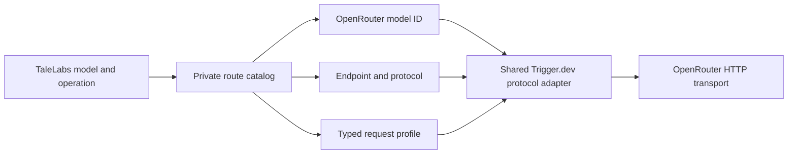

# `@talelabs/openrouter`

This package is TaleLabs' server-side OpenRouter boundary. It owns the private mapping from stable TaleLabs model operations to concrete OpenRouter models/endpoints, the shared HTTP transport, the small SDK wrapper, and webhook signature verification.

It does not own the public model catalog or the Trigger.dev generation lifecycle. The public catalog lives in `@talelabs/flows`; reusable execution adapters live in `@talelabs/trigger`.

## Start here

Read the package in this order:

1. [`src/index.ts`](src/index.ts) — public exports.
2. [`src/routes/index.ts`](src/routes/index.ts) — route API and startup validation.
3. [`src/routes/catalog.ts`](src/routes/catalog.ts) — catalog lookup entry point.
4. [`src/routes/contracts.ts`](src/routes/contracts.ts) — private route and request-profile types.
5. [`src/routes/current/routes.ts`](src/routes/current/routes.ts) — assembled current route registry.
6. [`src/routes/current/`](src/routes/current/) — current image, video, speech, and chat routes.
7. [`src/transport/client.ts`](src/transport/client.ts) and [`src/transport/requests/execute.ts`](src/transport/requests/execute.ts) — HTTP execution path.
8. [`src/sdk/client.ts`](src/sdk/client.ts) — official SDK-backed convenience client.
9. [`src/webhooks/signature.ts`](src/webhooks/signature.ts) — OpenRouter callback verification primitives.

## Package map

```text
src/
├── routes/
│   ├── builders/           Typed route constructors
│   ├── current/            Current executable route registry by protocol
│   ├── history/            Immutable prior route/status contracts
│   ├── major/              Curated major-model route declarations
│   ├── validation/         Identity, protocol, and coverage invariants
│   ├── catalog.ts          Private route lookup
│   ├── contracts.ts        Route and request-profile types
│   ├── index.ts            Route API and startup gate
│   └── verify.ts           Executable route coverage check
├── sdk/                    Official OpenRouter SDK wrapper and public SDK types
├── transport/
│   ├── requests/           JSON, byte, and streaming request execution
│   └── responses/          Bounded response parsing and provider errors
└── webhooks/               Callback signature verification
```

## How routing fits together



The registry maps an exact TaleLabs model contract and operation to one private route. Models sharing the same OpenRouter protocol share the same execution adapter; a request profile carries only the settings that vary between models.

## Current, major, and historical routes

- `routes/current/` assembles every route executable by the active TaleLabs catalog.
- `routes/major/` keeps large curated model families readable instead of making the active assembly file enormous.
- `routes/history/` preserves route facts needed by immutable snapshots created by earlier deployments.
- `routes/validation/` proves coverage and adapter compatibility before runtime.

`@talelabs/flows` remains the public source of model capability truth. This package adds server-only provider facts without leaking endpoints, credentials, fallbacks, or routing policy into public contracts.

## Where to make a change

| Change | Primary location | Follow through |
| --- | --- | --- |
| Add an active provider route | `src/routes/current/` or `routes/major/` | route assembly, validation, fake-HTTP provider scenarios |
| Change a request profile | `src/routes/contracts.ts` and the relevant builder/declaration | matching shared Trigger.dev adapter |
| Change route lookup | `src/routes/catalog.ts` | startup coverage and snapshot compatibility |
| Change HTTP behavior | `src/transport/` | response bounds, provider errors, adapter verification |
| Change SDK convenience methods | `src/sdk/` | public exports and server consumers |
| Change callback authentication | `src/webhooks/` | API callback handler and callback scenarios |
| Preserve an old route | `src/routes/history/` | immutable snapshot resolver |

## Verification

From the repository root:

```bash
npm run check-types -w @talelabs/openrouter
npm run routes:check -w @talelabs/openrouter
npm run build -w @talelabs/openrouter
```

Provider adapter verification belongs to `@talelabs/trigger` and must inject fake HTTP rather than making paid requests.
