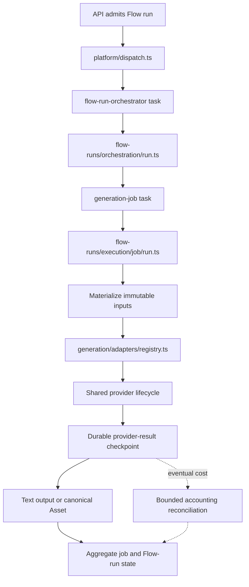

# TaleLabs Trigger Runtime

This package owns TaleLabs background execution: Asset processing, durable Flow
runs, provider calls, output recovery, and scheduled reconciliation.

The organizing rule is simple:

- `src/tasks` answers **what Trigger.dev deploys**.
- Feature folders answer **how the work is performed**.
- `src/index.ts` answers **what the API may import from this package**.

Trigger.dev recursively discovers TypeScript task files under the directories in
the root [`trigger.config.ts`](../../trigger.config.ts). TaleLabs configures only
`packages/trigger/src/tasks` as that discovery boundary. This follows
Trigger.dev's documented `dirs` configuration while keeping business logic out
of the deployment-entrypoint folder:

- [Trigger.dev configuration: `dirs`](https://trigger.dev/docs/config/config-file#dirs)
- [Trigger.dev task overview](https://trigger.dev/docs/tasks/overview)
- [Trigger.dev manual setup and monorepo examples](https://trigger.dev/docs/manual-setup)

## Start here

Read these files in order for the shortest path through the runtime:

1. [`../../trigger.config.ts`](../../trigger.config.ts) — runtime, task discovery,
   retries, duration, and build extensions.
2. [`src/tasks/flow-runs/orchestrator.task.ts`](src/tasks/flow-runs/orchestrator.task.ts)
   — deployed parent task for a Flow run.
3. [`src/flow-runs/orchestration/run.ts`](src/flow-runs/orchestration/run.ts) —
   reads the immutable snapshot and dispatches each topological level.
4. [`src/tasks/flow-runs/generation-job.task.ts`](src/tasks/flow-runs/generation-job.task.ts)
   — deployed task for one planned generation job.
5. [`src/flow-runs/execution/job/run.ts`](src/flow-runs/execution/job/run.ts) —
   validates the snapshot contract, materializes inputs, runs the provider, and
   finalizes outputs.
6. [`src/generation/adapters/registry.ts`](src/generation/adapters/registry.ts) —
   dispatches the captured binding to one provider package.
7. [`src/generation/adapters/lifecycle/runner.ts`](src/generation/adapters/lifecycle/runner.ts)
   — submit, checkpoint, resume, poll, and reconcile provider facts.
8. [`src/flow-runs/execution/outputs/finalizer.ts`](src/flow-runs/execution/outputs/finalizer.ts)
   — converts normalized results into canonical text outputs or Assets.
9. [`src/flow-runs/reconciliation/provider-accounting.ts`](src/flow-runs/reconciliation/provider-accounting.ts)
   — recovers eventual OpenRouter and Fal costs through bounded provider-specific
   sweeps without reopening provider work.

## Package map

```text
src/
├── index.ts                  Public server-side package API
├── platform/                 Trigger SDK client, dispatch, env, task contracts
├── tasks/                    Trigger.dev discovery boundary; thin entrypoints
│   ├── assets/               Ingest, purge, and reconciliation tasks
│   └── flow-runs/            Orchestrator, generation job, reconciliation tasks
├── assets/                   Asset processing and generated-output storage
│   ├── media/                Format probing and media-specific processing
│   ├── processing/           Ingest, purge, metadata, and reconciliation
│   └── outputs/              Output folders and public generated storage
├── flow-runs/                Durable run and job execution
│   ├── contracts/            Immutable execution/snapshot compatibility
│   ├── orchestration/        Parent-run traversal and graph failure behavior
│   ├── execution/            Per-job inputs, provider checkpoints, and outputs
│   ├── persistence/          Claims and terminal state transitions
│   ├── reconciliation/       Recovery of undispatched or stale work
│   └── observability/        Safe structured runtime logging
├── generation/               Durable provider lifecycle boundary
│   ├── inputs/               Tenant-scoped Asset resolution for providers
│   └── adapters/             Provider registry, lifecycle, mock fixtures
│       └── openrouter/video/  Durable callback URL and wake coordination only
└── shared/                   Cross-feature failures and binary helpers
```

## Deployed task entrypoints

All deployed task definitions end in `.task.ts`. Their IDs are stable runtime
contracts used by persisted runs and Trigger.dev.

| Task ID | Entry point | Responsibility |
| --- | --- | --- |
| `asset-ingest` | `tasks/assets/ingest.task.ts` | Download, validate, process, and persist Asset metadata |
| `asset-purge` | `tasks/assets/purge.task.ts` | Remove deleted Asset objects safely |
| `asset-reconcile` | `tasks/assets/reconcile.task.ts` | Redispatch stalled Asset processing/purging |
| `flow-run-orchestrator` | `tasks/flow-runs/orchestrator.task.ts` | Traverse an immutable Flow plan and wait for child jobs |
| `generation-job` | `tasks/flow-runs/generation-job.task.ts` | Execute one tenant-scoped generation job durably |
| `flow-run-reconcile` | `tasks/flow-runs/reconcile.task.ts` | Repair run state and dispatch admitted runs missing a parent task |
| `provider-cost-reconcile` | `tasks/flow-runs/provider-accounting.task.ts` | Recover eventual OpenRouter and Fal costs with bounded, non-overlapping sweeps |

Task files contain the Trigger.dev-facing task ID, payload schema, queue, retry
policy, schedule, and lifecycle-handler wiring. The owning feature folder
contains the implementation behind each entrypoint.

## Flow execution path



The API creates and locks the graph snapshot before dispatch. Trigger tasks load
tenant-scoped rows from PostgreSQL and never execute from the mutable canvas.
Provider results are normalized before output persistence. Paid submissions and
immediate results use durable boundaries so retries resume instead of charging
again.

## Provider boundary

Trigger validates the captured route, resolves a runtime-only credential, and
passes the exact snapshot binding plus tenant-aware Asset resolver to the
registry in `@talelabs/providers/server`. The provider package dispatches by
`binding.provider`; Trigger never imports an implementation module or constructs
OpenRouter request fields. Trigger retains submit/checkpoint/resume/poll
orchestration, callback wakeups, output validation, cost reconciliation, and
canonical Asset ingestion.

## Where to make a change

| Goal | Primary location |
| --- | --- |
| Add or change a deployed task | `src/tasks/<feature>/*.task.ts` plus the owning feature module |
| Change Flow traversal | `src/flow-runs/orchestration/` |
| Change one generation job | `src/flow-runs/execution/job/` |
| Change exact input provenance | `src/flow-runs/execution/inputs/` |
| Change retry-safe provider recovery | `src/flow-runs/execution/provider-results/` and `generation/adapters/lifecycle/` |
| Change eventual provider accounting | `src/flow-runs/reconciliation/provider-accounting.ts` and `flow-runs/persistence/accounting-queries.ts` |
| Change canonical output persistence | `src/flow-runs/execution/outputs/` |
| Add a model using an existing protocol | Matching `packages/models-catalog/models/<media>.json` file only |
| Add a genuinely new provider | Provider-specific catalog schema, implementation directory, package registry entry, and catalog bindings |
| Change API-side dispatch | `src/platform/dispatch.ts` and `src/index.ts` |

## Verification

From the repository root:

```bash
npm run check-types -w @talelabs/trigger
npm run build -w @talelabs/trigger
npm run providers:verify -w @talelabs/trigger
npm run provider-results:verify -w @talelabs/trigger
npm run trigger:deploy:check
```

The provider verification command exercises production catalog bindings with fake HTTP;
it does not make paid provider requests.
